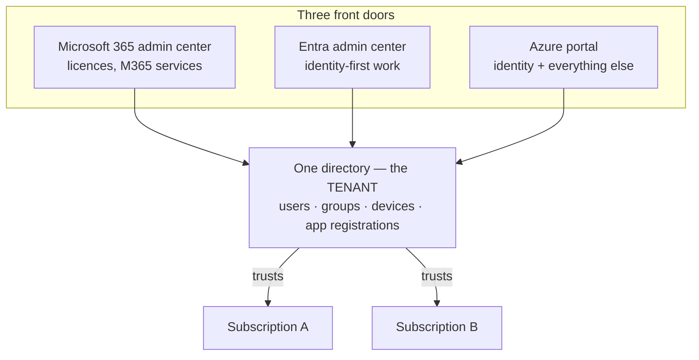
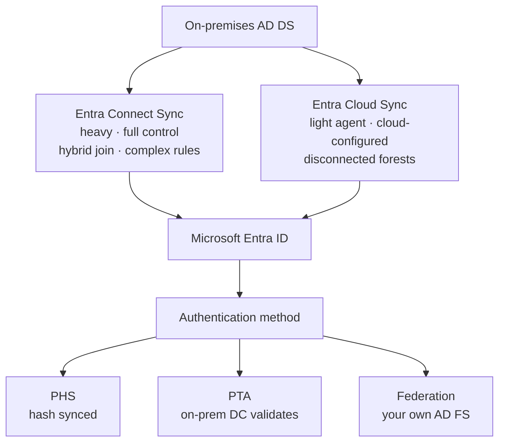
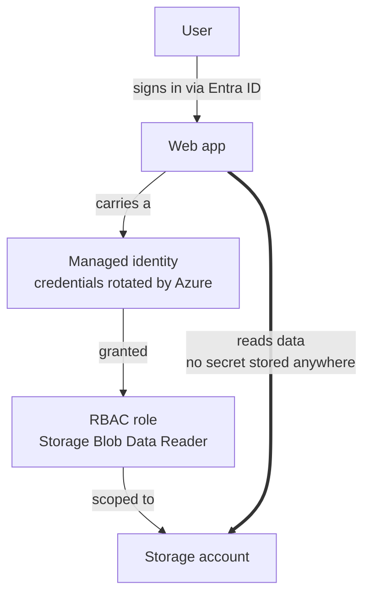

# 01 - Administer Identity

> [!abstract] In one line
> Microsoft Entra ID is the identity plane for Microsoft 365, Entra and Azure. Everything else in this course authenticates against it.

**Lab:** [[LAB 01 - Manage Entra ID Identities]]
**Course index:** [[AZ-104 Course Index]]

---

## 1. Where Entra ID sits

Microsoft 365 <-> **Entra ID** <-> Azure — one directory, three front doors.



> One tenant can trust many subscriptions. A subscription trusts **exactly one** tenant.

Users and groups can be created or managed from any of the three portals. They are the same objects underneath; only the admin experience differs.

![[Pasted image 20260914113049.png]]
![[Pasted image 20260914113056.png|361]]

| Portal | Use it for |
| --- | --- |
| Microsoft Entra admin center (`entra.microsoft.com`) | Identity-first work: users, groups, roles, Conditional Access, app registrations |
| Azure portal (`portal.azure.com`) | Same identity blades, plus everything else in Azure (RBAC, resources, subscriptions) |
| Microsoft 365 admin center (`admin.microsoft.com`) | **Licence assignment** (including group-based licensing), Microsoft 365 service settings |

> [!important] Licence assignment lives in Microsoft 365
> Licences are assigned and unassigned in the **Microsoft 365 admin center** (Billing > Licenses). Entra still surfaces licence *state* and assignment errors, but the assignment itself is done in M365.

### Tenant

A **tenant** is a single, dedicated instance of Entra ID — your organisation's directory. One tenant holds your users, groups, devices and app registrations. You can belong to more than one tenant and switch between them (Entra ID > Overview > **Manage tenants**).

A tenant is not the same thing as a subscription. One tenant can trust many subscriptions; a subscription trusts exactly one tenant.

---

## 2. Entra ID licence tiers

Four tiers. Which one you need is driven purely by which features you want.

| Capability | Free | P1 | P2 | Entra Suite |
| --- | :---: | :---: | :---: | :---: |
| Users, groups, SSO, on-prem directory sync | Yes | Yes | Yes | Yes |
| Security defaults (MFA via Authenticator app) | Yes | Yes | Yes | Yes |
| Self-service password reset (cloud users) | Yes | Yes | Yes | Yes |
| SSPR with **password writeback** to on-prem AD | No | Yes | Yes | Yes |
| **Conditional Access** | No | Yes | Yes | Yes |
| **Dynamic group membership** | No | Yes | Yes | Yes |
| **Group-based licensing** | No | Yes | Yes | Yes |
| MFA by phone call / SMS, trusted IPs, custom controls | No | Yes | Yes | Yes |
| Application Proxy, Entra Connect Health | No | Yes | Yes | Yes |
| Administrative units, custom roles | No | Yes | Yes | Yes |
| **Identity Protection** (risk detections, risk policies) | No | No | Yes | Yes |
| **Risk-based** Conditional Access | No | No | Yes | Yes |
| **Privileged Identity Management (PIM)** | No | No | Yes | Yes |
| Access reviews, entitlement management | No | No | Yes | Yes |
| Entra Internet Access / Private Access | No | No | No | Yes |
| Entra ID Governance (full), Verified ID premium | No | No | No | Yes |

**Entra Suite** is a bundle, not a higher tier — it requires P1 or above and adds Internet Access, Private Access, ID Governance, ID Protection and Verified ID premium.

> [!tip] Two exam-friendly rules of thumb
> - Anything **automated or policy-driven** (dynamic groups, Conditional Access, group licensing) = **P1**.
> - Anything **risk-aware or privilege-governing** (Identity Protection, PIM, access reviews) = **P2**.

---

## 3. User accounts

### Three ways a user gets into the directory

1. **Created directly** — via Entra, the Azure portal or the M365 admin center.
2. **Invited as a guest (B2B)** — any email address in the world, including personal accounts. Guests can then be given RBAC roles and access to subscriptions and resources.
3. **Synchronised from on-premises AD DS** — via Entra Connect Sync or Entra Cloud Sync.

### User types

| Type | Notes |
| --- | --- |
| **Member** | Belongs to your tenant (`user@yourtenant.onmicrosoft.com` or a verified domain) |
| **Guest** | External identity invited via B2B; `userType = Guest`; UPN is mangled to `user_domain.com#EXT#@yourtenant.onmicrosoft.com` |

### Key properties

Set on the **Properties** tab at creation, and used later as the basis for dynamic group rules and Conditional Access:
`jobTitle`, `department`, `companyName`, `usageLocation`, `city`, `country`, `employeeId`, `manager`.

> [!warning] Usage location is not optional in practice
> A licence cannot be assigned without a **usage location** — service availability varies by country. Worth setting at creation or via sync, not after the licence assignment has already failed.

### Deletion

Deleted users go to a **recycle bin and are restorable for 30 days**. After that they are permanently purged. The same 30-day window applies to deleted Microsoft 365 groups; **security groups are not recoverable**.

---

## 4. Hybrid identity — syncing from on-premises AD DS

Two tools. Both run an agent on-premises and push to Entra; the default sync cycle is **every 30 minutes**.



| | **Entra Connect Sync** | **Entra Cloud Sync** |
| --- | --- | --- |
| Agent | Heavy — full server, SQL, sync engine | Lightweight provisioning agent |
| Configuration | On the server (Synchronization Rules Editor) | In the Entra admin center |
| Multiple agents active at once | No (one active + staging) | Yes — failover and load sharing |
| Disconnected forests (M&A) | No | Yes |
| Scale per domain | Unlimited | ~150,000 objects |
| Device sync / **Hybrid Entra Join** | Yes | **No** |
| Pass-through auth / AD FS setup | Yes | No (configured separately) |
| Password hash sync, password writeback | Yes | Yes |
| Seamless SSO | Yes | Yes |
| Advanced sync rules, cross-forest references | Yes | No |
| Group provisioning cloud -> AD | No | Yes |

**Choosing:** Cloud Sync for simple or disconnected forests and lower overhead; Connect Sync where you need hybrid join, complex rules, or very large directories.

### Authentication methods for hybrid

- **Password Hash Sync (PHS)** — hash of the password hash is synced to Entra. Simplest, most resilient.
- **Pass-Through Authentication (PTA)** — validation happens against the on-prem DC via an agent; no hashes stored in the cloud.
- **Federation (AD FS)** — Entra redirects to your own STS.

> [!warning] AD FS federation breaks Entra Domain Services
> If on-prem uses federated auth, no usable password hashes exist in Entra, so Entra Domain Services cannot validate credentials.

---

## 5. Entra Domain Services vs AD DS vs Entra ID

Entra Domain Services is a **managed, stripped-back domain in Azure** — you get Kerberos/NTLM/LDAP and Group Policy without running or patching domain controllers. It exists for lift-and-shift workloads that need legacy protocols.

![[Pasted image 20260914115052.png|290]]

| | **AD DS (self-managed)** | **Entra Domain Services (managed)** | **Entra ID** |
| --- | --- | --- | --- |
| Deployment | Your DCs, on-prem or on Azure VMs | Microsoft-managed domain in a VNet | SaaS, no domain at all |
| Protocols | Kerberos, NTLM, LDAP | Kerberos, NTLM, LDAP(S) | OAuth 2.0, OIDC, SAML, WS-Fed |
| You patch / back up the DCs | Yes | No | N/A |
| Domain / Enterprise Admin rights | Yes | **No** | N/A |
| Domain join | Yes | Yes | Entra join / registration (not domain join) |
| Group Policy | Yes | Yes (built-in + custom GPOs) | No — MDM/Intune policy instead |
| **Schema extensions** | Yes | **No** | N/A (directory extensions instead) |
| Forest / domain **trusts** | Yes | One-way outbound only, Enterprise SKU | No |
| LDAP write | Yes | Yes, within the managed domain | No |
| Kerberos constrained delegation | Resource-based **and** account-based | Resource-based only | N/A |
| Object source | Authoritative | **Read-only projection** of Entra ID | Authoritative |

> [!note] Direction of flow
> Entra Domain Services is populated **from** Entra ID one way. You cannot create a user directly in the managed domain and have it appear in Entra ID.

**Device join models to keep straight:**

| Model | For | Managed by |
| --- | --- | --- |
| Entra **registered** | Personal / BYOD (Windows, iOS, Android, macOS) | MDM, limited |
| Entra **joined** | Corporate, cloud-only | Entra + Intune |
| Entra **hybrid joined** | Corporate, with existing on-prem AD | On-prem AD + Entra (needs Connect Sync) |

---

## 6. Group accounts

Groups exist so you assign RBAC, application access and licences **once** rather than per user.

![[Pasted image 20260914115953.png|406]]

### Group types

| Type | Use |
| --- | --- |
| **Security** | Access to Azure resources, apps, RBAC role assignments, licensing |
| **Microsoft 365** | Collaboration — brings a shared mailbox, calendar, SharePoint site and Teams |

### Membership types

| Type | Behaviour | Licence |
| --- | --- | --- |
| **Assigned** | Admin adds and removes members manually | Free |
| **Dynamic User** | Membership is a query over user attributes | **P1** |
| **Dynamic Device** | Membership is a query over device attributes | **P1** for the users, none for device-only groups |

You cannot manually add or remove a member from a dynamic group — the rule is the only source of truth. A group is also either user-based or device-based; you cannot mix the two in one rule.

### Dynamic membership rules

Syntax is `<object>.<property> <operator> "<value>"`.

```
user.department -eq "IT"
user.jobTitle -startsWith "Manager"
(user.department -eq "Sales") -or (user.department -eq "Marketing")
(user.department -eq "IT") -and -not (user.jobTitle -startsWith "Contractor")
user.department -in ["IT","Networks","Security"]
user.objectId -ne null                                    // all users incl. guests
(user.objectId -ne null) -and (user.userType -eq "Member")  // members only
device.deviceOSType -eq "Windows"
device.deviceOSVersion -startsWith "10.0.1"
```

**Operators:** `-eq -ne -startsWith -notStartsWith -endsWith -notEndsWith -contains -notContains -match -notMatch -in -notIn`, combined with `-and -or -not` and, for multi-value properties, `-any` / `-all`.

**Limits and behaviour:**

- Rule body max **3,072 characters**; max **15,000 dynamic groups** per tenant.
- The rule is re-evaluated whenever a relevant attribute changes — membership self-heals both ways.
- The visual rule builder handles up to five expressions and excludes `-contains` / `-notContains`; anything more complex goes in the text box, and device rules must use the text box.

> [!warning] Security consideration
> Whoever can write the attribute controls the membership. If a self-service field feeds a security group's rule, that is a privilege escalation path. Audit write permissions on any attribute used in a security-sensitive rule — both in Entra and in the source AD.

### Group housekeeping

- **Expiration policy** — set a group lifetime in days; the owner must renew or the group is deleted.
- **Naming policy** — blocked words plus an enforced prefix/suffix on group names.

---

## 7. Application and workload identities

Not every identity is a person. Applications and Azure resources need identities too.

| Concept | What it is |
| --- | --- |
| **App registration** | The application's definition in Entra — client ID, redirect URIs, API permissions, credentials |
| **Service principal** | The local instance of that app in a tenant; this is what gets RBAC role assignments |
| **Managed identity** | A service principal whose credentials Azure creates and **rotates automatically** — you never see or handle a secret |

### Managed identity types

| | **System-assigned** | **User-assigned** |
| --- | --- | --- |
| Lifecycle | Tied to one resource; deleted with it | Standalone resource, independent lifecycle |
| Sharing | One resource only | Shared across many resources |
| Use when | Single workload, simple | Fleet of resources needing the same access |

### Access to a data store, in order of preference

1. **Managed identity + RBAC** — no secrets to store or rotate. Preferred.
2. **App registration with a certificate or client secret** — you own rotation.
3. **Shared Access Signature (SAS)** — scoped, time-limited URL token for storage.
4. **Storage account access keys** — full control of the account, no scoping. Avoid where possible.



> [!example] Typical pattern from the module
> User signs in to a web app through Entra ID -> the web app carries a **managed identity** -> RBAC on the storage account grants that identity **Storage Blob Data Reader** -> no credential is ever stored in the app.

---

## Exam objective coverage

- [x] Create users and groups
- [x] Manage user and group properties
- [x] Manage licences in Microsoft Entra ID
- [x] Manage external users
- [x] Configure self-service password reset (SSPR)

## Recall check

1. Which licence tier is the minimum for dynamic groups, and which for PIM?
2. Where do you assign a licence, and what property must be set first?
3. Name three things Entra Domain Services cannot do that self-managed AD DS can.
4. Write a dynamic rule for all enabled members in the IT department who are not contractors.
5. What is the difference between an app registration, a service principal and a managed identity?
6. Which sync tool supports Hybrid Entra Join — and which supports disconnected forests?

## References

- [What licence do I need? - Microsoft Entra](https://learn.microsoft.com/en-us/entra/fundamentals/licensing)
- [Compare AD DS, Entra Domain Services and Entra ID](https://learn.microsoft.com/en-us/entra/identity/domain-services/compare-identity-solutions)
- [Dynamic membership rules for groups](https://learn.microsoft.com/en-us/entra/identity/users/groups-dynamic-membership)
- [Connect Sync vs Cloud Sync decision guide](https://learn.microsoft.com/en-us/entra/identity/hybrid/cloud-sync/connect-to-cloud-sync-decision-guide)
