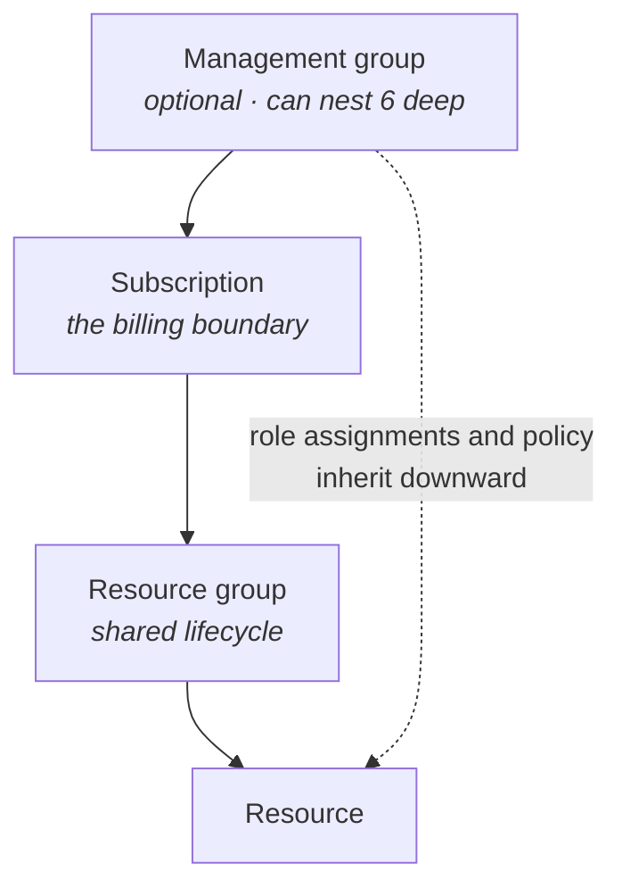
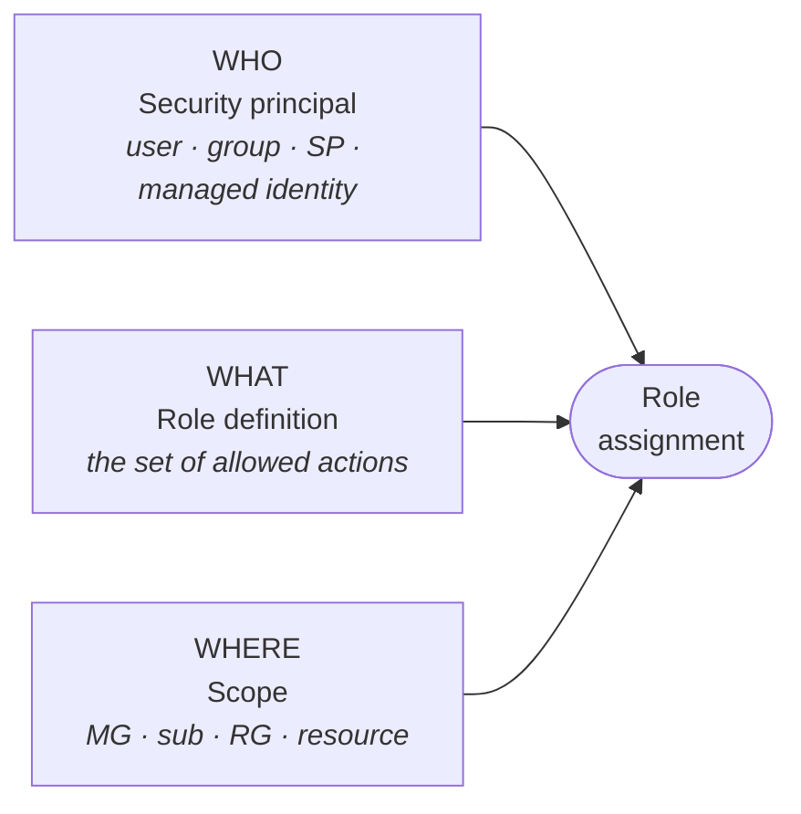
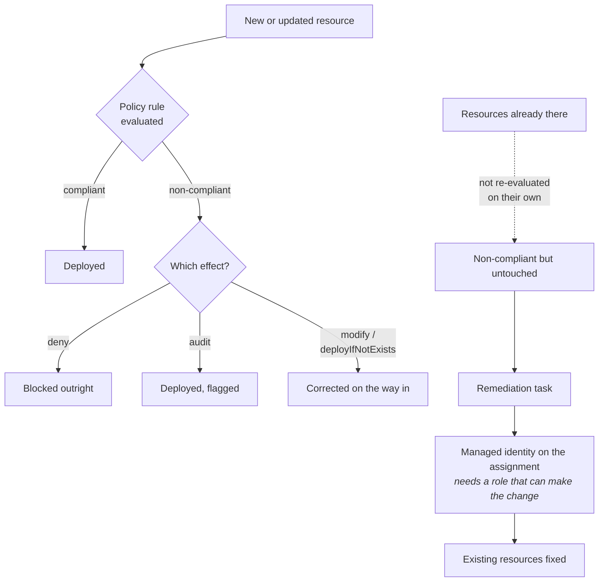

# 02 - Governance and Compliance

> [!abstract] In one line
> RBAC decides **who can press the button**. Policy decides **what the button is allowed to do**.

**Labs:** [[LAB 02a - Manage Subscriptions and RBAC]] · [[LAB 02b - Manage Governance via Azure Policy]]
**Course index:** [[AZ-104 Course Index]]

---

## 1. Choosing a region

Four things drive the decision:

| Factor | Why it matters |
| --- | --- |
| **Latency** | Put the resource near the users or the systems it talks to |
| **Cost** | The same SKU is priced differently region to region |
| **Data residency** | Legal and regulatory limits on where data may physically sit |
| **Availability** | Not every service, VM size or feature exists in every region |

---

## 2. The management hierarchy

Four scopes, each inheriting from the one above it:

| Scope | What it's for |
| --- | --- |
| **Management group** | Groups subscriptions so a policy or role assignment can be applied once and inherited by all of them |
| **Subscription** | The billing boundary — separate subscriptions separate the invoice, e.g. per customer, per environment |
| **Resource group** | Groups resources that share a **lifecycle** — deploy together, delete together. Also just good organisation |
| **Resource** | The thing itself |

> [!important] Everything inherits downward
> A role assignment or policy set at any scope flows down to everything beneath it. That is the whole reason the hierarchy exists — and the reason a mistake at the top is expensive.

### The root management group

Every tenant has one. It is what ties the Azure side to the Entra tenant.

![[Pasted image 20260914135554.png]]
*Tenant Root Group with the AZUREPLAN subscription under it — this is there by default.*

Facts worth remembering:

- Display name is **"Tenant Root Group"**; its **ID is the Entra tenant ID**.
- It **cannot be moved or deleted**. Every other management group can.
- New subscriptions land under it automatically.
- **Nobody has access to it by default** — a Global Administrator has to elevate themselves first, then assign roles.
- Anything assigned here hits **every resource in the directory**. Only put "must have" things at this scope.

### Nesting limits

| Limit | Value |
| --- | --- |
| Depth below the root | **6 levels** (not counting the root or the subscription level) |
| Management groups per directory | 10,000 |
| Parents per management group or subscription | **1** — many children, one parent |

> [!warning] Easy to misremember
> It is **six levels of depth below the root** — root plus six, not seven. The exam phrases it as six.

### Quotas

Limits on how much of a thing you can deploy — VM cores, public IPs, storage accounts. They're **per region, per subscription**. Hit one and you raise a support request for a quota increase.

The point of them is fair allocation of capacity: they stop a handful of large customers consuming a region's capacity and locking everyone else out. They are not a billing limit.

---

## 3. Role-Based Access Control (RBAC)

### Who / What / Where

A role assignment is always three things:

| | Component | Example |
| --- | --- | --- |
| **Who** | **Security principal** | User, group, service principal, or managed identity |
| **What** | **Role definition** | Contributor, Reader, Virtual Machine Contributor — the set of permitted *actions* |
| **Where** | **Scope** | Management group, subscription, resource group, or a single resource |

> [!warning] Don't confuse What with Where
> Resource groups, VMs and NICs are the **Where** — the scope. The **What** is the *role definition*, the list of actions. Keeping them separate matters: the same role assigned at a different scope is a completely different level of access.

### Built-in roles

| Role | Can do | Cannot do |
| --- | --- | --- |
| **Owner** | Everything, **including assigning roles to others** | — |
| **Contributor** | Create and manage all resource types | **Assign roles**, manage policy assignments or definitions, cancel subscriptions |
| **Reader** | View everything in scope | Change anything |
| **User Access Administrator** | Manage who has access — full `Microsoft.Authorization/*` | Manage the resources themselves |
| **Role Based Access Control Administrator** | Create and delete role assignments, plus read | Anything else |

> [!warning] Not just Owner
> **Three** roles can create role assignments: Owner, User Access Administrator, and RBAC Administrator. The exam likes User Access Administrator specifically — it's the answer to "grant access without granting control of the resources".

### Custom roles

When no built-in role fits, build one from the thousands of granular actions available (`Microsoft.Compute/virtualMachines/start/action` and so on).

| Property | Meaning |
| --- | --- |
| `Actions` | Control-plane operations allowed |
| `NotActions` | Subtracted from `Actions` |
| `DataActions` | Data-plane operations (e.g. read a blob's contents) |
| `NotDataActions` | Subtracted from `DataActions` |
| `AssignableScopes` | Where this role is allowed to be assigned |

Easiest route: clone an existing built-in role and edit it.

---

## 4. Azure Policy

Guardrails. Where RBAC controls **who** can act, Policy controls **what the result is allowed to look like**.

> RBAC says you can press the button. Policy says how and why you can press it.

Worked example: RBAC lets someone create VMs. Policy says *not that size*, *not in that region*, and *not without an owner tag*.

![[Pasted image 20260914151212.png|543]]
*Policy > Definitions, searching "allowed locations" — built-in definitions restricting which regions resources can be created in.*

### Definitions, initiatives, assignments

| Term | What it is |
| --- | --- |
| **Policy definition** | One rule — the condition and the effect |
| **Initiative** (policy set) | A bundle of definitions assigned and reported on as one thing |
| **Assignment** | A definition or initiative applied at a scope, with parameters and optional exclusions |

### Effects

| Effect | What happens |
| --- | --- |
| `deny` | Blocks the create/update outright |
| `audit` | Allows it, flags it as non-compliant |
| `append` | Adds properties to the request as it comes in |
| `modify` | Adds, updates or removes properties — including tags |
| `deployIfNotExists` | Deploys a related resource if it's missing (e.g. a diagnostic setting) |
| `auditIfNotExists` | Flags non-compliance based on a missing child or extension resource |
| `denyAction` | Blocks a specific *action* (e.g. delete) on an already-compliant resource |
| `manual` | Compliance attested by a human, not evaluated automatically |
| `disabled` | Turns the rule off without unassigning it |

Evaluation order: `disabled` → `append`/`modify` → `deny` → `audit` → `manual` → `auditIfNotExists` → `denyAction`.

### Remediation

Policy normally only evaluates when a resource is **created or updated**. Everything already sitting there is non-compliant but untouched — which is where remediation comes in.

The classic case is **tags**: a resource group has an owner tag, the VMs inside it don't, because nobody remembered. A `modify` policy plus a **remediation task** goes back and fixes the existing ones.

How it works:

1. The assignment uses a `deployIfNotExists` or `modify` effect.
2. Those two effects **require a managed identity** on the assignment — that's the account that performs the fix.
3. That identity needs a role with enough permission to make the change (Contributor, or Tag Contributor for tag work).
4. You then trigger a **remediation task** against existing non-compliant resources.

> [!tip] The real value
> This is how you make an optional setting mandatory. Anything people routinely forget — tags, diagnostic settings, backup, encryption — Policy can enforce going forward and remediate retrospectively.

---

## Still to cover

- [ ] Resource locks (ReadOnly vs CannotDelete, inheritance, interaction with RBAC)
- [ ] Tags in depth — inheritance behaviour, tag limits, enforcing with Policy
- [ ] Cost management — budgets, cost alerts, Azure Advisor
- [ ] Entra ID roles vs Azure RBAC roles — two separate systems

## Exam objective coverage

- [x] Configure management groups
- [x] Manage subscriptions
- [x] Manage resource groups
- [x] Manage built-in Azure roles
- [x] Assign roles at different scopes
- [x] Implement and manage Azure Policy
- [x] Interpret access assignments
- [x] Configure resource locks
- [x] Apply and manage tags on resources
- [x] Manage costs by using alerts, budgets and Azure Advisor recommendations

## Recall check

1. Name the four scopes in the hierarchy, and state which direction inheritance flows.
2. How deep can the management group tree go, and how many parents can a management group have?
3. What is the root management group called, what is its ID, and who has access to it by default?
4. What are the three components of a role assignment? Which of them is the role definition and which is the scope?
5. Which built-in roles can create a role assignment? Which one grants access without granting control of the resources?
6. Give the one-line difference between RBAC and Azure Policy.
7. Which two policy effects require a managed identity on the assignment, and why?
8. A policy is assigned and 200 existing VMs are non-compliant. What do you have to do to fix them?

## References

- [Management groups overview](https://learn.microsoft.com/en-us/azure/governance/management-groups/overview)
- [Azure built-in roles](https://learn.microsoft.com/en-us/azure/role-based-access-control/built-in-roles)
- [Privileged built-in roles](https://learn.microsoft.com/en-us/azure/role-based-access-control/built-in-roles/privileged)
- [Azure Policy effect basics](https://learn.microsoft.com/en-us/azure/governance/policy/concepts/effect-basics)
- [Remediate non-compliant resources](https://learn.microsoft.com/en-us/azure/governance/policy/how-to/remediate-resources)
