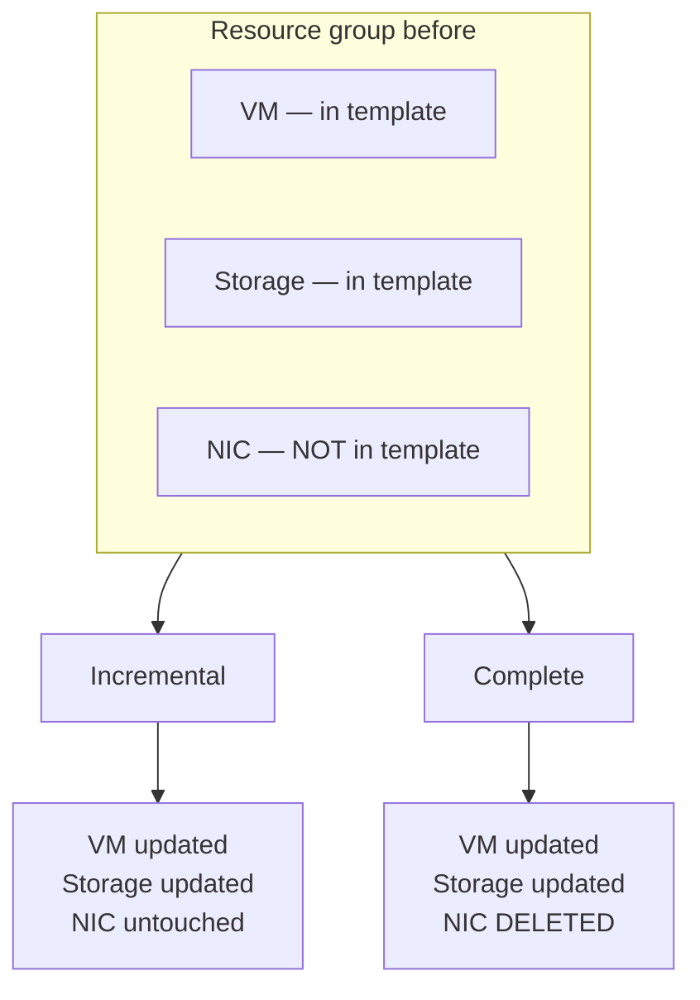
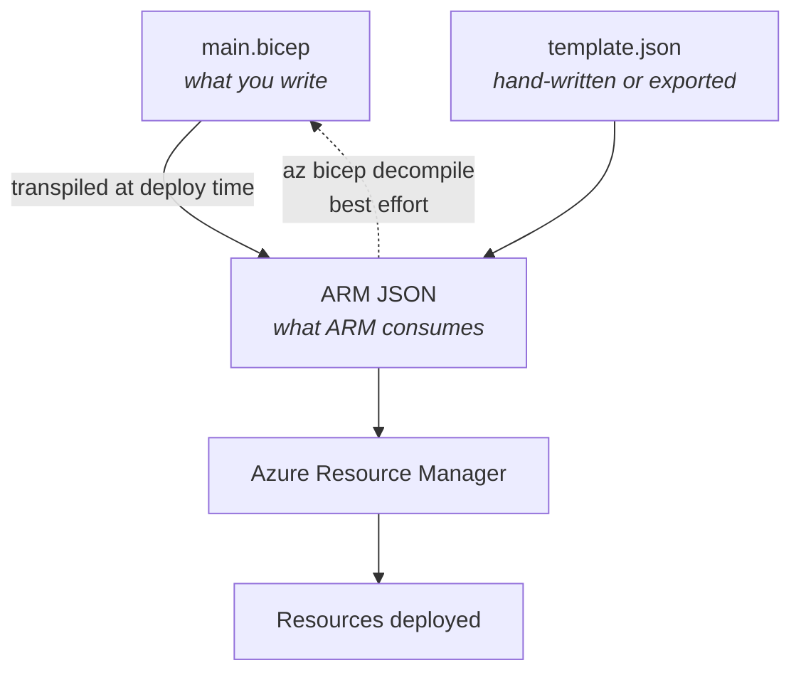

# 03 - Administer Azure Resources

> [!abstract] In one line
> The portal is fine for one thing at a time. Code is how you do the same thing a hundred times, identically, and prove what you did.

**Lab:** [[LAB 03 - Manage Azure Resources with ARM Templates]]
**Course index:** [[AZ-104 Course Index]]

---

## 1. Ways to administer Azure

| Tool | Syntax | Runs on | Notes |
| --- | --- | --- | --- |
| **Azure portal** | GUI | Browser | One resource at a time; good for discovery, poor for repetition |
| **Azure CLI** | `az ...` (Bash-friendly) | Windows, macOS, Linux | Cross-platform, tab completion, JSON output by default |
| **Azure PowerShell** | `Az` module cmdlets, `Verb-AzNoun` | Windows, macOS, Linux | Object pipeline; natural if you already live in PowerShell |
| **Cloud Shell** | Bash **or** PowerShell | Browser / portal / `shell.azure.com` | Pre-authenticated, pre-installed tooling, nothing to set up locally |
| **ARM templates / Bicep** | Declarative JSON / Bicep | Anywhere | Repeatable, reviewable, source-controllable |

> [!tip] The real point
> Doing things one by one in the portal is fine while you are learning. The value of CLI, PowerShell and templates is **mass change** — same operation, many resources, no drift, and an audit trail.

---

## 2. ARM templates

An **Azure Resource Manager template** is a declarative definition of a resource, in JSON. Think of it as the portal's creation form, written out in text.

### Structure

| Element | Purpose |
| --- | --- |
| `$schema` | Which template language version this is |
| `contentVersion` | Your own version stamp |
| **`parameters`** | Values supplied at deploy time — names, locations, SKUs, environment |
| `variables` | Values computed once inside the template |
| `functions` | Custom reusable expressions |
| **`resources`** | What actually gets deployed |
| `outputs` | Values returned after deployment (IPs, connection strings, resource IDs) |

| Term | Plain English |
| --- | --- |
| **Template** | The definition of the resource — the form itself, written as text |
| **Parameters** | The bits that change per deployment: name, region, size, environment |

### Deployment scopes

A template can target a **resource group** (most common), a **subscription**, a **management group**, or the **tenant**.

### Deployment modes

| Mode | Behaviour |
| --- | --- |
| **Incremental** (default) | Adds or updates what is in the template; leaves anything else in the resource group alone |
| **Complete** | Anything in the resource group **not** in the template is **deleted** |



> [!warning] Complete mode deletes
> Complete mode is the one that bites people. If a resource exists in the resource group but not in your template, it is removed. Run `what-if` first.

### Exporting a template

Two places:

- **Resource group > Automation > Export template** — reverse-engineers what exists. Useful, but generic: names get hard-coded, some properties are omitted, and it usually needs cleaning before reuse.
- **Resource group > Deployments > [a deployment] > Template** — the template *as submitted*, with the parameter file alongside it. More faithful.

---

## 3. Bicep

JSON is machine-readable, and that is exactly the problem — it is verbose and awkward for humans. **Bicep** is the next-generation authoring language that fixes this.

| | **ARM JSON** | **Bicep** |
| --- | --- | --- |
| Readability | Verbose, heavy punctuation | Concise, minimal syntax |
| Dependencies | Declared manually with `dependsOn` | Mostly inferred automatically |
| Modularity | Linked/nested templates | First-class `module` keyword |
| Type safety | Limited | IntelliSense and validation in VS Code |
| Learning curve | Steeper | Gentler |
| State file | None | None (Azure itself is the state) |



**How it actually works:** Azure Resource Manager only ever consumes JSON. Bicep is **transpiled to ARM JSON in the background** at deploy time. Anything you can do in ARM JSON you can do in Bicep, and new resource types are supported on day one.

> [!note] Import vs export
> The portal will **not export Bicep** — export always gives you JSON. You can go the other way at the command line:
> ```bash
> az bicep decompile --file template.json   # JSON -> Bicep (best effort, needs tidying)
> az bicep build --file main.bicep          # Bicep -> JSON
> ```

### Deploying either format

```bash
# Azure CLI
az deployment group create \
  --resource-group az104-rg \
  --template-file main.bicep \
  --parameters @main.parameters.json

# Preview the change set before committing
az deployment group what-if \
  --resource-group az104-rg \
  --template-file main.bicep
```

```powershell
# Azure PowerShell
New-AzResourceGroupDeployment `
  -ResourceGroupName az104-rg `
  -TemplateFile main.bicep `
  -TemplateParameterFile main.parameters.json
```

---

## 4. Copilot in Azure

Copilot is available inside the Azure portal and can help with authoring and orientation:

- Generate or explain Bicep and ARM JSON
- Draft CLI and PowerShell commands
- Explain a resource's configuration or a cost spike
- Point you at the right blade

> [!important] It assists, it does not act
> Copilot **will not perform deployments or changes for you**. It produces the code or the command; you review it and run it. Treat its output as a first draft that still needs checking against the docs.

---

## Exam objective coverage

- [ ] Interpret an ARM template or a Bicep file
- [ ] Modify an existing ARM template
- [ ] Modify an existing Bicep file
- [ ] Deploy resources by using an ARM template or a Bicep file
- [ ] Export a deployment as an ARM template, or convert ARM JSON to Bicep

## Recall check

1. Name the seven top-level elements of an ARM template.
2. What is the difference between incremental and complete deployment mode, and which is the default?
3. Which direction can the portal convert between JSON and Bicep — and what is the CLI command for the other direction?
4. Which command previews a deployment without applying it?
5. At which four scopes can a template be deployed?
6. What does Copilot in Azure explicitly not do?

## References

- [ARM template structure and syntax](https://learn.microsoft.com/en-us/azure/azure-resource-manager/templates/syntax)
- [What is Bicep?](https://learn.microsoft.com/en-us/azure/azure-resource-manager/bicep/overview)
- [Deployment modes](https://learn.microsoft.com/en-us/azure/azure-resource-manager/templates/deployment-modes)
- [Export templates](https://learn.microsoft.com/en-us/azure/azure-resource-manager/templates/export-template-portal)
