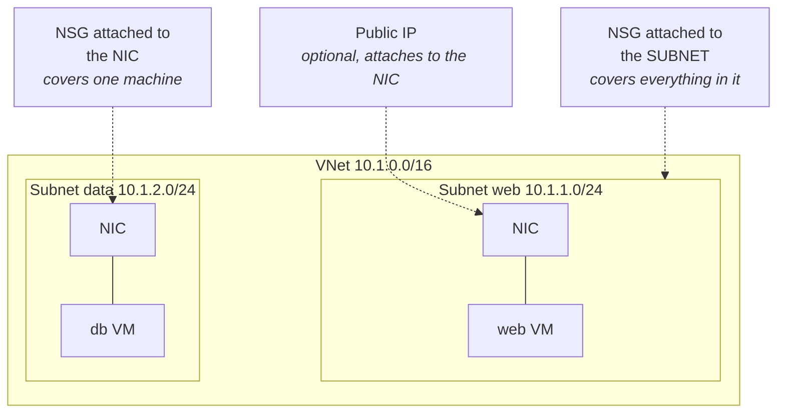
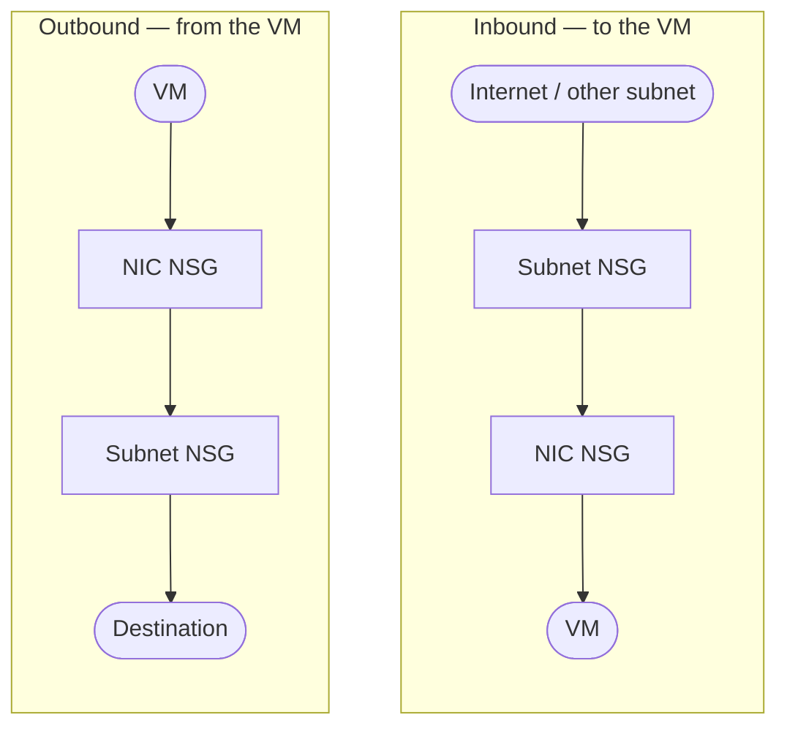

# 04 - Virtual Networking

> [!abstract] In one line
> A VNet is your private address space in Azure. Everything else in this module is either carving it up (subnets), controlling what crosses the boundaries (NSGs, ASGs), or resolving names inside it (DNS).

**Lab:** [[LAB 04 - Implement Virtual Networking]]
**Course index:** [[AZ-104 Course Index]]

---

## 1. Public vs private addressing

| | Public IP | Private IP (VNet) |
| --- | --- | --- |
| Reachable from | The internet | Inside the VNet, peered VNets, and connected on-prem networks |
| Resource type | Its own Azure resource, attached to a NIC, load balancer or gateway | Allocated from the subnet range |
| Example | — | VNet `10.1.0.0/16`, subnet `10.1.1.0/24` |

You **can** attach a public IP straight to a VM, but it's bad practice — it puts the management ports on the open internet and every exposed VM becomes its own attack surface to patch and monitor.

The alternatives, in rough order of preference:

- **Azure Bastion** — managed RDP/SSH through the portal over TLS, no public IP on the VM at all.
- **A load balancer or Application Gateway** in front, with the VMs private behind it.
- **VPN or ExpressRoute** for administrative access from a trusted network.

---

## 2. VNets and subnets

A **VNet** is a private address space. A **subnet** is a portion of it.

| | CIDR | Total addresses | Usable |
| --- | --- | --- | --- |
| VNet | `10.1.0.0/16` | 65,536 | — |
| Subnet | `10.1.1.0/24` | **256** | **251** |

> [!warning] Count carefully
> A `/24` is **256** addresses total, not 255, and a `/16` is **65,536**. More importantly, only **251** of that 256 are usable, because Azure reserves five in every subnet.

### The five reserved addresses

For `10.1.1.0/24`:

| Address | Reserved for |
| --- | --- |
| `10.1.1.0` | Network address |
| `10.1.1.1` | Default gateway |
| `10.1.1.2` | Azure DNS mapping |
| `10.1.1.3` | Azure DNS mapping |
| `10.1.1.255` | Broadcast |

### Sizing limits

| | Value |
| --- | --- |
| Smallest subnet | `/29` (8 addresses, **3 usable**) |
| Largest subnet | `/2` |
| IPv6 subnets | Exactly `/64` |

> [!important] You can't resize a subnet in use
> A subnet's range can only be added, removed, expanded or shrunk while **nothing is deployed in it**. Plan the address space before you build, not after — the fix otherwise is redeploying everything in that subnet.

Subnets also can't overlap each other, and a VNet's address space shouldn't overlap anything you might later peer with or connect back to on-prem.

### How a VM attaches

A VM doesn't connect to the VNet directly — it has a **NIC** (network interface), and the NIC lives in a subnet. The NIC is where the private IP, any public IP, the NSG association and the DNS settings all hang off.

> [!important] IP configuration is done in Azure, not in the guest OS
> Never set a static IP inside the VM's own OS. Azure hands out addresses via its own DHCP and expects to be authoritative; setting it in the guest desynchronises the two and the VM loses connectivity. Make it static **on the NIC, in Azure** instead.

---

## 3. Segmentation

The worked example: a web VM reachable from the internet, talking to a database VM behind it.

| Approach | Result |
| --- | --- |
| Both VMs in the **same subnet** | Anything that compromises the web VM is already adjacent to the database. Less safe. |
| Database in its **own subnet**, NSG between them | Lateral movement has to cross a filtering boundary you control. This is the pattern. |

The rule of thumb: subnet by **trust tier and traffic pattern**, not by convenience. Web / app / data as separate subnets, with NSGs allowing only the specific port each tier needs from the tier in front of it.

### What Azure manages for you inside a VNet

This is what "managed routing, managed DHCP, managed service" means — three platform services you get automatically and never build:

| Service | What you get | What you can change |
| --- | --- | --- |
| **Routing** | **System routes** are created automatically: every subnet can reach every other subnet in the VNet, plus routes for internet, peerings and gateways | Override with **user-defined routes (UDRs)** in a route table — e.g. force traffic through a firewall appliance |
| **DHCP** | Azure leases addresses to every NIC from the subnet range. No DHCP server to build | Set the NIC's allocation to static (still in Azure, not the guest) |
| **DNS** | Azure-provided recursive DNS on the reserved platform address `168.63.129.16`, resolving VM names within a VNet | Point the VNet or NIC at custom DNS servers, or use Private DNS zones |

That platform address `168.63.129.16` is worth memorising — it's also the source of load balancer health probes and the VM agent's communication channel, so it turns up in NSG and firewall questions.

---

## 4. Network Security Groups (NSGs)

A distributed, stateful packet filter — effectively a firewall at the subnet or NIC boundary. Rules match on **source, source port, destination, destination port, protocol**, and either allow or deny.

> [!warning] NSGs filter, they do not route
> Routing is system routes and **UDRs** — see the table above. Worth keeping separate — the exam tests both and the distinction is the point.

### Default rules

Every NSG arrives with three inbound and three outbound rules that mirror what the platform is doing underneath. They can't be deleted, only overridden by a lower-numbered rule.

**Inbound**

| Priority | Name | Source → Destination | Action |
| --- | --- | --- | --- |
| 65000 | AllowVNetInBound | VirtualNetwork → VirtualNetwork | Allow |
| 65001 | AllowAzureLoadBalancerInBound | AzureLoadBalancer → Any | Allow |
| 65500 | DenyAllInBound | Any → Any | **Deny** |

**Outbound**

| Priority | Name | Source → Destination | Action |
| --- | --- | --- | --- |
| 65000 | AllowVnetOutBound | VirtualNetwork → VirtualNetwork | Allow |
| 65001 | AllowInternetOutBound | Any → Internet | Allow |
| 65500 | DenyAllOutBound | Any → Any | **Deny** |

Net effect out of the box: everything inside the VNet can talk to everything else, outbound internet is open, inbound from the internet is closed.

### Priority

- Valid range **100–4096**. Lower number = evaluated first.
- **First match wins, then processing stops.** A rule further down that would have denied the traffic is never reached.
- Leave room. Starting at 100 gives you nowhere to insert a rule that must run before it — start at 200 or 1000 and space them out.

> [!warning] "Deny always wins" is only half true
> It holds **across** two NSGs, but not **within** one. Inside a single NSG it's first-match-wins by priority, so an allow at 200 beats a deny at 300. The "deny wins" rule applies when a subnet NSG and a NIC NSG both apply — see below.

### Association

An NSG does nothing until it's associated with:

- a **subnet** — covers everything in it, so one NSG for many machines, or
- a **NIC** — covers that one machine.

You can have both at once. When you do:

Both hops must allow the traffic, so the effective rule is the **more restrictive** of the two.

| Direction | Order | Result |
| --- | --- | --- |
| **Inbound** (to the VM) | Subnet NSG → NIC NSG | Must be allowed by **both** |
| **Outbound** (from the VM) | NIC NSG → Subnet NSG | Must be allowed by **both** |

So the effective permission is the **more restrictive** of the two, and a deny at either level blocks the traffic. That is where "deny wins" is correct.

> [!note] Rules only affect new connections
> Removing an allow rule doesn't kill established sessions — NSGs are stateful and only evaluate new connections.

---

## 5. Application Security Groups (ASGs)

A different way to group NICs — by **role**, rather than by where they sit in the address space.

You tag NICs into an ASG (`asg-web`, `asg-db`), then write NSG rules with the ASG as source or destination instead of an IP range or subnet. "Allow `asg-web` → `asg-db` on 1433" stays correct however the machines are addressed.

Why it beats filtering on subnets:

- The VMs can be in **different subnets** and still be grouped.
- Adding a new server means putting its NIC in the ASG — no rule edits, no IP ranges to maintain.
- Rules read as intent ("web to database") rather than as arithmetic.

Both ASGs in a rule must be in the same VNet.

---

## 6. Troubleshooting with Network Watcher

| Tool | Answers |
| --- | --- |
| **NSG diagnostics** | Given this source, destination and port — is it allowed or denied, and by **which rule**? The forensic one. |
| **IP flow verify** | Quick allow/deny check for a single 5-tuple against a VM |
| **Effective security rules** | The combined, flattened rule set actually applied to a NIC (subnet + NIC NSGs merged) |
| **Next hop** | Where does traffic to this destination actually go? Catches routing problems rather than filtering ones. |
| **Connection troubleshoot** | End-to-end reachability test between two endpoints |
| **Packet capture** | Capture on the VM when you need the actual traffic |

Rough diagnostic order: **effective security rules** or **NSG diagnostics** if you suspect filtering, **next hop** if you suspect routing.

---

## 7. Azure DNS

DNS resolves names to IP addresses and back — forward lookup (name → IP) and reverse lookup (IP → name). In Azure there are three ways to get it.

### Azure-provided DNS (the default)

- Works out of the box, no configuration, no cost.
- VMs **in the same VNet** resolve each other by hostname automatically.
- Resolves public internet names too.
- **Cannot** resolve on-premises names, and **cannot** resolve across VNets — that's the limitation that pushes you to the other two options.

### Custom DNS servers

Build a DNS VM (or point at your existing on-prem DNS), then change the VNet's DNS setting from "Azure provided" to your own server addresses.

Costs you a VM to run, patch and make highly available, but it gives you full control and on-prem resolution.

### Azure Private DNS zones (the managed answer)

A managed private zone, chargeable per zone and per query, that fixes the cross-VNet problem:

| Feature | What it gives you |
| --- | --- |
| **Virtual network links** | Link the **same zone to many VNets** — one DNS namespace across the estate, rather than one resolution island per VNet |
| **Auto-registration** | Enable it on a link and VMs in that VNet register their own records automatically, updating when the IP changes. (This is the "dynamic DNS" behaviour — the record follows the machine.) |
| **Private Link integration** | Private endpoints get their zone records created for you, so the PaaS service's public name resolves to a private IP |
| **Split-horizon** | The same name can resolve differently inside the VNet than it does publicly |

### Public DNS zones

The other half of Azure DNS: host a real internet-facing domain's records (`contoso.com`) on Azure's name servers. You delegate the domain to Azure by pointing the registrar at the NS records Azure gives you. Azure DNS does **not** sell or register domains.

### Getting to on-premises

> [!tip] The modern answer is not a forwarder VM
> Adding a forwarder used to mean standing up a DNS forwarder VM. The managed replacement is **Azure DNS Private Resolver**:
>
> - **Inbound endpoint** — on-prem DNS conditionally forwards *into* Azure to resolve private zones and private endpoints.
> - **Outbound endpoint** — Azure resolves *out* to on-prem DNS. Needs its own dedicated subnet.
> - **Forwarding ruleset** — the rules saying "`corp.local` goes to these on-prem servers", linked to the VNets that should use them. Longest suffix match wins.
>
> No VM to patch, zone-redundant, and a fraction of the cost of running DNS VMs.

---

## Still to cover

- [ ] Azure Bastion in detail
- [ ] Public IP SKUs — Basic vs Standard, static vs dynamic allocation
- [ ] User-defined routes and route tables in depth (also [[05 - Intersite Connectivity]])
- [ ] Service endpoints vs private endpoints for PaaS
- [ ] Azure Firewall vs NSG — when each applies

## Exam objective coverage

- [x] Create and configure virtual networks and subnets
- [x] Create and configure NSGs and application security groups
- [x] Evaluate effective security rules in NSGs
- [x] Configure Azure DNS
- [x] Troubleshoot network connectivity
- [x] Configure public IP addresses
- [ ] Configure user-defined routes
- [ ] Implement Azure Bastion
- [ ] Configure service endpoints for Azure PaaS
- [ ] Configure private endpoints for Azure PaaS

## Recall check

1. How many addresses does Azure reserve per subnet, which ones are they, and how many are usable in a `/24`?
2. What is the smallest subnet Azure supports, and how many usable addresses does it give you?
3. A subnet is too small and has VMs in it. What are your options?
4. Name the three default inbound NSG rules and their priorities. What is the net effect out of the box?
5. Within a single NSG, does an allow at priority 200 or a deny at priority 300 win? What about an allow on the NIC NSG and a deny on the subnet NSG?
6. Inbound traffic to a VM — which NSG is evaluated first, the subnet's or the NIC's? And outbound?
7. Why use an ASG instead of writing rules against subnet ranges?
8. What is `168.63.129.16` and why does it matter for NSG rules?
9. Two VMs in different VNets need to resolve each other by name. What are your options and which is the managed one?
10. Which Network Watcher tool tells you *which specific rule* blocked a connection?

## References

- [Azure Virtual Network FAQ — reserved addresses, subnet sizes, DHCP](https://learn.microsoft.com/en-us/azure/virtual-network/virtual-networks-faq)
- [Network security groups overview](https://learn.microsoft.com/en-us/azure/virtual-network/network-security-groups-overview)
- [Application security groups](https://learn.microsoft.com/en-us/azure/virtual-network/application-security-groups)
- [Azure Private DNS zones overview](https://learn.microsoft.com/en-us/azure/dns/private-dns-overview)
- [Azure DNS Private Resolver overview](https://learn.microsoft.com/en-us/azure/dns/dns-private-resolver-overview)
- [Network Watcher overview](https://learn.microsoft.com/en-us/azure/network-watcher/network-watcher-overview)
