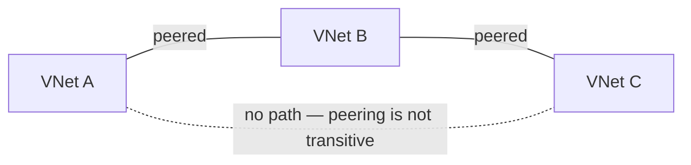
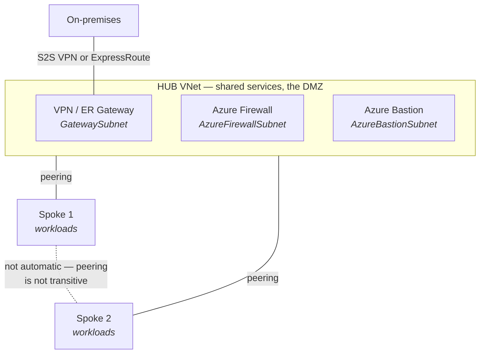
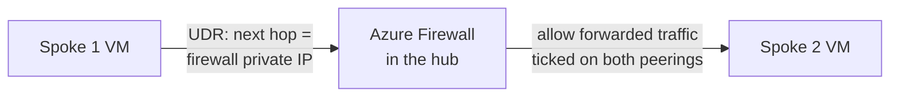

# 05 - Intersite Connectivity

> [!abstract] In one line
> VNets are islands by default. This module is the four bridges: **peering** (VNet to VNet), **VPN** (over the internet), **ExpressRoute** (private circuit), and the **routing** that makes traffic actually take them.

**Lab:** [[LAB 05 - Implement Intersite Connectivity]]
**Course index:** [[AZ-104 Course Index]]

---

## 1. VNet peering

Two VNets — same region or different, same subscription or different, even different tenants — are **fully isolated by default**. Peering joins them so resources talk over the Microsoft backbone using private IPs, as if they were one network.

| | |
| --- | --- |
| **Regional peering** | Both VNets in the same region |
| **Global peering** | VNets in different regions |
| Traffic path | Microsoft backbone — never the public internet |
| Bandwidth | No gateway, no bandwidth cap, low latency |
| Address spaces | **Must not overlap** |
| Cost | Charged per GB in **and** out |

### It's two links, not one

Peering establishes a pathway there and back, and the mechanism is worth being precise about: it is **two separate peering resources**, one on each VNet. The portal creates both for you when you have rights on both sides; if you only have rights on one, someone has to create the other half before the state moves from *Initiated* to **Connected**.

If a peering shows *Disconnected*, it's because one side was deleted. You can't fix it by editing the surviving side — delete and recreate both.

### Peering options

Four checkboxes, and they're where the exam lives:

| Option | What it does |
| --- | --- |
| **Allow access to remote virtual network** | The basic on/off for traffic between the two |
| **Allow forwarded traffic** | Accept traffic that *originated elsewhere* and was forwarded by an NVA or firewall in the peer. Required for hub-spoke through a firewall. |
| **Allow gateway transit** | Set on the **hub**: "spokes may use my VPN/ExpressRoute gateway" |
| **Use remote gateways** | Set on the **spoke**: "I will use the hub's gateway". The spoke cannot have its own gateway as well. |

> [!important] Peering is NOT transitive
> This is the single most-tested fact here. If **A ↔ B** and **B ↔ C** are peered, **A cannot reach C**. There is no automatic path.

Three ways round it:

1. **Peer A ↔ C directly** — fine for a handful of VNets, ugly at scale because it's a full mesh
2. **Route through an NVA or Azure Firewall in B** — a UDR in A pointing at the firewall's private IP, plus **allow forwarded traffic** on the peerings
3. **Azure Virtual WAN** — managed transitive hub-and-spoke, the answer at real scale

### Testing it

**Network Watcher → Next hop** tells you whether traffic to the remote VNet is actually being handed to the peering. If the next hop type comes back as `VNetPeering` (or `VirtualNetworkGateway`), routing is right and anything still broken is an NSG problem — check **effective security rules** next.

---

## 2. Hub and spoke

The reason you have multiple VNets is usually regions, environments (prod/dev/test), or business units. Hub-and-spoke is the standard way to organise them.

The **hub** holds the shared services every spoke needs — the gateway to on-prem, Azure Firewall, Bastion, DNS. The **spokes** hold the actual workloads and own nothing shared.

> [!note] The hub is not itself a jump box
> The **hub is a shared-services VNet**. **Bastion**, sitting in the hub, is the thing that does the jump-box job. The hub's other jobs — egress filtering through the firewall, one gateway shared by all spokes — have nothing to do with administrative access.

The hub is effectively the **DMZ**: it's where the public IPs live (on the firewall and Bastion), so the spokes need none.

### Why it's worth doing

- One firewall, one gateway, one Bastion — paid for and managed once, not per spoke.
- Public IP surface is concentrated in one place you can actually watch.
- Spokes are cheap to add and can be torn down without touching shared plumbing.

### Making spoke → spoke work

Because peering isn't transitive, Spoke 1 cannot reach Spoke 2 out of the box even though both are peered to the hub. To fix it:

1. **Azure Firewall** in the hub's `AzureFirewallSubnet`.

2. A **route table** on each spoke subnet: `0.0.0.0/0` (or the other spoke's range) → next hop type **Virtual appliance**, next hop = the firewall's private IP.
3. **Allow forwarded traffic** ticked on the hub side of both peerings.

### Letting spokes use the hub's gateway

1. **Allow gateway transit** on the hub's peering to the spoke.
2. **Use remote gateways** on the spoke's peering to the hub.
3. The spoke must not have a gateway of its own.

---

## 3. Azure Bastion

Managed RDP and SSH **over HTTPS (TCP 443)**, delivered in the browser through the Azure portal.

| | |
| --- | --- |
| Target VM needs a public IP | **No** |
| Target VM needs an agent | **No** |
| Client software needed | **No** — browser is enough (Standard SKU also allows the native client) |
| Ports open inbound on the VM | None from the internet — Bastion reaches it on its private IP |
| Placed in the hub | Yes — it reaches VMs in peered spokes over the peering |

> [!warning] 20 is per instance, not per deployment
> **20 is the per-instance figure, and it is RDP-specific.**
>
> | SKU | Instances | Max RDP | Max SSH |
> | --- | --- | --- | --- |
> | Developer | 1 (shared) | 1 | 1 |
> | **Basic** | 2 (fixed) | **40** | 80 |
> | Standard / Premium | 2–50 (you choose) | up to 1,000 | up to 2,000 |
>
> Each instance carries **20 RDP / 40 SSH**. Basic is fixed at two instances so it gives 40 RDP — but it cannot scale further. Host scaling needs Standard or above.

Standard adds native client support, shareable links, IP-based connection and file transfer; Premium adds session recording and private-only deployment.

---

## 4. Connecting to on-premises

The gateway lives in the hub. Two technologies, three connection types.

### Connection types

| Type | Connects | Far end needs | Protocol |
| --- | --- | --- | --- |
| **Site-to-site (S2S)** | A whole on-prem **site** to a VNet | An on-prem **VPN device / router** with a public IP | IPsec / IKE |
| **Point-to-site (P2S)** | One **user's device** to a VNet | VPN **client software** on that machine | OpenVPN, IKEv2, or SSTP |
| **VNet-to-VNet** | Two VNets | Another Azure VPN gateway | IPsec / IKE |

> [!tip] The router version — S2S vs P2S
> A router at the far end is exactly the **S2S vs P2S** distinction, and it is the practical difference between them:
>
> - **P2S** scales by *person*. Each laptop installs a client and gets its own tunnel. Good for remote admins and small numbers; no on-prem kit required, so it works from a hotel or from home.
> - **S2S** scales by *site*. One IPsec tunnel is built between your on-prem **router or firewall** and the Azure VPN gateway, and **every machine behind that router** is connected without knowing anything about it. This is the office-to-Azure case, and it's the one that looks like the WatchGuard BOVPNs at work.
>
> You can run both on the same gateway. Once connected, either can reach peered spokes provided gateway transit is configured.

### VPN gateway essentials

- Lives in a subnet that **must be named `GatewaySubnet`**. Minimum `/29` (Basic only); **`/27` or larger recommended** for everything else.
- **Route-based** is the modern type and what you want — supports IKEv2, P2S, and multiple tunnels. **Policy-based** is legacy, Basic SKU, IKEv1, single tunnel, and **cannot be converted** — you delete and recreate.
- **Active-passive** by default: two instances, one serving, failover on fault. **Active-active** runs both with two public IPs and two tunnels, for higher availability at the same price.
- Deploying a gateway is slow — budget **20–45 minutes**. Worth starting early in a lab.

### ExpressRoute

A **private circuit** from your network into Microsoft via a connectivity provider.

| | VPN gateway (S2S) | ExpressRoute |
| --- | --- | --- |
| Path | Encrypted tunnel **over the public internet** | **Private circuit — never touches the internet** |
| Bandwidth | Up to ~10 Gbps depending on SKU | 50 Mbps – 10 Gbps, resizable without a rebuild |
| Latency | Variable — internet conditions | Consistent and predictable |
| SLA | Yes | Yes, with built-in redundancy (dual connections to two Microsoft edge routers at every peering location) |
| Cost & lead time | Cheap, up in minutes | Expensive, weeks to provision via a carrier |
| Reaches | Azure | Azure **and** Microsoft 365 services |

**Peering types on a circuit:**

| Peering | Carries |
| --- | --- |
| **Private peering** | Traffic to your VNets — the IaaS case |
| **Microsoft peering** | Traffic to Microsoft public services: Microsoft 365, and Azure PaaS public endpoints |

**Global Reach** lets two of your own on-prem sites talk to each other *through* their ExpressRoute circuits, using the Microsoft backbone as the WAN between them.

A common production pattern is **ExpressRoute with a S2S VPN as the failover path**.

---

## 5. Routing

Peering and gateways create the *possibility* of a path. Routing decides whether traffic takes it.

### Route selection order

Azure picks the most specific prefix match; when two sources offer the same prefix, the tie-break is:

**User-defined route → BGP route → system route**

A UDR always wins. That is how you force traffic through a firewall that the system routes would otherwise bypass.

### Next hop types in a UDR

| Next hop type | Use |
| --- | --- |
| **Virtual appliance** | Send to an NVA or Azure Firewall — you supply its **private IP** |
| **Virtual network gateway** | Send to the VPN/ExpressRoute gateway (this is how **forced tunnelling** sends internet traffic back on-prem for inspection) |
| **Internet** | Straight out |
| **Virtual network** | Within the VNet |
| **None** | Black-hole it — traffic is dropped |

### IP forwarding

A VM acting as an NVA must have **IP forwarding enabled on its NIC** — otherwise Azure drops packets that aren't addressed to that VM's own IP, and your UDR quietly does nothing. Classic "routing looks right but nothing works" cause.

---

## 6. Required subnet names

Several Azure services will only deploy into a subnet with an **exact, reserved name**. Get the name or the size wrong and the service simply refuses to deploy.

| Service | Subnet name | Minimum size | Notes |
| --- | --- | --- | --- |
| VPN / ExpressRoute gateway | `GatewaySubnet` | `/29` (Basic), **`/27` recommended** | Deploy nothing else into it. NSGs and `0.0.0.0/0` UDRs are **not supported** here. |
| Azure Firewall | `AzureFirewallSubnet` | `/26` | `/26` covers every scaling scenario — it never needs to grow |
| Azure Firewall (forced tunnelling) | `AzureFirewallManagementSubnet` | `/26` | Only needed in forced-tunnelling mode |
| Azure Bastion | `AzureBastionSubnet` | `/26` | NSG supported, but specific rules are required. A tight subnet caps host scaling. |
| Route Server | `RouteServerSubnet` | `/27` | |

> [!warning] Plan these before you build the VNet
> A subnet can't be resized while resources sit in it ([[04 - Virtual Networking]]), and these names can't be changed afterwards. Carve out `GatewaySubnet`, `AzureFirewallSubnet` and `AzureBastionSubnet` when you first design the hub's address space — retrofitting them into a full VNet is a rebuild.

---

## Still to cover

- [ ] Azure Virtual WAN in detail
- [ ] BGP over VPN and ExpressRoute
- [ ] VPN gateway SKU comparison (tunnel counts, throughput, zone-redundant AZ SKUs)
- [ ] ExpressRoute FastPath and Direct

## Exam objective coverage

- [x] Create and configure virtual network peering
- [x] Configure user-defined routes
- [x] Troubleshoot network connectivity
- [x] Implement Azure Bastion

## Recall check

1. A ↔ B and B ↔ C are peered. Can A reach C? Name three ways to make it work.
2. Which peering option goes on the hub and which on the spoke, to let a spoke use the hub's gateway? What must the spoke *not* have?
3. What does "allow forwarded traffic" actually permit, and which architecture needs it?
4. A peering shows *Disconnected*. What happened and how do you fix it?
5. Which Network Watcher tool confirms traffic is being handed to a peering, and what next hop type should you see?
6. How many concurrent RDP sessions does one Bastion instance support? How many does Basic SKU give you in total, and why can't you raise it?
7. S2S vs P2S — what sits at the far end of each, and which one connects an entire office?
8. Name the four reserved subnet names you've met and the minimum size of each.
9. A UDR points at an NVA and traffic still fails. What NIC setting have you probably forgotten?
10. Route-based vs policy-based VPN — which is legacy, and can you convert between them?

## References

- [Virtual network peering overview](https://learn.microsoft.com/en-us/azure/virtual-network/virtual-network-peering-overview)
- [Hub-spoke network topology](https://learn.microsoft.com/en-us/azure/architecture/networking/architecture/hub-spoke)
- [Azure Bastion overview](https://learn.microsoft.com/en-us/azure/bastion/bastion-overview) · [SKU comparison](https://learn.microsoft.com/en-us/azure/bastion/bastion-sku-comparison)
- [About VPN Gateway](https://learn.microsoft.com/en-us/azure/vpn-gateway/vpn-gateway-about-vpngateways) · [gateway settings](https://learn.microsoft.com/en-us/azure/vpn-gateway/vpn-gateway-about-vpn-gateway-settings)
- [ExpressRoute introduction](https://learn.microsoft.com/en-us/azure/expressroute/expressroute-introduction)
- [Virtual network traffic routing](https://learn.microsoft.com/en-us/azure/virtual-network/virtual-networks-udr-overview)
