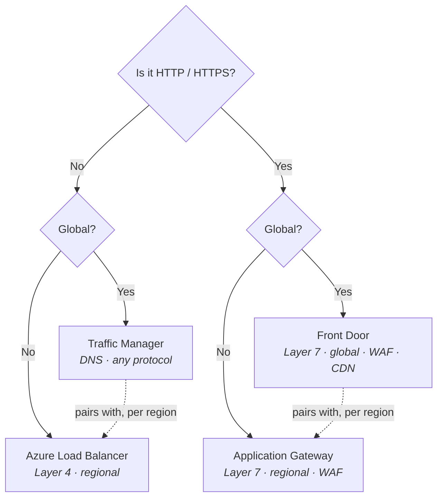
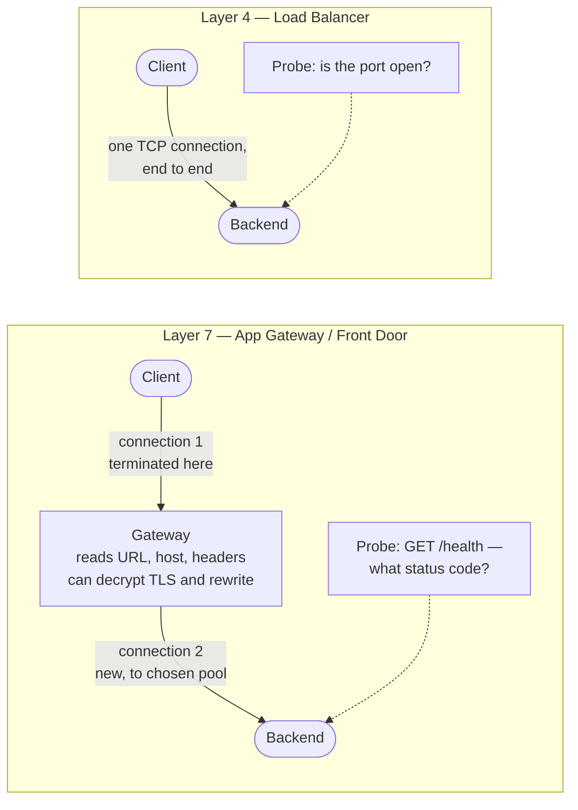

# 06 - Network Traffic Management

> [!abstract] In one line
> Four load balancing services. Pick by answering two questions in order: **global or regional?** and **HTTP(S) or not?** Everything else is detail.

**Lab:** [[LAB 06 - Implement Network Traffic Management]]
**Course index:** [[AZ-104 Course Index]]

---

## 1. Why load balance at all

Not primarily a security control — it's about **removing the single point of failure**.

| Benefit | What it gives you |
| --- | --- |
| **High availability** | One backend dies, traffic keeps flowing to the others |
| **Scale** | Spread load across many instances instead of buying one bigger box |
| **Maintenance without downtime** | Drain a node, patch it, put it back |
| **Health awareness** | A probe notices a dead backend before your users do |

The security angle is real but secondary: the backends need no public IPs of their own, and at Layer 7 you get a WAF in front of them.

---

## 2. Choosing between the four

| | **Load Balancer** | **Application Gateway** | **Traffic Manager** | **Front Door** |
| --- | --- | --- | --- | --- |
| **Scope** | Regional | Regional | **Global** | **Global** |
| **Layer** | **4** (TCP/UDP) | **7** (HTTP/S) | DNS | **7** (HTTP/S) |
| **Traffic** | Any TCP/UDP | HTTP(S), TCP, TLS | **Any** protocol | HTTP(S) only |
| **Mechanism** | Forwards packets | **Terminates** and proxies | Answers a DNS query | **Terminates** and proxies |
| **Sees the traffic?** | No | Yes | **Never** | Yes |
| **Failover speed** | Fast | Fast | **Slow** — DNS TTL caching | Fast |
| **Extras** | HA ports, outbound NAT | WAF, path routing, TLS offload | — | WAF, caching, CDN, acceleration |

### The decision flow

> [!tip] The pairing that confuses people
> Front Door and Application Gateway are not rivals — they stack. **Front Door** picks the region; **Application Gateway** load balances inside it. Same with Traffic Manager over regional Load Balancers.

---

## 3. Layer 4 vs Layer 7 — what actually differs

**L4 and L7 differ in what they can see**, and that shows up in two places: the health probe, and the routing decision.

### What each can see

| | **Layer 4 (Load Balancer)** | **Layer 7 (App Gateway / Front Door)** |
| --- | --- | --- |
| Reads | IP addresses, ports, protocol | The full HTTP request — URL, host header, cookies, method |
| Routing decision on | Frontend IP + port only | URL path, hostname, headers |
| Connection | **Passes through** — same TCP connection end to end | **Terminated** at the gateway, new one opened to the backend |
| Can modify traffic? | No | Yes — rewrite URLs, inject headers, redirect |
| TLS | Passes encrypted bytes through | Can **decrypt** (offload), inspect, then re-encrypt |

> [!important] The health probe is the real difference
> - An **L4 probe** opens a TCP connection to a port. If something answers, the backend is "healthy" — even if the app behind it is returning 500s on every request.
> - An **L7 probe** requests an actual **URL path** and checks the **status code** (and optionally the body text). It catches the app that is listening but broken — dependency down, database unreachable, deployment half-finished.
>
> So: if the application fails *loudly* (the process dies, the port closes), an L4 probe is enough. If it can fail *quietly* while still accepting connections — which web apps routinely do — you need L7.

### The concrete Azure case

**SQL Server Always On availability groups** are the standard L4 example. The listener sits behind an **internal Standard Load Balancer** with a dedicated probe port: only the node currently holding the primary replica answers on that port, so the probe alone tells the load balancer which node is active. Failover moves the probe response and traffic follows. No Layer 7 needed, because the cluster itself is doing the health decision.

Web front ends are the opposite — stateless, many identical instances, all of them answering on 443 whether or not the app behind is healthy. That's L7 territory.

> [!warning] Configurability is not the limit
> Azure Load Balancer is very configurable — rules, custom probes, distribution modes, outbound rules and idle timeouts are all yours.
>
> The real limit is different: **it never inspects or modifies the traffic.** It forwards packets as they are. That's why it's cheap and fast, and why it can't do anything URL-aware.

Cost comparison stands though: Load Balancer is inexpensive and effectively free at low rule counts; Application Gateway bills an hourly gateway cost **plus** capacity units, so it is meaningfully more expensive.

---

## 4. Azure Load Balancer (Layer 4)

### Public vs internal

| | Frontend | Use |
| --- | --- | --- |
| **Public** | Public IP | Internet-facing traffic into your backends |
| **Internal (ILB)** | Private IP from a subnet | Tier-to-tier inside the VNet — web to app, app to database, SQL AG listeners |

### Components

| Component | What it does |
| --- | --- |
| **Frontend IP configuration** | Where traffic arrives. Public IP = public LB, private IP = internal LB. Can have several. |
| **Backend pool** | The VMs or scale set instances. Auto-updates as the scale set scales. Backends need **no public IP**, and can even be added while stopped. |
| **Health probe** | TCP, HTTP or HTTPS. Decides who is in rotation. |
| **Load balancing rule** | Maps frontend IP + port → backend port, across **all** healthy instances |
| **Inbound NAT rule** | Maps frontend IP + port → **one specific** instance. This is how you RDP to VM3 via port 50003. |
| **Outbound rule** | Explicit control of outbound SNAT — which frontend IP the backends use to reach the internet, and how many ports each gets |

### Health probe behaviour

- Probe fails → **no new connections** go to that instance.
- **Existing TCP connections are not killed.** They run until the app closes them, the idle timeout expires, or the VM shuts down. Worth knowing when you expect a failover to be instant and it isn't.
- UDP flows move to a healthy instance; if none are healthy, they're dropped.

### Distribution mode (session persistence)

| Mode | Hash on | Effect |
| --- | --- | --- |
| **None (five-tuple)** — default | Source IP, source port, dest IP, dest port, protocol | Every new connection can land on a different backend. Best spread. |
| **Client IP** (two-tuple) | Source IP, dest IP | All connections from one client stick to one backend |
| **Client IP and protocol** (three-tuple) | Source IP, dest IP, protocol | As above, per protocol |

Use the defaults unless the app genuinely needs stickiness — persistence costs you even distribution.

### HA ports

A single rule with **protocol = All, port = 0**, so the load balancer handles every TCP and UDP port at once. Built for **network virtual appliances** — firewalls and SD-WAN boxes that need to receive everything.

Available on **internal Standard load balancers only** — not public, not Basic.

### SKU

> [!important] Basic Load Balancer is retired
> **Basic Load Balancer and Basic public IP were retired on 30 September 2025.** Standard is the SKU for anything new. Standard brings zone redundancy, HA ports, a much larger backend pool, an SLA, and **secure by default** behaviour.
>
> Secure by default is the one that catches people: a Standard Load Balancer's backends are **closed to inbound traffic until an NSG explicitly allows it**. Basic was open by default. If traffic isn't arriving and the probes look fine, check for a missing NSG allow rule.

---

## 5. Application Gateway (Layer 7)

A **reverse proxy** for HTTP(S). It terminates the client connection, makes its own decision, and opens a fresh connection to the backend.

### Components

| Component | What it does |
| --- | --- |
| **Frontend IP** | Public, private, or both |
| **Listener** | Binds to a frontend IP, port, protocol and (for multi-site) hostname. Where a request first lands. |
| **Routing rule** | Ties a listener to a backend pool and its settings. Basic, or path-based. |
| **Backend pool** | VMs, scale sets, App Services, or **any IP/FQDN** — including things outside Azure |
| **Backend settings** | Protocol and port to the backend, timeouts, cookie affinity, whether to re-encrypt |
| **Health probe** | Requests a path, matches on status code and optionally body text |

### Routing types

| Type | Routes on | Example |
| --- | --- | --- |
| **Path-based** | The URL path | `/images/*` → image pool, `/video/*` → video pool, everything else → default |
| **Multi-site** | The host header | `shop.contoso.com` and `blog.contoso.com` on one gateway, different backends |

### Features worth knowing

| Feature | Notes |
| --- | --- |
| **TLS termination (offload)** | Certificate lives on the gateway; backends receive plain HTTP. Saves backend CPU and centralises cert management. |
| **End-to-end TLS** | Re-encrypts to the backend. Needed when the traffic must stay encrypted the whole way. |
| **WAF** | OWASP Core Rule Set. **Detection** mode logs only; **Prevention** mode blocks. The `WAF_v2` SKU. |
| **Cookie-based session affinity** | Gateway injects a cookie to pin a user to one backend |
| **URL rewrite and header rewrite** | Change the request or response in flight |
| **Redirection** | HTTP → HTTPS is the common one |
| **Autoscaling and zone redundancy** | v2 only |

### Deployment requirements

- Needs its **own dedicated subnet** — nothing else in it. Unlike Firewall, Bastion and the gateway ([[05 - Intersite Connectivity]]) the **name is free**, but the exclusivity is not.
- **`/24` recommended** so it has room to scale out.
- Only **v2 SKUs** exist now (`Standard_v2`, `WAF_v2`) — **v1 was retired on 28 April 2026**.

---

## 6. Traffic Manager (global, DNS)

A **DNS-based** global traffic director. Crucially, **it never sees your traffic** — it answers a DNS query with the address of an endpoint, and the client then connects directly.

That single fact explains its whole character:

- Works with **any protocol**, because it isn't in the data path.
- **Failover is slow**, bounded by DNS TTL and resolver caching. Set a low TTL and accept it will still be minutes, not seconds.
- It sees the **recursive resolver's IP**, not the client's — so location-based routing is approximate.
- It cannot do anything URL-aware, cache, or offload TLS.

### Routing methods

| Method | Behaviour | Use for |
| --- | --- | --- |
| **Priority** | All traffic to the highest-priority endpoint; fail over down the list | Active/passive DR |
| **Weighted** | Split by weight (1–1000) | Canary releases, migrations, cloud bursting |
| **Performance** | Lowest **network latency** for the querying resolver, not nearest by distance | Global apps chasing speed |
| **Geographic** | Routes by where the query came from; each region maps to exactly one endpoint | **Data sovereignty**, localisation |
| **MultiValue** | Returns several healthy endpoints at once, client retries | Availability with fewer lookups |
| **Subnet** | Maps source IP ranges to endpoints | Internal testing, per-office experiences |

All profiles include endpoint health monitoring and automatic failover.

> [!tip] Geographic vs Performance
> A classic exam trap. **Geographic** is about *where the user is* and is used when the law says data must stay in a country. **Performance** is about *what's fastest* and will happily send a UK user to Ireland. If the question mentions compliance or sovereignty, the answer is Geographic.

---

## 7. Azure Front Door (global, Layer 7)

What Traffic Manager isn't. Front Door is a **global reverse proxy** on Microsoft's edge network: it terminates the connection at the nearest point of presence, so it can route, cache and inspect.

| | **Traffic Manager** | **Front Door** |
| --- | --- | --- |
| Mechanism | DNS answer | Terminating proxy at the edge |
| Protocols | Any | **HTTP(S) only** |
| Failover | Minutes (DNS TTL) | Seconds |
| Caching / CDN | No | **Yes** |
| WAF | No | **Yes** |
| TLS offload | No | Yes |
| Path-based routing | No | Yes |

Adds anycast routing, split TCP and connection reuse to the origin — so even uncached requests get faster.

Rule of thumb: **HTTP(S) and global → Front Door.** Traffic Manager is for global traffic that isn't HTTP, or where you need the client to connect directly to the endpoint.

---

## 8. Troubleshooting load balancing

Work down this list:

1. **Health probe status** — first place to look. An empty backend pool in the portal usually means every probe is failing, not that the pool is misconfigured.
2. **Is the probe's port and path actually serving?** Probe port ≠ the load balanced port in plenty of designs (SQL AG uses a separate probe port entirely).
3. **NSGs** — Standard LB is secure by default. You need an inbound allow for your traffic **and** one allowing `AzureLoadBalancer` (that's the `168.63.129.16` platform address from [[04 - Virtual Networking]]). Check **effective security rules** on the NIC.
4. **Is the backend listening on the right port**, on the right interface, with the host firewall open?
5. **Backend pool membership** — did the VM actually get added, and is it in the same VNet?
6. **For App Gateway**, check **Backend health** in the portal — it names the reason, usually a certificate mismatch, a probe path returning 404, or an NSG.
7. **Traffic Manager** — remember DNS caching. `nslookup` the profile name and check which endpoint comes back; flush the resolver before concluding failover is broken.

---

## Still to cover

- [ ] Application Gateway WAF rule tuning and custom rules
- [ ] Front Door rules engine and caching behaviour
- [ ] Gateway Load Balancer (NVA chaining)
- [ ] Outbound connectivity and SNAT port exhaustion / NAT Gateway

## Exam objective coverage

- [x] Configure an internal or public load balancer
- [x] Troubleshoot load balancing
- [x] Configure Azure DNS — covered in [[04 - Virtual Networking]]

## Recall check

1. Two questions pick the load balancing service. What are they, and in what order?
2. Traffic Manager and Front Door are both global. What is the actual mechanical difference, and what three consequences follow from it?
3. Why does a Layer 4 probe report a backend as healthy when the app is returning HTTP 500s?
4. Which Azure service is in the data path and which isn't — and why does that decide the protocols each supports?
5. What is the difference between a load balancing rule and an inbound NAT rule?
6. What is the default distribution mode, and what does it hash on?
7. What does an HA ports rule do, and on which SKU and type of load balancer is it available?
8. A Standard Load Balancer is deployed and no traffic reaches the backends, but the probes are green. What have you probably missed?
9. Which Traffic Manager routing method answers "our data must stay in the UK"? Which answers "give the user the fastest endpoint"?
10. What subnet does Application Gateway need, and what size is recommended?
11. TLS termination vs end-to-end TLS — when would you need the second?

## References

- [Load balancing options in Azure — decision matrix](https://learn.microsoft.com/en-us/azure/architecture/guide/technology-choices/load-balancing-overview)
- [Azure Load Balancer components](https://learn.microsoft.com/en-us/azure/load-balancer/components)
- [Upgrading from Basic Load Balancer — retirement guidance](https://learn.microsoft.com/en-us/azure/load-balancer/load-balancer-basic-upgrade-guidance)
- [Application Gateway overview](https://learn.microsoft.com/en-us/azure/application-gateway/overview)
- [Traffic Manager routing methods](https://learn.microsoft.com/en-us/azure/traffic-manager/traffic-manager-routing-methods)
