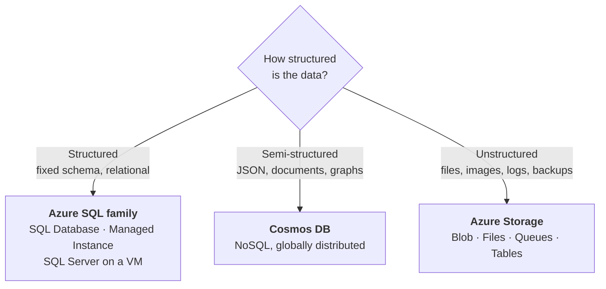
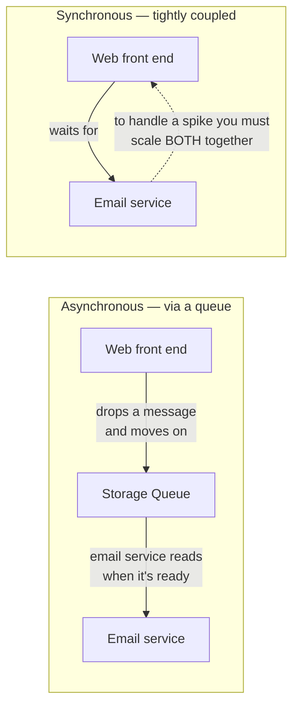
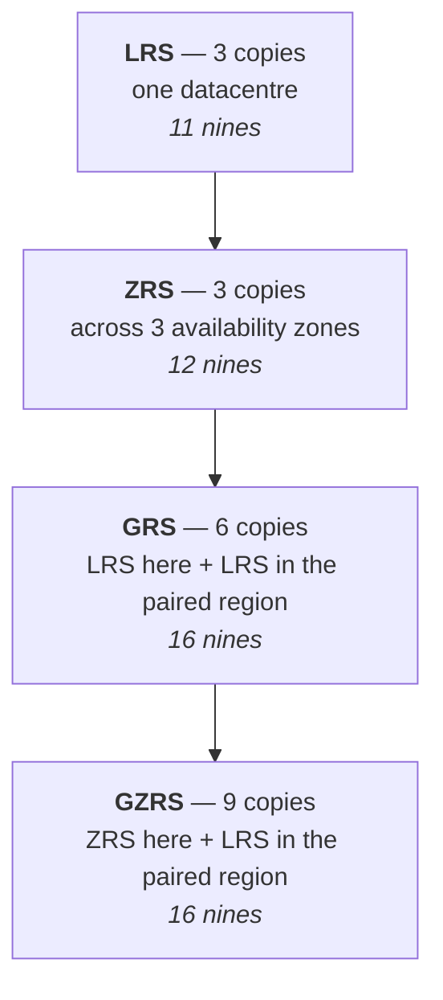

# 07 - Azure Storage

> [!abstract] In one line
> Pick by **how structured the data is**, then by **how often you'll touch it**, then by **how much failure you need to survive**. Those three questions are the whole module.

**Lab:** [[LAB 07 - Manage Azure Storage]]
**Course index:** [[AZ-104 Course Index]]

---

## 1. Where data lives in Azure

This is the map.

| | **Structured** | **Semi-structured** | **Unstructured** |
| --- | --- | --- | --- |
| Shape | Fixed schema, rows and columns, relationships | Self-describing — JSON, XML, key-value | No schema at all |
| Examples | Orders, patients, finance ledgers | Product catalogues, telemetry, IoT | Documents, images, video, VHDs, backups, logs |
| Azure service | **Azure SQL** family | **Cosmos DB** | **Azure Storage** |
| Queried with | T-SQL | SQL API, MongoDB, Cassandra, Gremlin, Table | By key/path — you fetch the whole object |
| Relative cost | Highest | Middle | **Lowest** |

### The Azure SQL family

Three options, sitting on the same IaaS→PaaS scale as [[09 - PaaS Compute Options]]:

| | **SQL Server on a VM** | **SQL Managed Instance** | **Azure SQL Database** |
| --- | --- | --- | --- |
| Model | **IaaS** | **PaaS** | **PaaS** |
| You manage | OS, patching, SQL config, backups, HA | Databases and logins | Databases and logins |
| Feature parity | 100% | ~100%, instance-scoped features (SQL Agent, cross-DB queries, CLR) | Most, but database-scoped only |
| OS access | **Yes** | No | No |
| Lives in your VNet | Yes | **Yes, private IP** | Public endpoint by default |
| Use for | Full control, zero-change lift and shift | **Most migrations** from on-prem | New cloud-native apps, SaaS |

**Cosmos DB** is the semi-structured answer — multi-model NoSQL, globally distributed, multiple APIs. **Azure Database for MySQL / PostgreSQL** are the same PaaS idea for the open-source engines.

> [!note] Not actually on the AZ-104 syllabus
> Databases aren't examined in AZ-104 — this is context so you know where storage stops and databases start. The exam cares about the **Azure Storage** column.

---

## 2. Storage accounts

The container for everything below. **The account itself is free** — you pay for what's in it:

| You pay for | Based on |
| --- | --- |
| **Capacity** | GB stored, and which access tier it's in |
| **Operations** | Reads, writes, listings — per 10,000 |
| **Data transfer** | Egress out of the region |
| **Retention** | How long it sits there (and early-deletion penalties) |

### Naming

**3–24 characters, lowercase letters and numbers only, and globally unique** — the name becomes a public DNS hostname, so it has to be unique across the entire planet. That's the single most common lab failure.

### Endpoints

| Service | Endpoint |
| --- | --- |
| Blob | `https://<account>.blob.core.windows.net` |
| Files | `https://<account>.file.core.windows.net` |
| Queue | `https://<account>.queue.core.windows.net` |
| Table | `https://<account>.table.core.windows.net` |
| Data Lake | `https://<account>.dfs.core.windows.net` |

> [!note] Clearing up "DFS"
> Two different things share that name in Azure, and it's worth separating them:
> - **`dfs.core.windows.net`** is the **Data Lake Storage Gen2** endpoint — hierarchical namespace on top of blob.
> - **Azure File Sync** is the service that plays the role Windows **DFS-R** did on-prem: sync a file share between on-prem servers and Azure Files, with cloud tiering so cold files live only in Azure.

### Account types

| Type | Supports | Redundancy available |
| --- | --- | --- |
| **Standard general-purpose v2** | Blob, Files, Queue, Table, Data Lake | **All six** |
| **Premium block blobs** | Blob, Data Lake | LRS, ZRS only |
| **Premium file shares** | Files only | LRS, ZRS only |
| **Premium page blobs** | Page blobs only | LRS, ZRS only |

### Standard vs Premium

> [!important] It is about IOPS, not availability
> **Premium is a performance choice, not a durability or availability one.** It's SSD-backed for low latency and high transaction rates, and it can be several times the price. Standard is the correct default for almost everything.
>
> The catch: **Premium accounts only support LRS and ZRS.** No geo-redundancy. If you need a copy in another region, you are on Standard.

Availability *does* vary — but by **access tier**, not by Standard vs Premium: Hot is 99.9%, Cool/Cold/Archive are 99%.

---

## 3. The four storage services

| | **Blob (containers)** | **Files** | **Queues** | **Tables** |
| --- | --- | --- | --- | --- |
| Holds | Any unstructured object | A file share | Messages | Key-value rows |
| Accessed over | **HTTPS / REST** | **SMB** and NFS | HTTPS / REST | HTTPS / REST |
| Mount as a drive? | No | **Yes** | No | No |
| Typical use | Files for download, images, video streaming, backups, logs, analytics data | Lift-and-shift file shares, roaming profiles, shared config | Decoupling components asynchronously | Cheap semi-structured storage — form submissions, device metadata |
| Cost | **Cheapest per GB** | Noticeably more than blob | Trivial | Far cheaper than SQL |

> [!tip] The one-line rule
> **If the need is HTTPS, use Blob. If the need is SMB, use Files.** That's genuinely the decision.

### Blob types

| Type | For |
| --- | --- |
| **Block blob** | The normal one — files, images, documents |
| **Append blob** | Logging — you can only add to the end |
| **Page blob** | Random read/write — this is what VM disks are |

Blobs live in **containers**, and each blob is addressable as its own HTTPS endpoint, which is what makes "click the link to download" work.

### Queues — the worked example

The scenario that makes queues click:

Customer places an order. The web front end **must** be synchronous with the database — the order has to be recorded before the page returns. The confirmation email does **not**.

- **Coupled:** the web tier waits on the email service, so a traffic spike means scaling both, and an email outage takes the checkout down with it.
- **Queued:** the web tier writes a message and returns immediately. The email service drains the queue at its own pace.

The trade: **the email arrives in a couple of minutes instead of instantly, and it is far cheaper and far more resilient.**

---

## 4. Redundancy

Four base options, two with read access to the secondary.

| | Copies | Survives a node failure | Survives a **datacentre** failure | Survives a **region** failure | Read the secondary? |
| --- | :--: | :--: | :--: | :--: | :--: |
| **LRS** | 3 | ✅ | ❌ | ❌ | — |
| **ZRS** | 3 | ✅ | ✅ | ❌ | — |
| **GRS** | 6 | ✅ | ❌ | ✅ *after failover* | ❌ |
| **RA-GRS** | 6 | ✅ | ❌ | ✅ | **✅** |
| **GZRS** | 9 | ✅ | ✅ | ✅ *after failover* | ❌ |
| **RA-GZRS** | 9 | ✅ | ✅ | ✅ | **✅** |

> [!important] What "RA" actually buys you
> Plain **GRS/GZRS keeps a second copy you cannot touch** until a failover happens — and failover has to be initiated, it isn't automatic. **RA-** means the secondary is readable *all the time*, at `<account>-secondary.blob.core.windows.net`, using the same keys.
>
> Two consequences worth knowing: geo-replication is **asynchronous**, so a regional disaster can lose the last few minutes of writes; and **Azure Files does not support RA-GRS or RA-GZRS** at all.

---

## 5. Access tiers

| Tier | Storage cost | Access cost | Min retention | Latency | Use for |
| --- | --- | --- | :--: | --- | --- |
| **Hot** | Highest | Lowest | none | ms | Data in active use, or being staged for processing |
| **Cool** | Lower | Higher | **30 days** | ms | Short-term backup, last quarter's data |
| **Cold** | Lower still | Higher still | **90 days** | ms | Rarely touched but must come back instantly |
| **Archive** | **Lowest** | **Highest** | **180 days** | **hours** | Long-term retention, compliance, raw originals |

> [!warning] The two traps
> **1. Early deletion penalties.** Move a blob to Cool and delete it after 21 days and you are still billed for the remaining 9. Same at 90 and 180 days for Cold and Archive. Tiering down aggressively can cost you *more*.
>
> **2. Archive is offline.** You cannot read an archived blob at all — it must be **rehydrated** first, which takes **up to 15 hours** (Standard priority) or less at High priority, and is billed as a read. Only three operations work on an archived blob without rehydrating: set tier, copy, delete.

**Where the tier is set:**

- **Account level** — the default for new blobs. Hot, Cool or Cold. **Never Archive.**
- **Blob level** — overrides the account default, and **every blob can have its own tier**. All four available.

Archive is also only supported on **LRS, GRS and RA-GRS** — not on any of the zone-redundant options.

### Lifecycle management

Rules that move or delete blobs automatically on age — "if not modified in 30 days → Cool, 90 days → Archive, 365 days → delete". Filters can target a prefix or blob index tags.

> [!important] Blob only
> **Lifecycle management is a blob feature. Azure Files does not have it.** Same for tiering generally — file shares have their own performance tiers, not the Hot/Cool/Archive model.

### Object replication

Asynchronously copies **a selected subset** of block blobs from one storage account to another — filtered by prefix, and you choose which containers. Different thing from redundancy: redundancy is Azure's copies of everything, object replication is your rules about specific data.

---

## 6. Azure Files specifics

| Feature | Notes |
| --- | --- |
| **Protocols** | **SMB** (mount as a drive letter on Windows, mount point on Linux) and **NFS** (premium only) |
| **Identity-based access** | On-prem **AD DS**, **Entra Domain Services**, or **Entra Kerberos** for cloud-only — so NTFS permissions work as expected |
| **Snapshots** | Point-in-time read-only copies — the shadow-copy equivalent, restorable |
| **Soft delete** | Recovers a deleted share within the retention window |
| **Azure File Sync** | Syncs an on-prem Windows file server with an Azure file share, with **cloud tiering** so cold files exist only in Azure |

---

## 7. Securing storage

In order of preference:

| Method | What it is | Verdict |
| --- | --- | --- |
| **Entra ID + RBAC** | Data-plane roles — Storage Blob Data Reader/Contributor/Owner — assigned to a user, group or **managed identity** | **Best.** No secret to store or rotate. |
| **Shared Access Signature (SAS)** | Time-limited, permission-scoped URL token | Good, when scoped tightly |
| **Stored access policy** | A server-side policy a SAS is tied to — lets you **revoke** without rotating the account key | Use with every service SAS |
| **Shared key (account keys)** | Two keys granting **full control of the whole account** | Avoid. Rotate if used. |
| **Anonymous public access** | Container or blob readable by anyone with the URL | Only for genuinely public content; disable at account level otherwise |

### SAS types

| Type | Signed with | Scope |
| --- | --- | --- |
| **User delegation SAS** | **Entra credentials** — no account key | Blob only. **The one to prefer.** |
| **Service SAS** | Account key | One service |
| **Account SAS** | Account key | Multiple services, account-level operations |

### Encryption

- **Storage Service Encryption (SSE)** — AES-256, **on by default**, cannot be disabled. Platform-managed keys, or **customer-managed keys** in Key Vault when you need control of rotation.
- **Infrastructure encryption** — optional second layer, set at account creation only.
- **Client-side encryption** — encrypted before it ever leaves your application.
- **In transit** — enforce **HTTPS only** and a **minimum TLS version** on the account. SMB 3.x is encrypted for file shares.

### Network controls

Default is a **public endpoint**. Lock it down with:

- **Storage firewall** — allow only named IP ranges.
- **Service endpoints** — allow only named VNet subnets.
- **Private endpoints** — give the account a private IP in your VNet and take it off the internet entirely. ([[04 - Virtual Networking]])

### Soft delete

Available for blobs, containers and file shares. **Soft delete itself is free — you are billed for the data it retains.**

---

## 8. Moving data

| Tool | For |
| --- | --- |
| **Azure Storage Explorer** | GUI, browse and drag-drop, works across accounts |
| **AzCopy** | Command line, scriptable, the right tool for bulk and sync |
| **Azure Data Box** | Physical appliance shipped to you — for tens of TB upward where the network would take weeks |
| **Data Lake Storage Gen2** | Hierarchical namespace on blob, for analytics-scale data and real directory semantics |

---

## Still to cover

- [ ] Blob versioning and point-in-time restore
- [ ] Immutable storage — legal hold and time-based retention policies
- [ ] Azure File Sync deployment in detail
- [ ] Storage account failover, hands-on

## Exam objective coverage

- [x] Create and configure storage accounts
- [x] Configure Azure Storage redundancy
- [x] Configure storage account encryption
- [x] Configure storage tiers
- [x] Configure blob lifecycle management
- [x] Configure object replication
- [x] Configure Azure Storage firewalls and virtual networks
- [x] Create and use shared access signature (SAS) tokens
- [x] Configure stored access policies
- [x] Manage access keys
- [x] Configure identity-based access for Azure Files
- [x] Create and configure a container in Azure Blob Storage
- [x] Create and configure a file share in Azure Files
- [x] Configure soft delete for blobs and containers
- [x] Configure snapshots and soft delete for Azure Files
- [x] Manage data by using Azure Storage Explorer and AzCopy
- [ ] Configure blob versioning

## Recall check

1. Structured, semi-structured, unstructured — which Azure service for each?
2. What are the storage account naming rules, and why is the "globally unique" part unavoidable?
3. Is a storage account itself billed? What exactly are you paying for?
4. Premium vs Standard — what does Premium actually buy, and what does it cost you in redundancy options?
5. Blob vs Files — give the one-line rule.
6. Name the three blob types and what each is for.
7. Explain the queue example: what breaks if the web tier calls the email service directly?
8. Which redundancy options survive a whole region failing? Which of those let you read the secondary before a failover?
9. How many copies does GZRS keep, and where?
10. What's the minimum retention on Cool, Cold and Archive — and what happens if you delete early?
11. How long does rehydrating an archived blob take, and which three operations work without rehydrating?
12. Which tier can't be set as an account default? Which redundancy options don't support Archive at all?
13. Lifecycle management — blob, files, or both?
14. Rank the five ways of authenticating to storage, best first. Which SAS type needs no account key?
15. What does a stored access policy give you that a bare SAS doesn't?

## References

- [Storage account overview](https://learn.microsoft.com/en-us/azure/storage/common/storage-account-overview)
- [Azure Storage redundancy](https://learn.microsoft.com/en-us/azure/storage/common/storage-redundancy)
- [Access tiers for blob data](https://learn.microsoft.com/en-us/azure/storage/blobs/access-tiers-overview)
- [Blob lifecycle management](https://learn.microsoft.com/en-us/azure/storage/blobs/lifecycle-management-overview)
- [Grant limited access with SAS](https://learn.microsoft.com/en-us/azure/storage/common/storage-sas-overview)
- [Azure Files identity-based authentication](https://learn.microsoft.com/en-us/azure/storage/files/storage-files-active-directory-overview)
- [What is Azure SQL? IaaS vs PaaS](https://learn.microsoft.com/en-us/azure/azure-sql/azure-sql-iaas-vs-paas-what-is-overview)
