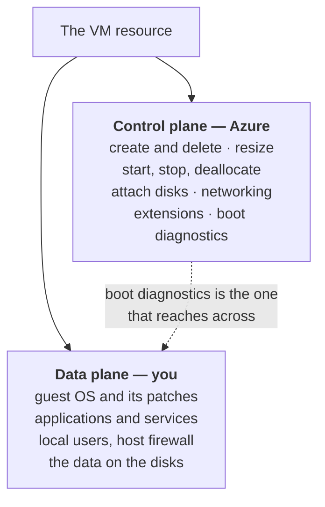
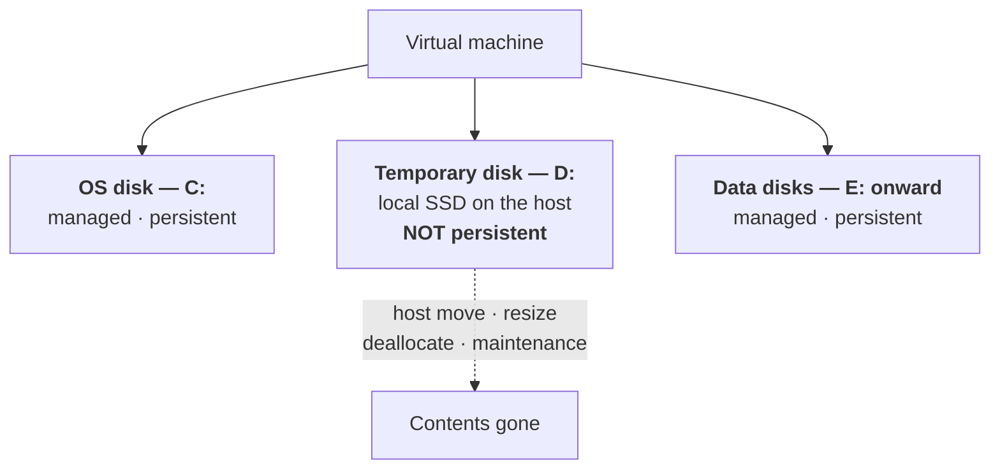
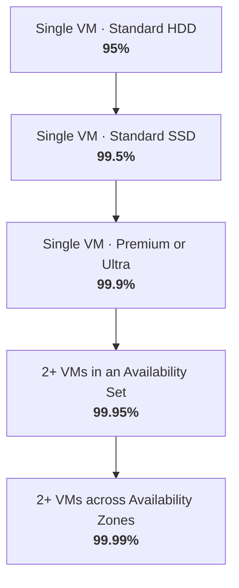
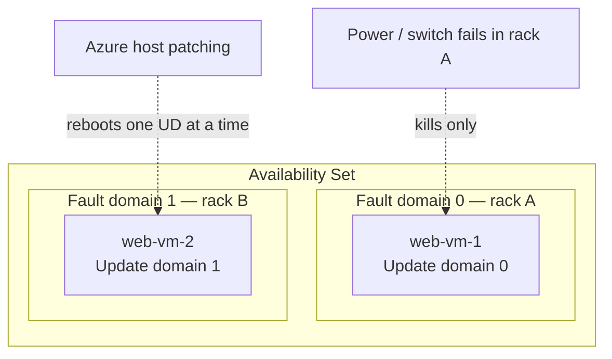
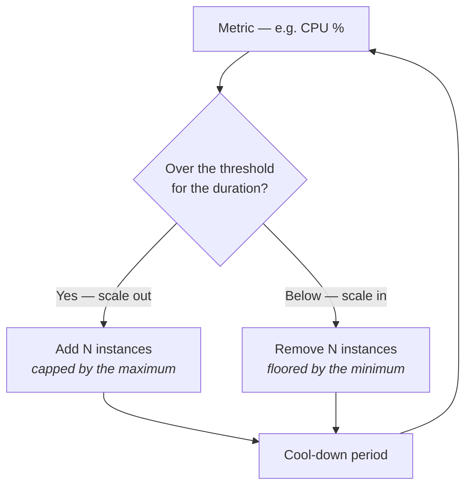
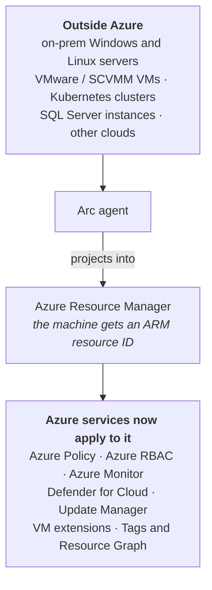

# 08 - Azure Virtual Machines

> [!abstract] In one line
> Azure owns the **control plane** — create, resize, start, stop, attach disks. You own the **data plane** — the OS, the patching, the apps inside. The exam lives on the line between them.

**Lab:** [[LAB 08 - Manage Virtual Machines]]
**Course index:** [[AZ-104 Course Index]]

---

## 1. Control plane vs data plane



You pick the guest OS, but what Azure can *do* to it from outside is limited to the control plane. Anything inside the VM needs an extension, the Azure VM agent, or you signing in.

> [!note] Boot diagnostics is the one that crosses the line
> Screenshot and serial console of a VM that won't boot — **without** access to the hypervisor. You never get the hypervisor; that's Microsoft's.

---

## 2. Choosing an image

| Factor | Notes |
| --- | --- |
| **OS** | Marketplace images, your own custom images, or Azure Compute Gallery |
| **Licensing** | **Linux is cheaper** — no OS licence baked into the hourly rate |
| **Azure Hybrid Benefit** | Bring existing Windows Server or SQL Server licences with Software Assurance and drop the licence portion of the bill |
| **Generation** | Gen2 for anything new — UEFI, larger disks, Trusted Launch, confidential computing |

### Spot VMs

Unused Azure capacity at a heavy discount. The catch: **you are bidding on space**. If capacity is needed elsewhere, or the price rises past your maximum, you get **30 seconds' notice** and the VM is evicted.

| Good for | Never for |
| --- | --- |
| Batch jobs, rendering, CI agents, dev/test | Anything stateful or customer-facing |
| Workloads that can checkpoint and resume | Domain controllers, databases, production web |

Eviction policy is either **Deallocate** (keeps the disks, you pay storage, can restart later) or **Delete** (gone).

---

## 3. VM size naming convention

![[Pasted image 20260916094820.png]]
*The anatomy of a VM size name.*

Full pattern:

```
[Family][Subfamily][vCPUs][-Constrained][Additive features][Accelerator][Memory]_[Version]
   D        C          8                      ads                 _v5
```

### Families

| Family | Optimised for |
| --- | --- |
| **B** | Burstable — banks credits while idle, spends them on spikes. Cheap dev/test. |
| **D** | General purpose — the default choice |
| **E** | Memory optimised — databases, in-memory caches |
| **F** | Compute optimised — high CPU per GB of RAM |
| **L** | Storage optimised — high local disk throughput |
| **M** | Massive memory — SAP HANA and similar |
| **N** | GPU — rendering, AI training and inference |
| **H** | High performance compute |

### The lowercase feature letters

These are what people get wrong. Read them left to right after the vCPU count:

| Letter | Means |
| --- | --- |
| **a** | AMD processor |
| **p** | Arm processor |
| **d** | Has a **local temporary disk** |
| **s** | **Premium SSD** capable |
| **l** | Low memory — less RAM per vCPU |
| **m** | Memory intensive — most RAM per vCPU |
| **t** | Tiny memory — least RAM per vCPU |
| **i** | Isolated — the whole physical host is yours |
| **n** | Network optimised |
| **b** | Bandwidth optimised for remote storage |
| **e** | Encrypted / confidential compute capable |
| **r** | RDMA secondary network |

### Worked examples

| Size | Reads as |
| --- | --- |
| **D8ads_v5** | General purpose, 8 vCPU, **A**MD, local temp **d**isk, premium **s**torage capable, version 5 |
| **DC8ads_v5** | As above, but **C** subfamily = **confidential** computing |
| **E96bds_v5** | Memory optimised, 96 vCPU, **b**andwidth optimised, temp **d**isk, premium **s**torage. The SQL Server favourite. |
| **B2ms** | **B**urstable, 2 vCPU, **m**emory intensive, premium **s**torage capable |
| **M8-2ms_v2** | Massive memory, 8 vCPU of which only **2 are usable** — constrained vCPU, used to cut per-core licensing cost while keeping the RAM |

> [!tip] The two letters that matter most in the lab
> **d** = you get a temp disk. **s** = you can attach premium SSDs. A size without `s` cannot take a premium disk, which is the usual cause of "why won't this disk attach".

---

## 4. Disks



| Disk | Drive letter | Persistent? | What lives there |
| --- | --- | --- | --- |
| **OS disk** | `C:` | Yes | The operating system. Managed disk in Azure Storage. |
| **Temporary disk** | `D:` | **No** | Page file and scratch only |
| **Data disks** | `E:` onward | Yes | Everything you care about |

> [!warning] The temporary disk is genuinely temporary
> It's local SSD on the physical host, so it's fast — and it is **wiped whenever the VM moves to a different host**: a resize, a deallocate/start, host maintenance, or a hardware fault. Nothing important goes on `D:`.
>
> On Linux the temp disk is usually `/dev/sdb` mounted at `/mnt`, not `D:`.

### Disk types

| Type | Backing | Use for |
| --- | --- | --- |
| **Standard HDD** | Spinning disk | Backup, infrequent access, cheapest |
| **Standard SSD** | SSD | Light production, web servers, dev/test |
| **Premium SSD** | SSD, provisioned IOPS by size | Production workloads. Needed for the single-VM SLA. |
| **Premium SSD v2** | SSD, IOPS and throughput set **independently of size** | Production where you want performance without buying capacity |
| **Ultra Disk** | Sub-millisecond latency, tunable live | SAP HANA, top-tier transactional databases |

**Managed disks** are the only sensible choice — Azure handles the storage account, placement and fault-domain alignment. Unmanaged disks are legacy.

---

## 5. Encryption

Every managed disk is encrypted at rest by default with **Server-Side Encryption (SSE)** using platform-managed keys. The choices above that:

| Option | What it encrypts | Notes |
| --- | --- | --- |
| **SSE with platform-managed keys** | OS and data disks at rest | On by default, free, nothing to do |
| **SSE with customer-managed keys** | Same, but your key in Key Vault | For key-rotation and compliance control |
| **Encryption at host** | OS disk, data disks **and the temp disk**, plus disk caches | Encrypted before it ever leaves the host. **The one to use.** |
| **Azure Disk Encryption (ADE)** | Inside the guest — BitLocker on Windows, dm-crypt on Linux | Older approach, more moving parts |

> [!important] Encryption at host is the future-proof choice
> It is the current recommendation. It covers the temporary disk and caches, which ADE does not, and it doesn't depend on a guest agent. Prefer it over ADE for anything new.

---

## 6. Availability

### The SLA ladder



What those percentages mean in real downtime:

| Configuration | SLA | Downtime per **month** | Downtime per **year** |
| --- | --- | --- | --- |
| Single VM, Standard HDD | 95% | 36 hours | ~18 days |
| Single VM, Standard SSD | 99.5% | 3h 36m | ~1d 19h |
| **Single VM, Premium/Ultra all disks** | **99.9%** | **43m 12s** | ~8h 46m |
| **2+ VMs in an availability set** | **99.95%** | **21m 36s** | ~4h 23m |
| **2+ VMs across availability zones** | **99.99%** | **4m 19s** | ~52m 34s |

> [!note] Source check
> **99.95% for an availability set** is stated directly in the Microsoft docs. The 99.9% / 99.99% figures come from the consolidated [SLA for Online Services](https://www.microsoft.com/licensing/docs/view/Service-Level-Agreements-SLA-for-Online-Services) document rather than the VM docs pages — long-standing and stable, but confirm against that PDF if an exam question hinges on the exact number.

That table is the answer to "is the extra effort worth it": moving from a single premium VM to an availability set buys you about **22 minutes a month**; going to zones buys another **17 minutes**. Whether that matters depends entirely on what the workload does.

### Why availability sets exist

Azure racks servers in large modular units — think shipping containers of blades — and a rack shares a **power supply and a network switch**. That shared infrastructure is the single point of failure, and by default Azure has no reason not to put both of your web servers on the same one.



| | **Fault domain** | **Update domain** |
| --- | --- | --- |
| Protects against | **Unplanned** — power, network, hardware failure | **Planned** — Azure host maintenance and patching |
| Grouping | Shared power source and network switch | A reboot group |
| Count in an availability set | **3** max | **20** max, 5 by default |
| Behaviour | VMs spread across them automatically | Only one UD is rebooted at a time, **30 minutes** between them |

VMs are distributed round-robin. With 5 update domains, VM 6 wraps back to UD 0, VM 7 to UD 1, and so on.

> [!warning] You cannot add a running VM to an availability set
> Availability set membership is set **at creation**. To move an existing VM you deallocate it and redeploy. Plan it up front — this is a very common exam question and a very annoying real-world discovery.

### Availability zones

Physically separate datacentres within one region, each with independent power, cooling and networking.

| | **Availability set** | **Availability zone** |
| --- | --- | --- |
| Separation | Racks within **one** datacentre | **Different datacentres** in the region |
| Protects against | Rack failure, host patching | Whole-datacentre failure |
| SLA | 99.95% | 99.99% |
| Cost of the feature | Free | Free |
| Available everywhere? | Yes | **No** |

> [!note] The UK case
> **UK South (London) has three availability zones. UK West (Cardiff) has none.** If the design calls for zones in the UK, it has to be UK South — and UK West becomes the paired region for regional DR instead.

Zones themselves cost nothing and you pay for the VMs as normal. Data moving *between* zones has historically been charged; Microsoft has revised that more than once, so check the current bandwidth pricing page rather than trusting a figure in a note.

---

## 7. Virtual Machine Scale Sets

The whole argument for scale sets, in one picture:

```
              00   03   06   09   12   15   18   21   00
Real demand    ▁    ▁    ▂    ▅    █    █    ▆    ▂    ▁

One big VM    ████ ████ ████ ████ ████ ████ ████ ████   ← paid 24/7
              └──────── wasted ────────┘    └ wasted ┘

Scale set      ▁▁   ▁▁   ▂▂   ▅▅   ██   ██   ▆▆   ▂▂    ← capacity follows demand
               2    2    3    5    8    8    6    3     instances
```

The point isn't that a scale set is faster — it's that a single VM has to be sized for the **peak** and you pay for that peak at 3am. A scale set sizes for the *current* load.

So instead of one large VM running flat out at noon and idle overnight, you deploy a smaller instance size and add more of them when demand arrives.

### Orchestration modes

| | **Uniform** | **Flexible** |
| --- | --- | --- |
| Instances | Identical, from one model | Can differ; you can mix sizes and even add existing VMs |
| Managed as | The scale set | Individual VMs, visible in the portal |
| Fault domain control | Implicit | Explicit |
| Use for | Large stateless fleets, classic autoscale | Almost everything else — Microsoft's current recommendation |

### Autoscale rules

A rule is **metric + threshold + duration + action**:



Always set **minimum and maximum instance counts** — the minimum protects availability, the maximum protects the bill.

> [!tip] Pair your rules
> A scale-out rule with no matching scale-in rule means you scale up once and stay there forever. Make the thresholds asymmetric — out at 70%, in at 30% — or the set will flap.

Scale sets default to spreading across **fault domains within a region**; you can deploy them **zone-redundantly** across availability zones instead, which is the better choice where zones exist.

---

## 8. Managing and running VMs

| Feature | What it does |
| --- | --- |
| **Auto-shutdown** | Scheduled deallocate at a set time — the single biggest dev/test saving. Note there is **no auto-start**; you need an Automation runbook, Logic App or a scheduled task for that. |
| **Extensions** | Small agents bolted into the guest OS — Custom Script, DSC, Monitor Agent, Defender, domain join |
| **VM applications** | Package an app once in the Compute Gallery and deploy it to VMs, versioned, without scripting it |
| **Boot diagnostics** | Screenshot and serial console for a VM that won't boot |
| **Azure Update Manager** | Patch orchestration across Azure and, via Arc, on-prem — schedules, maintenance windows, periodic assessment |
| **Hotpatching** | Patch Windows Server Datacenter: Azure Edition **without rebooting**. Requires that specific image; a premium capability, not the default. |
| **Microsoft Defender for Cloud** | Posture management and threat detection for the VM |
| **Entra login** | Sign in to the VM with Entra ID credentials instead of a local account |

### Resizing

Restarts the VM. If the target size **isn't available on the current host cluster**, you must **deallocate** first, then resize — Azure then places it on a cluster that supports it. That's why a resize sometimes works instantly and sometimes refuses.

### Dedicated Host

It looks like an odd thing to want for most workloads, but there are three real reasons:

1. **Licensing** — BYOL software licensed per physical core, where you need to know and control the core count.
2. **Compliance** — regulations that forbid shared tenancy.
3. **Maintenance control** — you choose the host's maintenance window instead of Azure choosing it.

Outside those, you're paying for the whole host whether you fill it or not.

---

## 9. Azure Arc

> [!note] Separate topic
> Arc is not really a VM feature — it is the reverse direction. Everything above is about running machines **in** Azure; Arc is about managing machines **outside** Azure as if they were in it.

**Azure Arc projects non-Azure resources into Azure Resource Manager.** Install an agent on a server sitting in your own datacentre, and it appears in the Azure portal as a resource with an ARM resource ID — taggable, in a resource group, in a subscription.



### What Arc-enabling actually buys you

| Service | Applied to the non-Azure machine |
| --- | --- |
| **Azure Policy** | Audit and enforce configuration — machine configuration, guest policy |
| **Azure RBAC** | Control who can manage it, from the same role assignments as everything else |
| **Azure Monitor** | Metrics and logs into the same Log Analytics workspace |
| **Defender for Cloud** | Same posture management and threat protection |
| **Update Manager** | One patching schedule across cloud and on-prem |
| **VM extensions** | The same extension model as Azure VMs |
| **Tags, resource groups, Resource Graph** | One inventory and one query surface |

The Arc control plane itself is free; you pay standard pricing for whichever Azure services you then point at the machine.

> [!tip] Why this matters at work
> An estate split across Azure, a colo and practice sites is exactly the problem Arc is built for — one Policy assignment, one Defender view and one patch schedule covering all of it rather than three separate toolsets.

---

## Still to cover

- [ ] Azure Compute Gallery and custom images in depth
- [ ] Moving a VM between resource groups, subscriptions and regions
- [ ] Trusted Launch and confidential VMs
- [ ] Reserved instances and savings plans

## Exam objective coverage

- [x] Create a virtual machine
- [x] Configure encryption at host for Azure virtual machines
- [x] Manage virtual machine sizes
- [x] Manage virtual machine disks
- [x] Deploy virtual machines to availability zones and availability sets
- [x] Deploy and configure Azure Virtual Machine Scale Sets
- [ ] Move a virtual machine to another resource group, subscription or region

## Recall check

1. Decode **E96bds_v5** letter by letter.
2. A size has no `s` in its name. What can't you attach to it?
3. Which drive is the temporary disk on Windows, and name three things that wipe it.
4. What SLA does a single VM get, and what exactly is the condition?
5. Convert 99.95% and 99.99% into downtime per month.
6. Fault domain vs update domain — which protects against planned maintenance, and how many of each does an availability set have?
7. You have a running VM and want it in an availability set. What do you have to do?
8. Which encryption option covers the temporary disk and the disk caches?
9. Uniform vs Flexible orchestration — which is Microsoft's current recommendation and why?
10. A scale-out rule fires at 70% CPU. What have you forgotten if the set never shrinks again?
11. A resize is refused until you deallocate. Why?
12. Name four Azure services that become available to an on-prem server once it's Arc-enabled.

## References

- [Azure VM sizes — naming conventions](https://learn.microsoft.com/en-us/azure/virtual-machines/vm-naming-conventions)
- [Availability options for Azure VMs](https://learn.microsoft.com/en-us/azure/virtual-machines/availability)
- [Availability sets overview](https://learn.microsoft.com/en-us/azure/virtual-machines/availability-set-overview)
- [Azure managed disk types](https://learn.microsoft.com/en-us/azure/virtual-machines/disks-types)
- [Virtual Machine Scale Sets overview](https://learn.microsoft.com/en-us/azure/virtual-machine-scale-sets/overview)
- [Azure Arc overview](https://learn.microsoft.com/en-us/azure/azure-arc/overview)
- [Regions list — which support availability zones](https://learn.microsoft.com/en-us/azure/reliability/regions-list)
