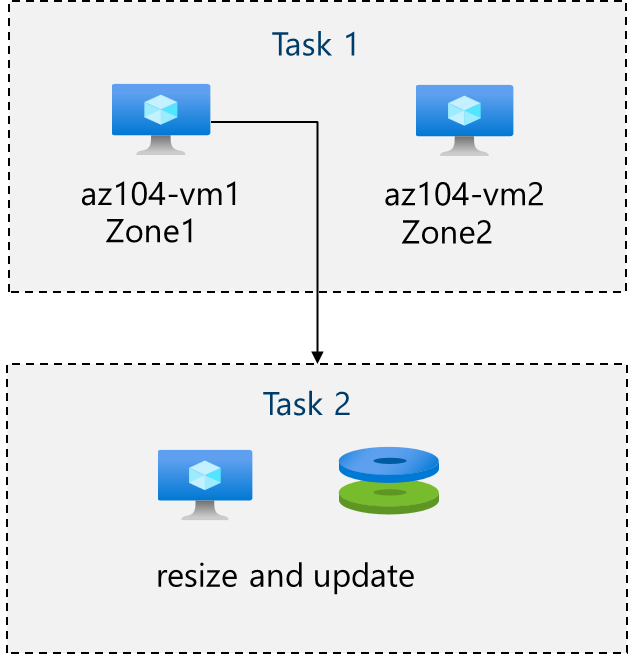
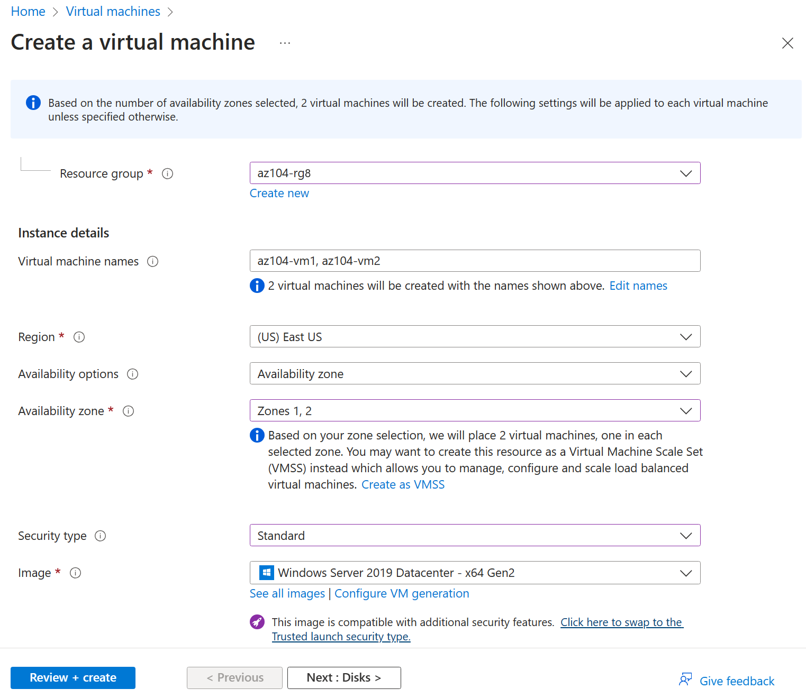
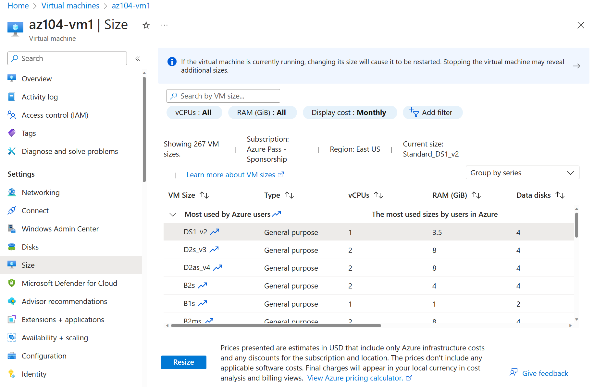
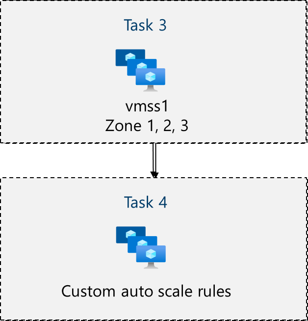
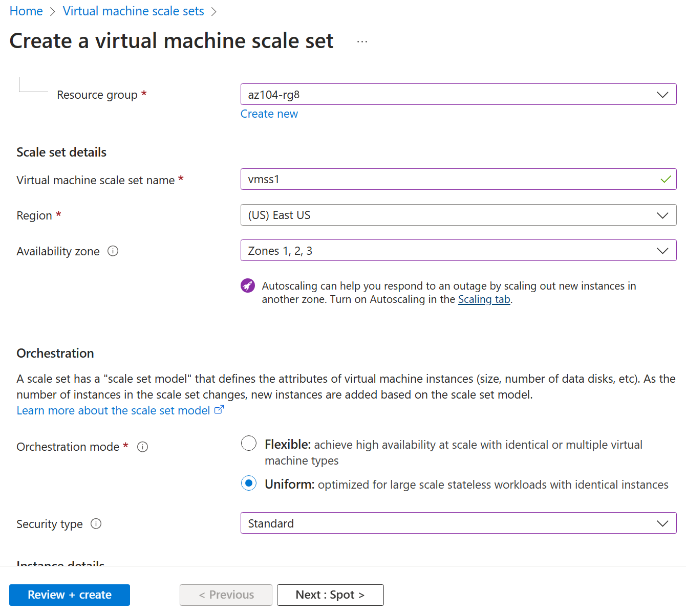
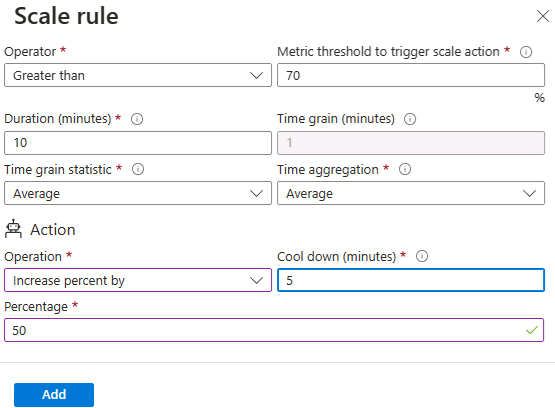

---
lab:
  title: 'Lab 08: Manage Virtual Machines'
  module: Administer Virtual Machines
  description: Create and scale virtual machines and virtual machine scale sets. 
  duration: 50 minutes
  level: 400
  islab: true
  primarytopics:
  - Azure
  - Virtual machines
  - Virtual Machine Scale Sets
---

> **Module:** [[08 - Azure Virtual Machines]]  ·  **Index:** [[AZ-104 Course Index]]

# Lab 08 - Manage Virtual Machines

## Lab introduction

In this lab, you create and compare virtual machines to virtual machine scale sets. You learn how to create, configure and resize a single virtual machine. You learn how to create a virtual machine scale set and configure autoscaling.

This lab requires an Azure subscription. Your subscription type may affect the availability of features in this lab. You may change the region, but the steps are written using **East US**.

## Estimated timing: 50 minutes

## Lab scenario

Your organization wants to explore deploying and configuring Azure virtual machines. First, you implement an Azure virtual machine with manual scaling. Next, you implement a Virtual Machine Scale Set and explore autoscaling.

## Job skills

+ Task 1: Deploy zone-resilient Azure virtual machines by using the Azure portal.
+ Task 2: Manage compute and storage scaling for virtual machines.
+ Task 3: Create and configure Azure Virtual Machine Scale Sets.
+ Task 4: Scale Azure Virtual Machine Scale Sets.
+ Task 5: Create a virtual machine using Azure PowerShell (optional 1).
+ Task 6: Create a virtual machine using the CLI (optional 2).

## Azure Virtual Machines Architecture Diagram



## Task 1: Deploy zone-resilient Azure virtual machines by using the Azure portal

In this task, you will deploy two Azure virtual machines into different availability zones by using the Azure portal. Availability zones offer the highest level of uptime SLA for virtual machines at 99.99%. To achieve this SLA, you must deploy at least two virtual machines across different availability zones.

1. Sign in to the Azure portal - `https://portal.azure.com`.

2. Search for and select `Virtual machines`, on the **Virtual machines** blade, click **+ Create**, and then select in the drop-down **virtual machine**. Notice your other choices.

3. On the **Basics** tab, in the **Availability zone** drop down menu, place a checkmark next to **Zone 2**. This should select both **Zone 1** and **Zone 2**.

> [!note]
> This will deploy two virtual machines in the selected region, one in each zone. You achieve the 99.99% uptime SLA because you have at least two VMs distributed across at least two zones. In the scenario where you might only need one VM, it is a best practice to still deploy the VM to another zone.

4. On the Basics tab, continue completing the configuration:

| Setting | Value |
| --- | --- |
| Subscription | the name of your Azure subscription |
| Resource group |  **az104-rg8** (If necessary, click **Create new**) |
| Virtual machine names | `az104-vm1` and `az104-vm2` (After selecting both availability zones, select **Edit names** under the VM name field.) |
| Region | **East US** |
| Availability options | **Availability zone** |
| Availability zone | **Zone 1, 2** (read the note about using virtual machine scale sets) |
| Self-selected zone | (take the default) |
| Azure-selected zone (Preview) | disabled |
| Security type | **Standard** |
| Image (See all images) | **Windows Server 2025 Datacenter - x64 Gen2** |
| Azure Spot instance | **unchecked** |
| Size | **Standard_D2s_v5** |
| Username | `localadmin` |
| Password | **Provide a secure password** |
| Public inbound ports | **None** |
| Would you like to use an existing Windows Server license? | **Unchecked** |

> [!note]
> Use **Standard_D2s_v5** first. If the size is unavailable or Azure lacks capacity, select **Standard_D2s_v6**. If that size is also unavailable, select **Standard_D2s_v7**.



5. Click **Next : Disks >** , specify the following settings (leave others with their default values):

| Setting | Value |
| --- | --- |
| OS disk type | **Premium SSD** |
| Delete with VM | **checked** (default) |
| Enable Ultra Disk compatibility | **Unchecked** |

6. In the **VM disk encryption** section, leave **Encryption at host** at its default (disabled).

7. Click **Next : Networking >** take the defaults but do not provide a load balancer，change **Load balancing options** from **Azure load balancer** to **None**.

| Setting | Value |
| --- | --- |
| Delete public IP and NIC when VM is deleted | **Checked** |
| Load balancing options | **None** |

8. Click **Next : Management >** and review the settings. Do not make any changes, leave **Metadata Security Protocol** checkboxes and **Microsoft Entra ID** settings at their defaults.

9. Click **Next : Monitoring >** and specify the following settings (leave others with their default values):

| Setting | Value |
| --- | --- |
| Boot diagnostics | **Disable** |

10. Click **Next : Advanced >**, take the defaults, then click **Review + Create**.

11. After the validation, click **Create**.

12. Once deployment finishes, dismiss any informational coachmarks or suggestions that appear on the deployment page, such as the **Scale out your VM** tooltip or **Cost management** alerts. Continue to the next step.

> [!note]
> Notice as the virtual machine deploys the NIC, disk, and public IP address (if configured) are independently created and managed resources.

13. Wait for the deployment to complete, then select **Go to resource**.

> [!note]
> Monitor the **Notification** messages.

## Task 2: Manage compute and storage scaling for virtual machines

In this task, you will scale a virtual machine by adjusting its size to a different SKU. Azure provides flexibility in VM size selection so that you can adjust a VM for periods of time if it needs more (or less) compute and memory allocated. This concept is extended to disks, where you can modify the performance of the disk, or increase the allocated capacity.

1. On the **az104-vm1** virtual machine, go to **Overview** and click **Stop** to deallocate the VM, then confirm.

2. Once the VM shows as **Stopped (deallocated)**, in the **Availability + scale** blade, select **Size**.

3. Set the virtual machine size to **Standard_D4s_v5** and click **Resize**. When prompted, confirm the change.

> [!note]
> The virtual machine was created with **Standard_D2s_v5**. Resizing to **Standard_D4s_v5** increases it from 2 vCPUs and 8 GiB of memory to 4 vCPUs and 16 GiB of memory. If that size is unavailable, select **Standard_D4s_v6**. If that size is also unavailable, select **Standard_D4s_v7**.



4. In the **Settings** area, select **Disks**.

5. Under **Data disks** select **+ Create and attach a new disk**. Configure the settings (leave other settings at their default values).

| Setting | Value |
| --- | --- |
| Disk name | `vm1-disk1` |
| Storage type | **Standard HDD** |
| Size (GiB) | `32` |

6. Click **Apply**.

7. After the disk has been created, click **Detach** (if necessary, scroll to the right to view the detach icon), and then click **Apply**.

> [!note]
> Detaching removes the disk from the VM but keeps it in storage for later use.

8. Using **Global Search**, search for and select `Disks`.

9. In the **Storage Center | Azure Disks** blade, select the **Resources** tab, and then select the **vm1-disk1** object.

> [!note]
> The **Overview** blade also provides performance and usage information for the disk.

10. In the **Settings** blade, select **Size + performance**.

11. Set the storage type to **Standard SSD**, and then click **Save**.

12. Navigate back to the **az104-vm1** virtual machine and select **Disks**.

13. In the **Data disk** section, select **Attach existing disks**.

14. In the **Disk name** drop-down, select **VM1-DISK1**.

15. Verify the disk is now **Standard SSD**.

16. Select **Apply** to save your changes.

> [!note]
> You have now created a virtual machine, scaled the SKU and the data disk size. In the next task we use Virtual Machine Scale Sets to automate the scaling process.

## Azure Virtual Machine Scale Sets Architecture Diagram



## Task 3: Create and configure Azure Virtual Machine Scale Sets

In this task, you will deploy an Azure virtual machine scale set across availability zones. VM Scale Sets reduce the administrative overhead of automation by enabling you to configure metrics or conditions that allow the scale set to horizontally scale, scale in or scale out.

1. In the Azure portal, search for and select `Virtual machine scale sets` and, on the **Virtual machine scale sets** blade, click **+ Create**.

2. On the **Basics** tab of the **Create a virtual machine scale set** blade, specify the following settings (leave others with their default values) and click **Next : Spot >**:

| Setting | Value |
| --- | --- |
| Subscription | the name of your Azure subscription  |
| Resource group | **az104-rg8**  |
| Virtual machine scale set name | `vmss1` |
| Region | **(US)East US** |
| Availability zone | **Zones 1, 2, 3** |
| Orchestration mode | **Uniform** |
| Security type | **Standard** |
| Scaling options | **Review and take the defaults**. We will change this in the next task. |
| Image (See all images) | **Windows Server 2025 Datacenter - x64 Gen2** |
| Run with Azure Spot discount | **Unchecked** |
| Size | **Standard_D2s_v5** |
| Username | `localadmin` |
| Password | **Provide a secure password**  |
| Already have a Windows Server license? | **Unchecked** |

> [!note]
> Use **Standard_D2s_v5** first. If the size is unavailable or Azure lacks capacity, select **Standard_D2s_v6**. If that size is also unavailable, select **Standard_D2s_v7**.

> [!note]
> For the list of Azure regions which support deployment of Windows virtual machines to availability zones, refer to [What are Availability Zones in Azure?](https://docs.microsoft.com/en-us/azure/availability-zones/az-overview)



3. On the **Spot** tab, accept the defaults and select **Next : Disks >**.

4. On the **Disks** tab, accept the default values and click **Next : Networking >**.

5. On the **Networking** page, select **Edit virtual network** link. Make a few changes. When finished, select **OK**.

| Setting | Value |
| --- | --- |
| Name | `vmss-vnet` |
| Address range | `10.82.0.0/20` (delete the existing address range) |
| Subnet name | `subnet0` |
| Subnet range | `10.82.0.0/24` |

6. In the **Networking** tab, click the **Edit network interface** icon to the right of the network interface entry.

7. For **NIC network security group** section, select **Advanced** and then click **Create new** under the **Configure network security group** drop-down list.

8. On the **Create network security group** blade, specify the following settings (leave others with their default values):

| Setting | Value |
| --- | --- |
| Name | **vmss1-nsg** |

9. Click **Add an inbound rule** and add an inbound security rule with the following settings (leave others with their default values):

| Setting | Value |
| --- | --- |
| Source | **Any** |
| Source port ranges | * |
| Destination | **Any** |
| Service | **HTTP** |
| Action | **Allow** |
| Priority | **1010** |
| Name | `allow-http` |

10. Click **Add** and, back on the **Create network security group** blade, click **OK**.

11. In the **Edit network interface** blade, in the **Public IP address** section, click **Enabled** and click **OK**.

12. In the **Networking** tab, under the **Load balancing** section, confirm that Load balancing options is set to Azure load balancer (selected by default), Specify the following (leave others with their default values).

| Setting | Value |
| --- | --- |
| Load balancing options | **Azure load balancer** |
| Select a load balancer | **Create a load balancer** |

13. On the **Create a load balancer** page, in the side pane that opens, set the Load balancer name to `vmss-lb`. Leave Type, Protocol, and all Rules settings (including Load balancer rule and Inbound NAT rule) at their defaults. Click **Create** when you are done then **Next : Management >**.

| Setting | Value |
| --- | --- |
| Load balancer name | `vmss-lb` |

> [!note]
> Pause for a minute and review what you done. At this point, you have configured the virtual machine scale set with disks and networking. In the network configuration you have created a network security group and allowed HTTP. You have also created a load balancer with a public IP address.

14. On the **Management** tab, specify the following settings (leave others with their default values):

| Setting | Value |
| --- | --- |
| Boot diagnostics | **Disable** |

15. Click **Next : Health >**.

16. On the **Health** tab, review the default settings without making any changes and click **Next : Advanced >**.

17. On the **Advanced** tab, click **Review + create**.

18. On the **Review + create** tab, ensure that the validation passed and click **Create**.

> [!note]
> Wait for the virtual machine scale set deployment to complete. This should take approximately 5 minutes. While you wait review the [documentation](https://learn.microsoft.com/azure/virtual-machine-scale-sets/overview).

## Task 4: Scale Azure Virtual Machine Scale Sets

In this task, you scale the virtual machine scale set using a custom scale rule.

1. Select **Go to resource** or search for and select the **vmss1** scale set.

2. Expand the **Availability + scale** section then select **Scaling**.

3. Select **Custom autoscale**. Then change the **Scale mode** to **Scale based on metric**. A warning message will appear indicating no scale rules are defined — click the **Add a rule** link within that message.

> [!tip] Did you know?
> You can **Manual scale** or **Custom autoscale**. In scale sets with a small number of VM instances, increasing or decreasing the instance count (Manual scale) may be best. In scale sets with a large number of VM instances, scaling based on metrics (Custom autoscale) may be more appropriate.

**Scale out rule**

4. Let's create a rule that automatically increases the number of VM instances. This rule scales out when the average CPU load is greater than 70% over a 10-minute period. When the rule triggers, the number of VM instances is increased by 50%.

| Setting | Value |
| --- | --- |
| Metric source | **Current resource (vmss1)** |
| Metric namespace | **Virtual Machine Host** |
| Metric name | **Percentage CPU** (review your other choices) |
| Operator | **Greater than** |
| Metric threshold to trigger scale action | **70** |
| Duration (minutes) | **10** |
| Time grain statistic | **Average** |
| Operation | **Increase percent by** (change the default) |
| Cool down (minutes) | **5** |
| Percentage | **50** |

> [!note]
> The default of Operation is "Increase count by",you need to change it to "Increase percent by"



5. Be sure to **Save** your changes.

**Scale in rule**

6. During evenings or weekends, demand may decrease so it is important to create a scale in rule.

7. Let's create a rule that decreases the number of VM instances in a scale set. The number of instances should decrease when the average CPU load drops below 30% over a 10-minute period. When the rule triggers, the number of VM instances is decreased by 20%.

8. Select **Add a rule**, adjust the settings, then select **Add**.

| Setting | Value |
| --- | --- |
| Operator | **Less than** |
| Threshold | **30** |
| Operation | **decrease percentage by** (review your other choices) |
| Percentage | **50** |

9. Be sure to **Save** your changes.

**Set the instance limits**

10. When your autoscale rules are applied, instance limits make sure that you do not scale out beyond the maximum number of instances or scale in beyond the minimum number of instances.

11. **Instance limits** are shown on the **Scaling** page after the rules.

| Setting | Value |
| --- | --- |
| Minimum | **2** |
| Maximum | **10** |
| Default | **2** |

12. Be sure to **Save** your changes

13. On the **vmss1** page, select **Instances**. This is where you would monitor the number of virtual machine instances.

> [!note]
> If you are interested in using Azure PowerShell for virtual machine creation, try Task 5. If you are interested in using the CLI to create virtual machines, try Task 6.

## Task 5: Create a virtual machine using Azure PowerShell (option 1)

1. Use the icon (top right) to launch a **Cloud Shell** session. Alternately, navigate directly to `https://shell.azure.com`.

2. Be sure to select **PowerShell**. If necessary, configure the shell storage.

3. Run the following command to create a virtual machine. When prompted, provide a username and password to create the local administrator account on the VM. While you wait check out the [New-AzVM](https://learn.microsoft.com/powershell/module/az.compute/new-azvm?view=azps-11.1.0) command reference for all the parameters associated with creating a virtual machine.

```powershell
New-AzVm `
-ResourceGroupName 'az104-rg8' `
-Name 'myPSVM' `
-Location 'East US' `
-Image 'Win2019Datacenter' `
-Zone '1' `
-Size 'Standard_D2s_v5' `
-Credential (Get-Credential)
```

> [!note]
> Use **Standard_D2s_v5** first. If the command fails because the size is unavailable or Azure lacks capacity, rerun it with **Standard_D2s_v6**. If that command fails for the same reason, rerun it with **Standard_D2s_v7**.

4. Once the command completes, use **Get-AzVM** to list the virtual machines in your resource group.

```powershell
Get-AzVM `
-ResourceGroupName 'az104-rg8' `
-Status
```

5. Verify your new virtual machine is listed and the **Status** is **Running**.

6. Use **Stop-AzVM** to deallocate your virtual machine. Type **Yes** to confirm.

```powershell
Stop-AzVM `
-ResourceGroupName 'az104-rg8' `
-Name 'myPSVM' 
```

7. Use **Get-AzVM** with the **-Status** parameter to verify the machine is **deallocated**.

> [!tip] Did you know?
> When you use Azure to stop your virtual machine, the status is *deallocated*. This means that any non-static public IPs are released, and you stop paying for the VM’s compute costs.

## Task 6: Create a virtual machine using the CLI (option 2)

1. Use the icon (top right) to launch a **Cloud Shell** session. Alternately, navigate directly to `https://shell.azure.com`.

2. Be sure to select **Bash**. If necessary, configure the shell storage.

3. Run the following command to create a virtual machine. While you wait check out the [az vm create](https://learn.microsoft.com/cli/azure/vm?view=azure-cli-latest#az-vm-create) command reference for all the parameters associated with creating a virtual machine.

```sh
az vm create --name myCLIVM --resource-group az104-rg8 --image Canonical:0001-com-ubuntu-server-jammy:22_04-lts:latest --admin-username localadmin --generate-ssh-keys
```

4. Once the command completes, use **az vm show** to verify your machine was created.

```sh
az vm show --name  myCLIVM --resource-group az104-rg8 --show-details --output table
```

5. Verify the **powerState** is **VM Running**.

6. Use **az vm deallocate** to deallocate your virtual machine. Type **Yes** to confirm.

```sh
az vm deallocate --resource-group az104-rg8 --name myCLIVM
```

7. Use **az vm show** to ensure the **powerState** is **VM deallocated**.

> [!tip] Did you know?
> When you use Azure to stop your virtual machine, the status is *deallocated*. This means that any non-static public IPs are released, and you stop paying for the VM’s compute costs.

## Cleanup your resources

If you are working with **your own subscription** take a minute to delete the lab resources. This will ensure resources are freed up and cost is minimized. The easiest way to delete the lab resources is to delete the lab resource group.

+ In the Azure portal, select the resource group, select **Delete the resource group**, **Enter resource group name**, and then click **Delete**.
+ Using Azure PowerShell, `Remove-AzResourceGroup -Name resourceGroupName`.
+ Using the CLI, `az group delete --name resourceGroupName`.

## Extend your learning with Copilot
Copilot can assist you in learning how to use the Azure scripting tools. Copilot can also assist in areas not covered in the lab or where you need more information. Open an Edge browser and choose Copilot (top right) or navigate to *copilot.microsoft.com*. Take a few minutes to try these prompts.

+ Provide the steps and the Azure CLI commands to create a Linux virtual machine.
+ Review the ways you can scale virtual machines and improve performance.
+ Describe Azure storage lifecycle management policies and how they can optimize costs.

## Learn more with self-paced training

+ [Introduction to Azure virtual machines](https://learn.microsoft.com/training/modules/intro-to-azure-virtual-machines/). Learn about the decisions you make before creating a virtual machine, the options to create and manage the VM, and the extensions and services you use to manage your VM.
+ [Create a Windows virtual machine in Azure](https://learn.microsoft.com/training/modules/create-windows-virtual-machine-in-azure/). Create a Windows virtual machine using the Azure portal. Connect to a running Windows virtual machine using Remote Desktop
+ [Guided Project: Deploy and administer Linux virtual machines on Azure](https://learn.microsoft.com/training/modules/guided-project-deploy-administer-linux-virtual-machines-azure/). Learn Linux virtual machine administrator tasks.

## Key takeaways

Congratulations on completing the lab. Here are the main takeaways for this lab.

+ Azure virtual machines are on-demand, scalable computing resources.
+ Azure virtual machines provide both vertical and horizontal scaling options.
+ Configuring Azure virtual machines includes choosing an operating system, size, storage and networking settings.
+ Azure Virtual Machine Scale Sets let you create and manage a group of load balanced VMs.
+ The virtual machines in a Virtual Machine Scale Set are created from the same image and configuration.
+ In a Virtual Machine Scale Set the number of VM instances can automatically increase or decrease in response to demand or a defined schedule.


---

## My lab notes

> [!note] Fill this in while you work, not after
> Anything that surprised you, anything that didn't match the script, and any portal path you had to hunt for.

### What I actually did

### Things that didn't go to plan

### Commands / KQL worth keeping

### Back to the module note
Anything conceptual from this lab that belongs in **[[08 - Azure Virtual Machines]]** — add it there, not here.
