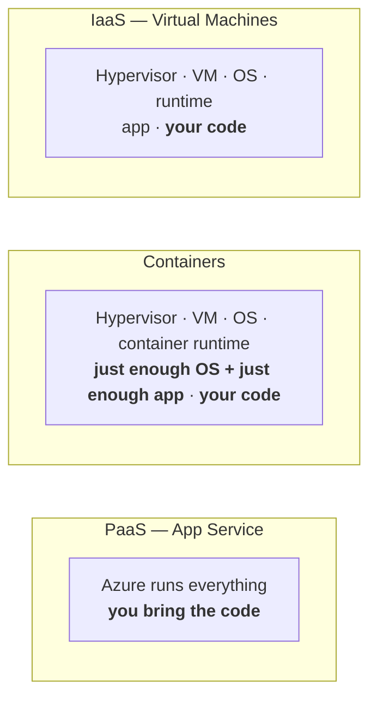
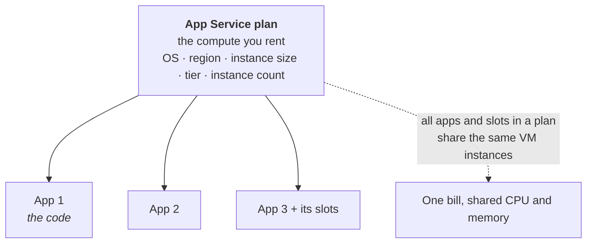
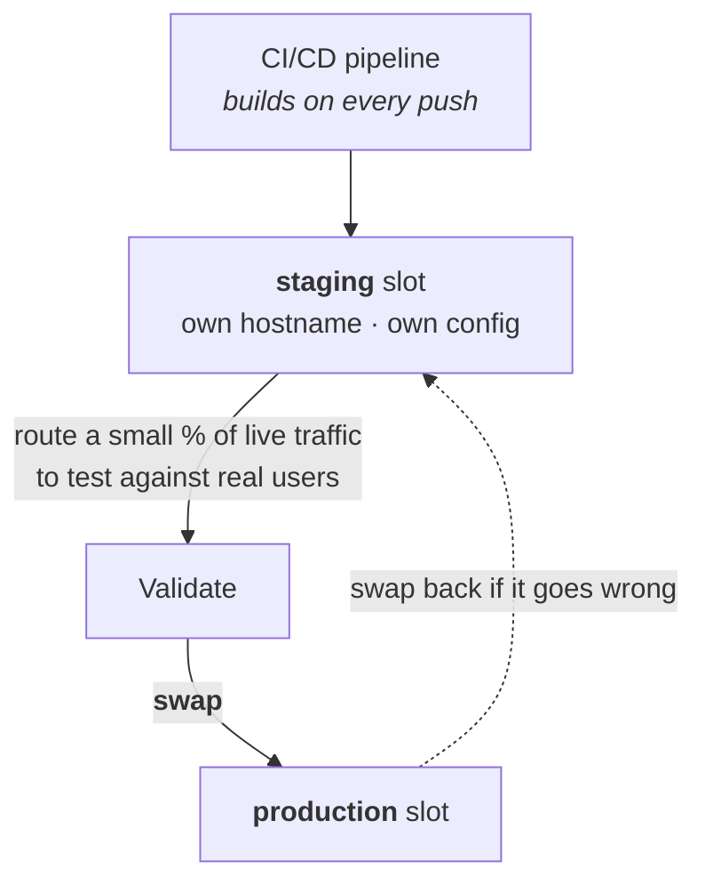
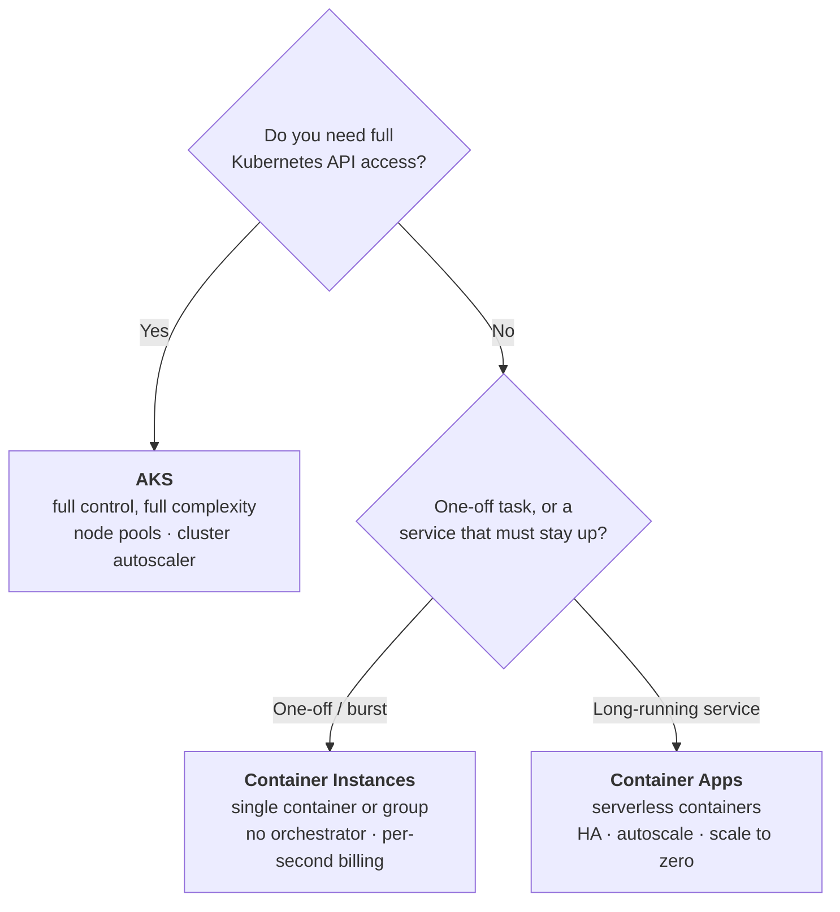
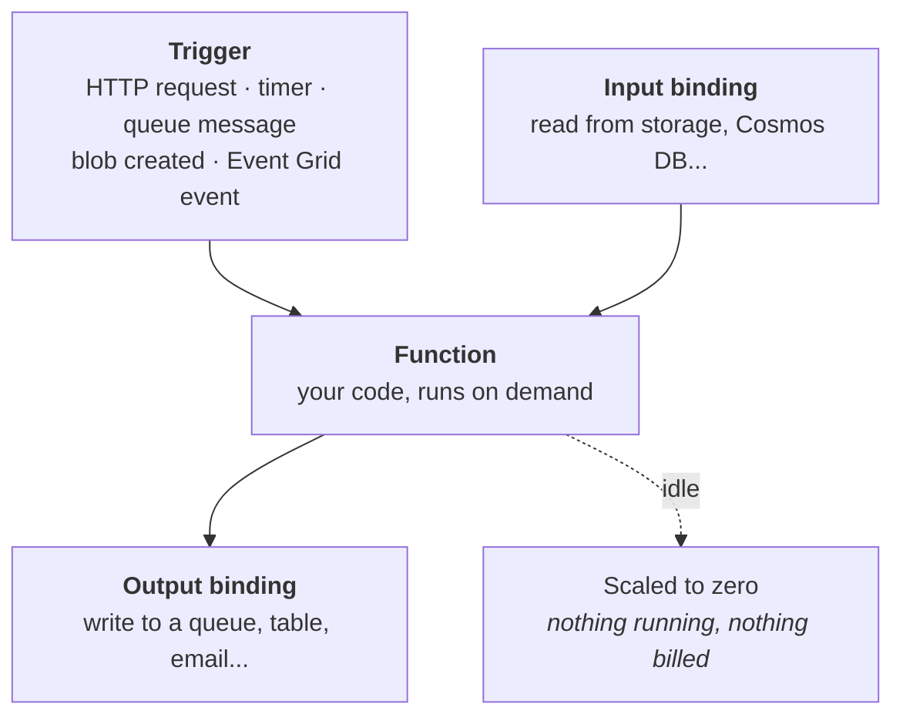
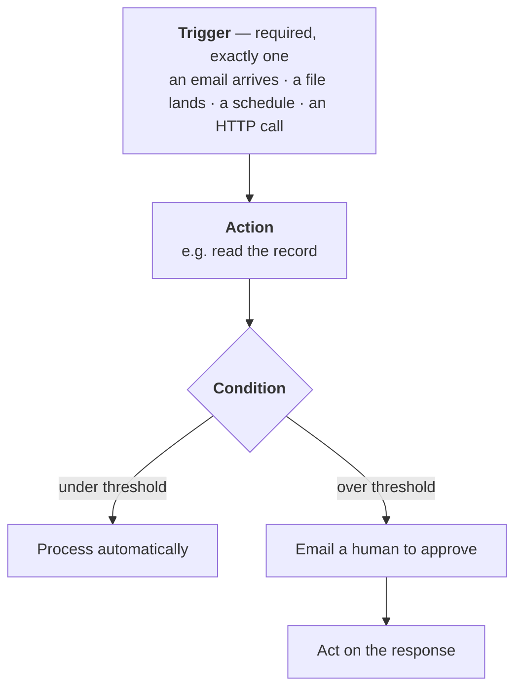

# 09 - PaaS Compute Options

> [!abstract] In one line
> A sliding scale of how much of the stack you hand to Azure. **IaaS** = you own everything above the hypervisor. **Containers** = you own the app and just enough OS. **PaaS** = you own the code and nothing else.

**Labs:** [[LAB 09a - Implement Web Apps]] · [[LAB 09b - Implement Azure Container Instances]] · [[LAB 09c - Implement Azure Container Apps]]
**Course index:** [[AZ-104 Course Index]]

---

## 1. The scale of abstraction

Worth drawing out, because every service in this module sits somewhere on it.

| | **You manage** | **Azure manages** |
| --- | --- | --- |
| **IaaS** (VMs) | OS, patching, runtime, app, code | Hypervisor, hardware, network fabric |
| **Containers** | The image — app + *just enough* OS | Host OS, patching the host, the orchestrator |
| **PaaS** (App Service) | **Only the code** | Everything underneath |

Trade-off is always the same: **the more you hand over, the less control you keep.** Pick the highest level of abstraction the workload can tolerate.

### Choosing a compute service

![[Pasted image 20260916133952.png|437]]
*Microsoft's decision tree — migrate vs build new, then whether it can be containerised, then how much orchestration you actually need.*

---

## 2. App Service

The default backend for web apps, APIs and mobile app backends in Azure.

### Plan first, app second

> [!important] You pay for the plan, not the app
> The plan is the compute. Apps and their deployment slots all run on those same instances. Two busy apps in one plan will fight each other — put a resource-hungry app in its own plan.

### Tiers

| Tier | Compute | Slots | Max scale-out | Custom domains | Autoscale | SLA |
| --- | --- | :--: | :--: | :--: | :--: | --- |
| **Free** | Shared | 0 | 1 shared | ❌ | ❌ | **None** |
| **Shared** | Shared | 0 | 1 shared | ✅ | ❌ | **None** |
| **Basic** | Dedicated | **0** | 3 | ✅ | ❌ manual only | ✅ |
| **Standard** | Dedicated | **5** | 10 | ✅ | ✅ | ✅ |
| **Premium (v2–v4)** | Dedicated | **20** | 30 | ✅ | ✅ + zone redundancy | ✅ |
| **Isolated (v2)** | Dedicated VNet | **20** | 100+ | ✅ | ✅ + zone redundancy | ✅ |

> [!warning] Two things commonly got wrong
> 1. It is **not** true that every App Service has a 99.95% SLA. **Free and Shared have no SLA at all** — they run on shared compute. The SLA starts at Basic.
> 2. Slots are **not** 20 across the board. It is **5 on Standard** and **20 on Premium and Isolated**. Basic has **none** — that's the tier that catches people, because it's dedicated compute but still no slots.

### Scale up vs scale out

| | What changes | Where |
| --- | --- | --- |
| **Scale up** | The **tier** — bigger instances, more features | Plan → Scale up |
| **Scale out** | The **instance count** — more copies of the same | Plan → Scale out |

Autoscale rules work the same way as scale sets ([[08 - Azure Virtual Machines]]): metric + threshold + duration + action, with a minimum and maximum. Metrics available include CPU, memory, HTTP queue length, data in/out.

---

## 3. Deployment slots

The feature worth knowing properly, because it's how you deploy without downtime.

- Each slot is a **live app with its own hostname**, running on the same plan.
- **Traffic percentage** routes a slice of real users to a slot — canary testing against production traffic.
- **Swap** exchanges the two slots. Azure warms the staging instances up first, so the swap itself has **no cold start**.
- If it goes wrong, **swap back** — the previous version is sitting in the other slot.

> [!tip] What follows the slot vs what follows the app
> Settings marked **"deployment slot setting"** stay with the slot and don't swap — connection strings pointing at a test database, for instance. Everything else travels with the code. Getting this wrong is how a swap sends production at the test database.

Slots cost nothing extra — they run on the plan you're already paying for. Counts by tier are in the table above.

---

## 4. Custom domains, certificates, access and auth

### Custom domains

The default name is `yourapp.azurewebsites.net`. To use your own:

1. Add a **DNS record** at your registrar — `CNAME` to the azurewebsites.net name for a subdomain, or an **A record** to the app's IP for a root/apex domain.
2. Add a **TXT verification record** so Azure knows you own it.
3. Add the custom domain in the app, and Azure validates.

Requires **Basic tier or above** — Free supports no custom domains at all.

### Certificates

| Option | Cost | Notes |
| --- | --- | --- |
| **App Service Managed Certificate** | **Free** | Auto-renewed. **No wildcards, no apex domains without an A record, not exportable**, not supported in an ASE. |
| **App Service Certificate** | Paid | Bought and managed in Azure, stored in Key Vault, exportable |
| **Key Vault certificate** | Paid | Import a PKCS12 cert you already hold centrally |
| **Upload your own** | — | PFX for private certs, .cer for public ones your code reads |

Also needs **Basic or above**. The free managed cert covers most lab and small-site cases — the wildcard and apex limitations are what push people to a paid one.

### Access restrictions

An **allow/deny list evaluated in priority order**, exactly like an NSG ([[04 - Virtual Networking]]) but applied at the App Service front end rather than in the network. Up to **512 rules per app**, matched on IP/CIDR, service tag or service endpoint.

### The networking features, sorted by direction

This is the distinction the exam tests:

| Feature | Direction | What it does |
| --- | --- | --- |
| **Access restrictions** | **Inbound** | IP allow/deny at the front end |
| **Private endpoint** | **Inbound** | Gives the app a private IP in your VNet. Premium v2+. |
| **Service endpoints** | **Inbound** | Restrict access to specific VNet subnets |
| **VNet integration** | **Outbound** | Lets the app reach into a VNet — databases, internal APIs |
| **Hybrid Connections** | **Outbound** | Reach a specific TCP host:port on-premises, no VPN needed |

> [!important] The one-line version
> **Private endpoint = inbound. VNet integration = outbound.** They solve opposite problems and are frequently confused.

### Authentication ("Easy Auth")

Built-in authentication that runs **before your code**, so the app never handles the sign-in flow. Providers include Microsoft Entra ID, Apple, Google, Facebook, GitHub, X, and any OpenID Connect provider. You choose whether unauthenticated requests are redirected to sign in or rejected outright.

---

## 5. Containers

### Why containers

A container packages the app with **just enough operating system** to run it. That makes it **portable** — the same image runs on your laptop, on-prem, in Azure, or in another cloud — and it starts in seconds rather than minutes because there's no full OS to boot.

### Azure Container Registry (ACR)

Your private image registry. Push images to it, and every Azure container service can pull from it.

| | **Basic** | **Standard** | **Premium** |
| --- | --- | --- | --- |
| Included storage | 10 GiB | 100 GiB | 500 GiB |
| Use for | Learning, dev | **Most production** | High volume, enterprise |
| Geo-replication | ❌ | ❌ | ✅ |
| Private Link / private endpoints | ❌ | ❌ | ✅ |
| Content trust (image signing) | ❌ | ❌ | ✅ |
| Customer-managed keys | ❌ | ❌ | ✅ |
| IP access rules | ❌ | ❌ | ✅ |

Zone redundancy is available on **all three** tiers in supported regions. SKU changes are live — no downtime — but downgrading from Premium means removing the Premium-only bits first.

**Authenticating to ACR**, best first:

1. **Managed identity** — the container service pulls with its own identity plus the `AcrPull` role. No secret. ([[01 - Administer Identity]])
2. **Service principal** — for CI/CD systems outside Azure.
3. **Admin user** — a single shared username/password on the registry. Convenient in a lab, **disable it in production**.

### Choosing a container service

| | **ACI** | **ACA** | **AKS** |
| --- | --- | --- | --- |
| Orchestrator | **None** | Managed, hidden from you | **Kubernetes, yours to drive** |
| Complexity | Lowest | Middle | Highest |
| Autoscaling | **No** — you create instances | **Yes**, KEDA-based | Yes, pod + cluster autoscaler |
| Scale to zero | No | **Yes** | No |
| High availability | **No** — single instance, no failover | Yes | Yes |
| Billing | Per second, per container | Per use, scales to zero | Per node, always on |
| Use for | Batch jobs, build agents, burst capacity | Microservices, event-driven apps, jobs | Complex orchestration, existing k8s workloads |

> [!warning] ACI's limitation is the point
> **ACI has no scalability and no failover.** It's a single container instance — if it dies, it dies. That's not a flaw, it's the design: ACI is the low-level building block for short-lived work. Anything that has to *stay up* wants ACA or AKS.

### Container Apps in a bit more detail

Since it's the sweet spot — Kubernetes-grade capability without the Kubernetes:

| Concept | What it is |
| --- | --- |
| **Environment** | The secure boundary apps share — same VNet, same Log Analytics workspace |
| **Revisions** | Immutable snapshots of a version. Multiple can run at once. |
| **Traffic splitting** | Send a percentage to a new revision — blue/green and canary, same idea as App Service slots |
| **Scale rules** | HTTP concurrency, CPU/memory, or any **KEDA** event source — a queue length, an event hub |
| **Dapr** | Optional built-in microservice plumbing: service discovery, pub/sub, state |

---

## 6. Function Apps

The far end of the abstraction scale from section 1. With App Service you still deploy and run an *app*; with Functions you deploy **individual pieces of code that run only when something triggers them**. No server, no app to keep alive, no idle cost on the serverless plans.

### Triggers and bindings

This is the whole programming model, and it's what makes Functions different from a web app:

| | What it is |
| --- | --- |
| **Trigger** | What causes the function to run. Exactly one per function — an HTTP request, a timer/CRON schedule, a new queue message, a blob being created, an Event Grid event. |
| **Input binding** | Data pulled in for you before the code runs — a Cosmos DB document, a blob — declared rather than coded. |
| **Output binding** | Where the result goes — a queue, a table, a SendGrid email — again declared, not coded. |

The point is you write the logic and let the platform handle the plumbing on both sides.

### Hosting plans

| Plan | Scales to zero | Cold starts | Timeout (default / max) | VNet | Billing |
| --- | :--: | --- | --- | :--: | --- |
| **Consumption** *(legacy)* | ✅ | Yes, on first request | 5 min / **10 min** | ❌ | Per execution + memory |
| **Flex Consumption** | ✅ | Improved; always-ready instances available | 30 min / unbounded | ✅ | Per execution, memory, always-ready |
| **Premium** | ❌ min 1 instance | **None** — prewarmed workers | 30 min / unbounded | ✅ | Core seconds + memory, incl. prewarmed |
| **Dedicated (App Service plan)** | ❌ | None | 30 min / unbounded *(needs Always On)* | ✅ | Same as any App Service plan |
| **Container Apps** | Configurable | Depends on min replicas | 30 min / unbounded | ✅ | Per Container Apps plan |

> [!important] The two numbers worth memorising
> **Consumption caps a function at 10 minutes.** If the job can run longer than that, Consumption is the wrong plan — go Flex Consumption, Premium or Dedicated.
>
> Separately, **HTTP-triggered functions have a hard 230-second limit** regardless of plan, because that's the Azure Load Balancer idle timeout. Long HTTP work needs an async pattern, not a bigger timeout.

> [!note] Consumption is being superseded
> **Flex Consumption** is now the recommended serverless plan — it keeps scale-to-zero but adds VNet integration and much longer timeouts, both of which classic Consumption lacks. Linux Consumption retires 30 September 2028.

### Where it sits against the rest of the module

| | Runs when | Pay when | Good for |
| --- | --- | --- | --- |
| **App Service** | Always | Always (the plan) | Web apps and APIs that must be up |
| **Container Apps** | On demand, can scale to zero | Only when running | Microservices, event-driven containers |
| **Functions** | **Only when triggered** | **Only when executing** (serverless plans) | Glue code, scheduled jobs, event reactions |

> [!tip] The practical read
> Functions is where the small automation jobs live — the thing that runs at 2am to tidy a storage container, the webhook that fires when a blob lands, the scheduled report. Anything you'd otherwise have built a scheduled task on a VM for.

---

## 7. Logic Apps

The other half of the serverless automation pair. Where Functions is **code-first**, Logic Apps is **designer-first** — you build a workflow visually and the connectors do the talking to other systems.

Same trigger-then-do-something shape as Functions, but the steps are **configured, not coded**, and branching, approvals and retries are built into the designer.

### Connectors are the point

Over **1,400 prebuilt connectors** — Office 365, SharePoint, Outlook, Teams, SQL, SAP, ServiceNow, Salesforce, Blob storage, plus generic HTTP. That's the reason to reach for Logic Apps: the integration work is already done.

| Connector type | Runs | Notes |
| --- | --- | --- |
| **Built-in** | Natively in the Logic Apps runtime | Fastest, cheapest at volume |
| **Managed** | Microsoft-hosted proxy to the service's API | The 1,400+ |
| **Custom** | Yours | For anything not covered |

### Consumption vs Standard

| | **Consumption** | **Standard** |
| --- | --- | --- |
| Tenancy | Multitenant, shared | **Single-tenant, isolated** |
| Workflows per logic app | **One** | **Many** |
| Billing | Per action executed | Per hosting plan |
| Outbound IPs | Shared across tenants | **Your own, predictable** |
| VNet / private endpoints | ❌ | ✅ |
| Stateless workflows | ❌ | ✅ |
| Custom code | ❌ | ✅ JavaScript, C#, PowerShell |
| Use for | Getting started, light or variable workloads | Enterprise integration, high throughput, predictable cost |

### Functions vs Logic Apps

| | **Functions** | **Logic Apps** |
| --- | --- | --- |
| Built by | Writing **code** | A **visual designer** |
| Strength | Arbitrary logic, transformation, compute | **Connecting systems together** |
| Integration | You write the API calls | 1,400+ connectors already built |
| Who can maintain it | Developers | Ops and non-developers too |
| Billing | Per execution / core-seconds | Per action executed |
| Reach for it when | The hard part is the **logic** | The hard part is the **plumbing** |

> [!tip] They're not rivals
> A Logic App calling a Function for the one awkward calculation is a very common and sensible pattern. Designer for the orchestration, code for the bit that genuinely needs code.

### Where it shows up in this course

Logic Apps isn't really an AZ-104 topic in its own right — it's AZ-204/AZ-305 territory. It matters here because it's an **action group target** in Azure Monitor ([[11 - Monitoring]]): an alert fires, the action group triggers a Logic App, and the workflow raises a ticket, posts to Teams or kicks off a remediation. Know it exists and know what it's for.

> [!note] The neighbours
> **Power Automate** is the same engine aimed at business users rather than IT. **Azure Automation runbooks** are the PowerShell-based option for infrastructure tasks — restart a VM, tidy up resources — and that's usually the closer fit for ops work than a Logic App.

---

## Still to cover

- [ ] App Service backup and restore
- [ ] App Service Environment (ASE) and the Isolated tier
- [ ] AKS node pools and cluster autoscaling in depth

## Exam objective coverage

- [x] Provision an App Service plan
- [x] Configure scaling for an App Service plan
- [x] Create an App Service
- [x] Configure certificates and TLS for an App Service
- [x] Map an existing custom DNS name to an App Service
- [x] Configure networking settings for an App Service
- [x] Configure deployment slots for an App Service
- [x] Create and manage an Azure Container Registry
- [x] Provision a container by using Azure Container Instances
- [x] Provision a container by using Azure Container Apps
- [x] Manage sizing and scaling for containers
- [ ] Configure backup for an App Service

## Recall check

1. What exactly are you paying for in App Service — the app or the plan? What does that mean for two busy apps?
2. Which tiers have no SLA, and why?
3. How many deployment slots does Standard give you? Basic? Premium?
4. Scale up vs scale out — which one changes the tier?
5. What does a slot swap do about cold starts, and what happens if the new version is broken?
6. Which settings do *not* travel during a swap, and why does that matter?
7. Private endpoint vs VNet integration — which is inbound and which is outbound?
8. Name three limitations of the free App Service Managed Certificate.
9. What DNS records do you need for a subdomain vs a root domain?
10. Which container service has no autoscaling and no failover — and why is that not a defect?
11. Which container service scales to zero?
12. What's the best way to authenticate a container service to ACR, and which ACR feature is Premium-only?
13. What is a trigger, and how many can one function have?
14. What's the maximum timeout on the Consumption plan — and what's the separate hard limit on HTTP-triggered functions?
15. Which Functions plans scale to zero, and which one has no cold starts?
16. Functions vs Logic Apps — which do you reach for when the hard part is the plumbing rather than the logic?
17. Name three things Logic Apps Standard can do that Consumption cannot.
18. Where does a Logic App turn up in the AZ-104 syllabus proper?

## References

- [App Service plan overview](https://learn.microsoft.com/en-us/azure/app-service/overview-hosting-plans)
- [App Service limits by tier](https://learn.microsoft.com/en-us/azure/azure-resource-manager/management/azure-subscription-service-limits)
- [Set up staging environments (deployment slots)](https://learn.microsoft.com/en-us/azure/app-service/deploy-staging-slots)
- [App Service networking features](https://learn.microsoft.com/en-us/azure/app-service/networking-features)
- [Add a TLS/SSL certificate in App Service](https://learn.microsoft.com/en-us/azure/app-service/configure-ssl-certificate)
- [Compare container options in Azure](https://learn.microsoft.com/en-us/azure/container-apps/compare-options)
- [Azure Container Registry service tiers](https://learn.microsoft.com/en-us/azure/container-registry/container-registry-skus)
- [Choose an Azure compute service](https://learn.microsoft.com/en-us/azure/architecture/guide/technology-choices/compute-decision-tree)
- [Azure Functions hosting options](https://learn.microsoft.com/en-us/azure/azure-functions/functions-scale)
- [Azure Functions triggers and bindings](https://learn.microsoft.com/en-us/azure/azure-functions/functions-triggers-bindings)
- [Azure Logic Apps overview](https://learn.microsoft.com/en-us/azure/logic-apps/logic-apps-overview)
- [Single-tenant vs multitenant Logic Apps](https://learn.microsoft.com/en-us/azure/logic-apps/single-tenant-overview-compare)
