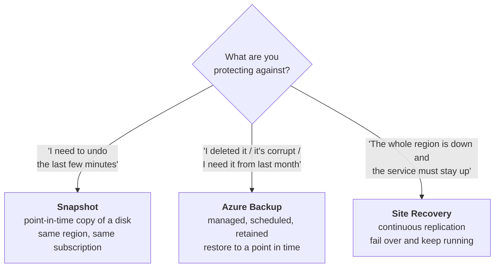
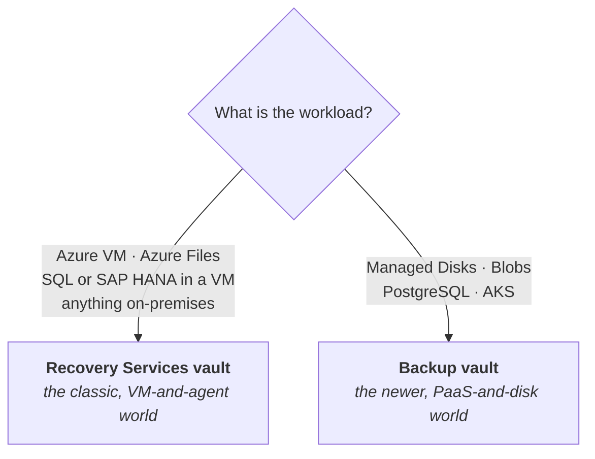
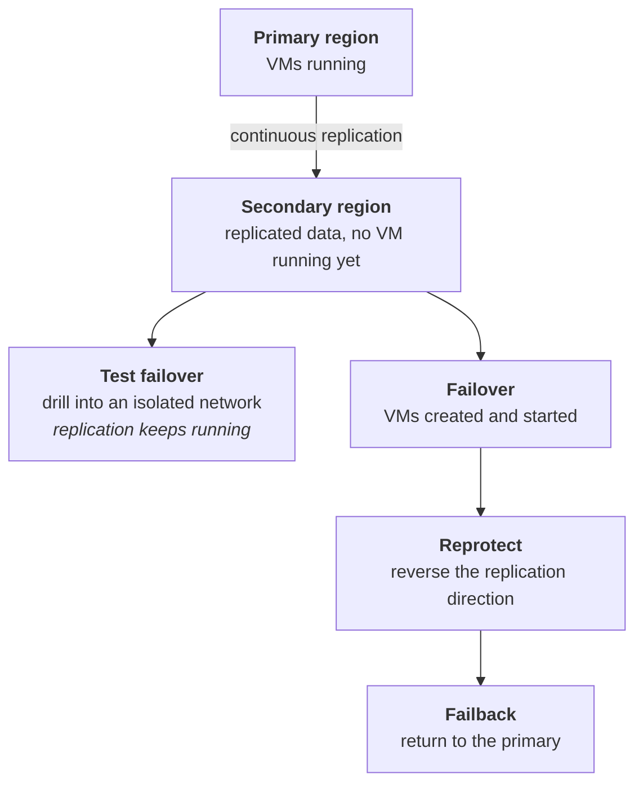

# 10 - Data Protection

> [!abstract] In one line
> **Backup** gets your data back. **Site Recovery** keeps the workload *running somewhere else*. They answer different questions and most real estates need both.

**Lab:** [[LAB 10 - Implement Data Protection]]
**Course index:** [[AZ-104 Course Index]]

---

## 1. Snapshots vs Backup vs Site Recovery

This is the one to know, because the exam sets up a scenario and expects you to pick.

| | **Snapshot** | **Azure Backup** | **Azure Site Recovery** |
| --- | --- | --- | --- |
| Protects against | An immediate mistake | **Deletion, corruption, ransomware** | **Region or datacentre outage** |
| What it is | A read-only copy of a disk at a moment | A managed backup service with policy, schedule and retention | Continuous replication of the whole VM to another region |
| Granularity | Whole disk | VM, disk, file, database — down to individual files | Whole VM |
| Retention | You manage it manually | **Days to years**, policy-driven | Recovery points, hours to 15 days |
| RPO | Whenever you last took one | Hours to a day | **Seconds to minutes** |
| RTO | Manual — build a disk, attach it | Minutes to hours | **Minutes** — the VM is already replicated |
| Cost | Storage only | Storage + protected instance | **Highest** — you pay for replication continuously |
| Runs the workload elsewhere? | No | No | **Yes** |

> [!important] The distinction the exam leans on
> **Backup is about time. Site Recovery is about place.**
>
> Backup answers *"give me yesterday's version"*. Site Recovery answers *"the primary region is gone, bring it up in the secondary"*. Site Recovery is **not** a backup — its recovery points only go back hours or days, so it will happily replicate your ransomware to the secondary region. You want both.

---

## 2. Vaults

Two kinds, and which one you use is decided **by the workload**, not by preference.

Which workload goes where:

| Workload | Vault | Method |
| --- | --- | --- |
| **Azure VM** | Recovery Services | VM extension, snapshot then transfer to vault |
| **SQL Server in an Azure VM** | Recovery Services | Workload backup — full, differential, log |
| **SAP HANA in an Azure VM** | Recovery Services | Workload backup |
| **Azure Files** | Recovery Services | Share snapshots, managed by the vault |
| **On-prem files and folders** | Recovery Services | **MARS agent** on the machine |
| **On-prem VMs (VMware/Hyper-V), app-aware** | Recovery Services | **MABS** (Azure Backup Server) or **DPM** |
| **Azure Managed Disks** | **Backup vault** | Disk snapshots |
| **Azure Blobs** | **Backup vault** | Operational (local) or vaulted backup |
| **Azure Database for PostgreSQL** | **Backup vault** | Native database backup |
| **Azure Kubernetes Service** | **Backup vault** | Cluster and persistent volume backup |

> [!tip] Rough rule
> **Recovery Services vault = the older, VM-and-agent world.** **Backup vault = the newer, PaaS-and-disk world.** If the question says "Azure VM" or "on-premises", it's a Recovery Services vault.

### Agents, if you're backing up on-prem

| | **MARS agent** | **MABS / DPM** |
| --- | --- | --- |
| Installed on | The machine itself | A dedicated backup server |
| Protects | Files, folders, system state | VMs, SQL, SharePoint, Exchange — app-aware |
| Backs up to | The vault directly | Local disk first, then the vault |
| Bare-metal recovery | System state only | Yes |

---

## 3. Vault settings

### Redundancy

> [!warning] ZRS is supported
> A Recovery Services vault is often described as LRS or GRS only. It does support **ZRS** — all three are available: **LRS, ZRS and GRS**. Backup vaults support the same three.

| Option | Protects against | Use for |
| --- | --- | --- |
| **LRS** | Hardware failure in one datacentre | Dev/test only |
| **ZRS** | A whole datacentre failing | Production where the region has zones |
| **GRS** *(default)* | **A whole region failing** | Production, and the prerequisite for cross-region restore |

> [!important] Set it before you protect anything
> **Redundancy cannot be changed once backups are configured in the vault.** The option greys out. Getting this wrong means a new vault and re-protecting everything — plan it at creation, like subnet sizing in [[04 - Virtual Networking]].

### Protection features

| Feature | What it does |
| --- | --- |
| **Soft delete** | A deleted backup is retained for **14 days** by default and can be undeleted. **Enhanced soft delete** makes it always-on with a customisable retention period. |
| **Immutable vault** | Backups **cannot be deleted or shortened** before their retention expires — locked, this is irreversible. The direct answer to **ransomware**. |
| **Multi-user authorisation (MUA)** | A second approver, via a Resource Guard, before destructive operations like disabling soft delete or reducing retention |
| **Cross Region Restore (CRR)** | Restore into the **paired region** at any time, not only during an outage. **Requires GRS.** |
| **Cross Subscription Restore (CSR)** | Restore into a different subscription from the one backed up |
| **Encryption** | Platform-managed keys by default; customer-managed keys in Key Vault available |

> [!tip] The resiliency view
> The **resiliency tab** is worth using — it is the single pane that shows both backup and Site Recovery posture for a resource, rather than checking each service separately.

---

## 4. Backup policies

A policy is **what to back up, how often, and how long to keep it**. The Recovery Services vault is both the backup software and the storage — there's nothing else to install for an Azure VM.

### Standard vs Enhanced (Azure VMs)

| | **Standard** | **Enhanced** |
| --- | --- | --- |
| Backup frequency | **Once a day** | **Multiple times a day — as often as every 4 hours** |
| Snapshot tier retention | Shorter | **Up to 30 days** |
| Snapshot zone resilience | No | **Yes, ZRS snapshots** |
| Trusted Launch VMs | Limited (CLI/PowerShell/REST only) | **Yes** |
| Premium SSD v2 and Ultra Disks | **No** | **Yes** |
| Multi-disk crash-consistent snapshots | No | **Yes** |
| Cost | Lower | Higher — more snapshots, kept longer |

> [!warning] Enhanced is a one-way door
> You can migrate a policy **Standard → Enhanced**, but **not back again**. Choose deliberately.

### Retention

Policies are built as a grid — **daily, weekly, monthly, yearly** — each with its own retention. That's how you get "keep 30 dailies, 12 monthlies and 7 yearlies" from a single daily backup job.

### Instant restore

The snapshot is taken first and kept **locally alongside the VM** before it's transferred into the vault. Restoring from that local snapshot is far quicker than pulling from vault storage — hence "instant".

Retention is configurable, and it's the knob that trades speed against snapshot cost.

---

## 5. Restore options

| Option | What you get | Use when |
| --- | --- | --- |
| **Create new VM** | A whole new VM built from the recovery point | The original is gone or unrecoverable |
| **Replace existing disks** | The original VM keeps its identity, NIC and IP; the disks are swapped | The VM is fine but the data is bad — **least disruptive** |
| **Restore disks** | Disks dropped into a storage account for you to attach yourself | You want to inspect before committing, or build something custom |
| **File recovery** | Mounts the recovery point as a drive so you can copy **individual files** | Someone deleted one file — no need to restore the whole VM |

> [!tip] The one people forget
> **File recovery** is the everyday answer. Mount the recovery point, copy the file back, unmount. Restoring an entire VM to retrieve one document is the sort of thing that turns up as a wrong answer on the exam.

---

## 6. Azure Site Recovery

Continuous replication so a workload can come up somewhere else.

### Scenarios

| From | To |
| --- | --- |
| **Azure region → Azure region** | The common one, and what the lab does |
| On-prem VMware, Hyper-V or physical → Azure | Migration and DR for the existing estate |
| On-prem → on-prem secondary datacentre | Legacy, via the on-prem tooling |

### Recovery points

| Type | Captures | Note |
| --- | --- | --- |
| **Crash-consistent** | Disk contents at that instant | Like pulling the power — fine for most, taken every 5 minutes |
| **App-consistent** | Disk **plus memory and in-flight transactions** | What a database needs; taken less often, more overhead |

RPO can be as low as **30 seconds** for Hyper-V and is effectively continuous for Azure and VMware VMs.

### Recovery plans

Group VMs and **sequence** the failover, so a multi-tier app comes up in the right order — database, then app tier, then web tier. Can include manual steps and **Azure Automation runbooks** for things like re-pointing DNS.

### Failover types

| Type | Data loss | Use |
| --- | --- | --- |
| **Test failover** | None | A **drill**. Runs into an isolated network and **does not interrupt replication** — do this regularly. |
| **Planned failover** | **Zero** | An expected event you can schedule around |
| **Unplanned failover** | Up to the RPO | The real disaster |
| **Reprotect** | — | After failing over, reverse replication so the secondary is now protected |
| **Failback** | — | Return to the primary once it's healthy |

> [!important] Test failover is the point
> A DR plan you have never tested is a hope, not a plan. **Test failover is non-destructive** — it builds the VMs in an isolated network, proves the plan works, and leaves live replication alone. There's no reason not to run it.

---

## 7. Monitoring backups

| Where | What it shows |
| --- | --- |
| **Backup center** | One view across all vaults, subscriptions and workloads |
| **Backup reports** | Log Analytics–backed — usage, job success rates, policy adherence, trends |
| **Backup alerts** | Built-in alerts for failed jobs; route them through **action groups** ([[11 - Monitoring]]) |
| **Jobs blade** | Per-vault, per-job success and failure detail |

> [!tip] The question worth asking at work
> "Did the backup run?" is easy. "**Could we actually restore it, and how long would that take?**" is the one that matters — and only a test restore answers it.

---

## Still to cover

- [ ] Azure Backup pricing model — protected instances vs storage consumed
- [ ] MABS / DPM deployment in detail
- [ ] Site Recovery capacity planning and network mapping
- [ ] Backup for Azure Files vs Azure File Sync snapshots

## Exam objective coverage

- [x] Create a Recovery Services vault
- [x] Create an Azure Backup vault
- [x] Create and configure a backup policy
- [x] Perform backup and restore operations by using Azure Backup
- [x] Configure Azure Site Recovery for Azure resources
- [x] Perform a failover to a secondary region by using Site Recovery
- [x] Configure and interpret reports and alerts for backups

## Recall check

1. Backup vs Site Recovery — which is about *time* and which is about *place*? Why isn't Site Recovery a backup?
2. Which vault type for an Azure VM? For Azure Blobs? For an on-prem file server?
3. What are the three redundancy options for a Recovery Services vault, and when can you change them?
4. What does Cross Region Restore require, and where does it restore to?
5. What's the default soft delete retention, and what does an immutable vault add?
6. Standard vs Enhanced policy — how often can each back up, and which way can you migrate?
7. Name the four VM restore options. Which is least disruptive, and which do you use for one deleted file?
8. Crash-consistent vs app-consistent recovery point — which does a database need and why?
9. What does a recovery plan give you that failing over VMs individually doesn't?
10. Why should you run a test failover regularly, and what does it *not* affect?
11. MARS agent vs MABS — which protects files and folders, and which is app-aware?

## References

- [Azure Backup overview](https://learn.microsoft.com/en-us/azure/backup/backup-overview)
- [Recovery Services vault overview](https://learn.microsoft.com/en-us/azure/backup/backup-azure-recovery-services-vault-overview)
- [Backup vault overview](https://learn.microsoft.com/en-us/azure/backup/backup-vault-overview)
- [Azure Backup FAQ — which vault for which workload](https://learn.microsoft.com/en-us/azure/backup/backup-azure-backup-faq)
- [Back up Azure VMs with the Enhanced policy](https://learn.microsoft.com/en-us/azure/backup/backup-azure-vms-enhanced-policy)
- [Azure Instant Restore capability](https://learn.microsoft.com/en-us/azure/backup/backup-instant-restore-capability)
- [About Site Recovery](https://learn.microsoft.com/en-us/azure/site-recovery/site-recovery-overview)
