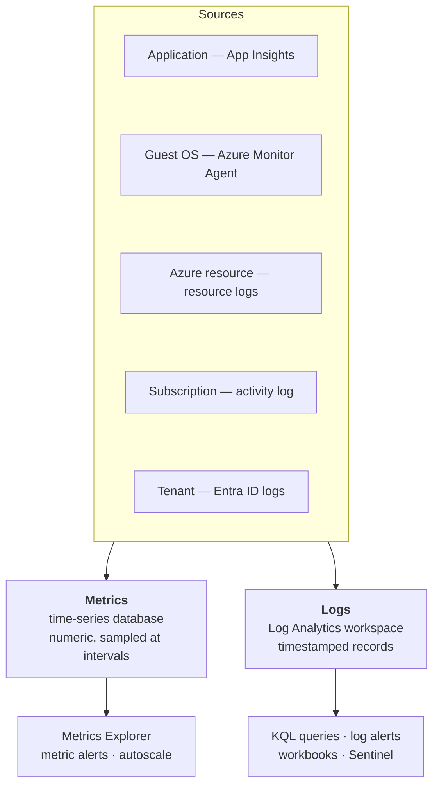
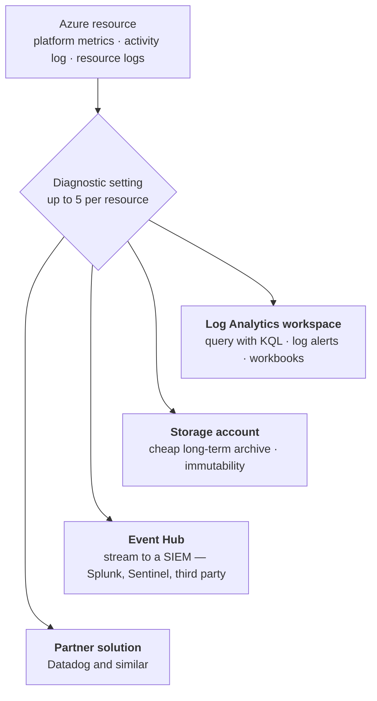
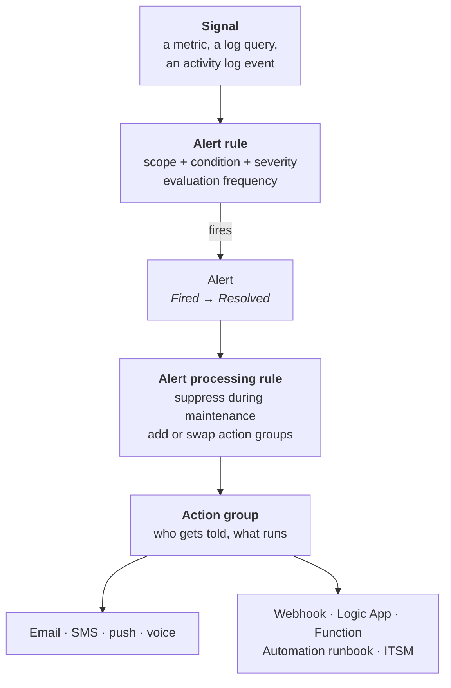

# 11 - Monitoring

> [!abstract] In one line
> Azure Monitor collects exactly two kinds of data — **metrics** (numbers over time) and **logs** (timestamped records). Everything else in this module either feeds those two or consumes them.

**Lab:** [[LAB 11 - Implement Monitoring]]
**Course index:** [[AZ-104 Course Index]]

---

## 1. Why monitor

Three jobs, and they pull in different directions:

| Job | What you need from monitoring |
| --- | --- |
| **Incident response** | Fast detection and a clear signal — metrics and alerts |
| **Root cause analysis** | Deep, queryable detail after the fact — logs and KQL |
| **Cost and capacity analysis** | Trends over weeks and months — workbooks and cost data |

The tension is real: metrics are cheap, fast and shallow; logs are rich, slower and billed per GB. A good setup uses metrics to *notice* and logs to *explain*.

### The Monitoring blade on every resource

Every VM and most resources have their own Monitoring section, and the items in it map to the rest of this note:

| Blade item | What it is |
| --- | --- |
| **Insights** | A pre-built dashboard for that resource type |
| **Alerts** | Rules and fired alerts scoped to this resource |
| **Metrics** | Metrics Explorer — chart the numeric data |
| **Diagnostic settings** | Where this resource's logs get sent |
| **Logs** | KQL against the workspace |
| **Workbooks** | Interactive reports combining metrics, logs and text |
| **Dashboards / Grafana** | Pinned tiles, or Azure Managed Grafana for richer visuals |

---

## 2. The data platform — metrics vs logs



| | **Metrics** | **Logs** |
| --- | --- | --- |
| Shape | A number, a timestamp and some labels | Structured or free-text records |
| Stored in | Time-series database | **Log Analytics workspace** (Azure Data Explorer underneath) |
| Collected | **Automatically**, no configuration | Resource logs need a **diagnostic setting** |
| Queried with | Metrics Explorer | **KQL** |
| Latency | **Near real-time** | Minutes |
| Retention | **93 days** for platform metrics | 30 days default, up to **730 days** interactive, then long-term retention |
| Cost | Effectively free | **Billed per GB ingested and retained** |
| Best for | Alerting, autoscale, spotting a spike | Root cause, correlation, audit |

> [!tip] Which one to reach for
> **Metrics tell you something is wrong. Logs tell you why.** If you can alert on a metric, do — it's faster and cheaper than a log query alert.

---

## 3. Getting data in

### Activity log vs resource logs

The distinction the exam tests:

| | **Activity log** | **Resource logs** |
| --- | --- | --- |
| Scope | **Subscription** — the control plane | **Inside one resource** — the data plane |
| Answers | *Who created, changed or deleted what, and when* | *What did the resource actually do* |
| Example | "User X resized VM Y at 14:32" | A Key Vault secret was read; a SQL query ran |
| Collected by default | **Yes**, kept **90 days**, free | **No** — nothing until you configure it |
| To keep longer or query with KQL | Diagnostic setting → workspace | Diagnostic setting → workspace |

Same control-plane / data-plane split as [[08 - Azure Virtual Machines]].

### Diagnostic settings

The plumbing that moves logs and metrics somewhere useful. **Up to five per resource**, one destination of each type per setting.



| Destination | Choose it when |
| --- | --- |
| **Log Analytics workspace** | You want to **query, alert and investigate**. The default answer. |
| **Storage account** | **Cheap, long retention** for audit and compliance — years, with immutability |
| **Event Hub** | **Stream to an external SIEM** or processing pipeline in real time |
| **Partner solution** | You already run a third-party observability platform |

> [!note] The guest OS needs an agent
> A diagnostic setting gets you the resource's *own* logs. Anything **inside** the VM — performance counters, Windows event logs, syslog — needs the **Azure Monitor Agent**, configured by a **Data Collection Rule (DCR)** that says what to collect and which workspace to send it to.

---

## 4. Log Analytics and KQL

A **Log Analytics workspace** is the container: the data, the retention setting, the access control and the query surface.

Design decision worth getting right early: **one central workspace or several?** Central is easier to query across and usually cheaper; separate workspaces make sense for hard data-residency or access boundaries. Most estates do better with one per region and per compliance boundary, not one per application.

### KQL

> [!tip] Already familiar
> KQL is the **same language as Microsoft Defender advanced hunting** and Azure Data Explorer. If you can write a Defender hunting query, you can already read every query in this module — only the table names change.

```kusto
Heartbeat
| where TimeGenerated > ago(1h)
| summarize LastSeen = max(TimeGenerated) by Computer
| order by LastSeen asc
```

| Operator | Does |
| --- | --- |
| `where` | Filter rows — put it early, it's what makes queries fast |
| `project` / `project-away` | Choose columns |
| `extend` | Add a calculated column |
| `summarize ... by ...` | Aggregate — `count()`, `avg()`, `max()`, `percentile()` |
| `join` | Combine two tables |
| `top N by` / `order by` | Rank |
| `render timechart` | Draw it |
| `ago()` / `bin()` | Relative time, and bucketing into intervals |

Tables you'll meet in the lab: `Heartbeat` (agent alive), `InsightsMetrics` (perf counters), `AzureActivity` (activity log), `AzureDiagnostics` (resource logs), `Event` and `Syslog` (guest OS).

---

## 5. Alerts

### The anatomy



An alert rule is **scope + condition + action group**, plus a severity and how often it's evaluated.

### Alert types

| Type | Evaluates | Use for |
| --- | --- | --- |
| **Metric alert** | Platform or custom metrics at an interval. Supports **dynamic thresholds** that learn normal. | CPU, memory, disk, latency — the fast ones |
| **Log search alert** | A KQL query on a schedule | Anything metrics can't express — patterns across logs |
| **Activity log alert** | New activity log events, including **Service Health** and **Resource Health** | "A VM was deleted", "Azure has an incident in UK South" |

> [!tip] Applying one rule to many resources
> A metric alert rule can be scoped to a **resource group or an entire subscription** rather than one VM. That's how you get one rule covering every VM, including ones created later — far better than cloning a rule per machine.

### Action groups

**What happens when an alert fires.** Defined once, reused by many rules.

| Notifications | Actions |
| --- | --- |
| Email | Webhook (standard or secure) |
| SMS | Azure Function |
| Push (Azure mobile app) | **Logic App** ([[09 - PaaS Compute Options]]) |
| Voice call | **Automation runbook** |
| Email to an Azure Resource Manager role | ITSM connector · Event Hub |

### Alert processing rules

A separate object that modifies alerts **after they fire**.

| | **Action group** | **Alert processing rule** |
| --- | --- | --- |
| Answers | *What happens when this fires?* | *What should happen to fired alerts in general?* |
| Attached to | An alert rule | A scope, with filters |
| Typical use | Notify the on-call address | **Suppress everything in this resource group during Saturday's patch window** |

Suppression during a maintenance window is the headline use — without it, a planned reboot pages everyone.

### Severity

| Level | Portal label |
| --- | --- |
| **Sev 0** | Critical |
| **Sev 1** | Error |
| **Sev 2** | Warning |
| **Sev 3** | Informational |
| **Sev 4** | Verbose |

Severity drives routing — an alert processing rule or downstream ITSM integration can treat Sev 0 differently from Sev 3. Fired alerts are retained for **30 days**.

> [!warning] Alert fatigue is the real failure mode
> A rule that fires constantly gets ignored, and then the one that matters gets ignored too. Tune thresholds, use dynamic thresholds where the baseline moves, and suppress during known maintenance.

---

## 6. Insights, workbooks and dashboards

| | What it is |
| --- | --- |
| **Insights** | Curated, pre-built monitoring for a resource type — **VM Insights** (performance and a dependency map), **Storage Insights**, **Network Insights**, **Container Insights**, **Application Insights** |
| **Workbooks** | Interactive reports mixing metrics, log queries, parameters and narrative text. The right tool for a recurring report. |
| **Dashboards** | Pinned tiles on a portal dashboard — quick, shareable, shallow |
| **Azure Managed Grafana** | Managed Grafana over Azure Monitor data, when you want richer visuals or already run Grafana |

> [!tip] Insights first
> Before building anything, check whether an Insight already exists for that resource type. VM Insights gives you performance charts and a dependency map with no query writing at all.

---

## 7. Network Watcher

Regional network diagnostics. Covered from the troubleshooting side in [[04 - Virtual Networking]]; here it is as a set:

| Tool | Answers |
| --- | --- |
| **NSG diagnostics** | Is this flow allowed or denied — and **by which rule**? |
| **IP flow verify** | Quick allow/deny for one 5-tuple |
| **Effective security rules** | The flattened rule set actually applied to a NIC |
| **Next hop** | Where does traffic to this destination actually go? |
| **Connection troubleshoot** | One-off reachability test between two endpoints |
| **Connection monitor** | **Ongoing** reachability and latency testing, with alerts |
| **Packet capture** | Capture the actual traffic on a VM |
| **Topology** | Visualise the VNet |

> [!important] Connection troubleshoot vs Connection monitor
> **Troubleshoot** is a single test you run now. **Monitor** is continuous, records latency over time and can alert. The exam distinguishes them.

---

## Still to cover

- [ ] Data Collection Rules in depth
- [ ] Log Analytics workspace cost management and commitment tiers
- [ ] Application Insights
- [ ] Azure Monitor for Prometheus and managed Grafana

## Exam objective coverage

- [x] Interpret metrics in Azure Monitor
- [x] Configure log settings in Azure Monitor
- [x] Query and analyse logs in Azure Monitor
- [x] Set up alert rules, action groups and alert processing rules
- [x] Configure and interpret monitoring of VMs, storage accounts and networks using Insights
- [x] Use Azure Network Watcher and Connection monitor

## Recall check

1. What are the only two kinds of data Azure Monitor holds, and which one is cheap and fast?
2. Which data is collected automatically, and which needs a diagnostic setting?
3. Activity log vs resource log — which is control plane, and how long is the activity log kept for free?
4. Name the four diagnostic setting destinations and when you'd pick each.
5. How many diagnostic settings can one resource have?
6. What gets performance counters and event logs out of the guest OS, and what tells it what to collect?
7. How long are platform metrics retained? What's the default Log Analytics retention?
8. Name the three alert types and what each evaluates.
9. How do you apply one metric alert rule to every VM in a subscription, including future ones?
10. Action group vs alert processing rule — which one suppresses alerts during a patch window?
11. What is Sev 0, and how long are fired alerts kept?
12. Connection troubleshoot vs Connection monitor — which one alerts you?
13. Which Network Watcher tool names the specific rule blocking a flow?

## References

- [Azure Monitor overview](https://learn.microsoft.com/en-us/azure/azure-monitor/overview)
- [Azure Monitor data platform](https://learn.microsoft.com/en-us/azure/azure-monitor/fundamentals/data-platform)
- [Diagnostic settings](https://learn.microsoft.com/en-us/azure/azure-monitor/essentials/diagnostic-settings)
- [Alerts overview](https://learn.microsoft.com/en-us/azure/azure-monitor/alerts/alerts-overview)
- [Action groups](https://learn.microsoft.com/en-us/azure/azure-monitor/alerts/action-groups)
- [Alert processing rules](https://learn.microsoft.com/en-us/azure/azure-monitor/alerts/alerts-processing-rules)
- [KQL quick reference](https://learn.microsoft.com/en-us/azure/data-explorer/kql-quick-reference)
- [Network Watcher overview](https://learn.microsoft.com/en-us/azure/network-watcher/network-watcher-overview)
