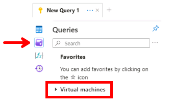
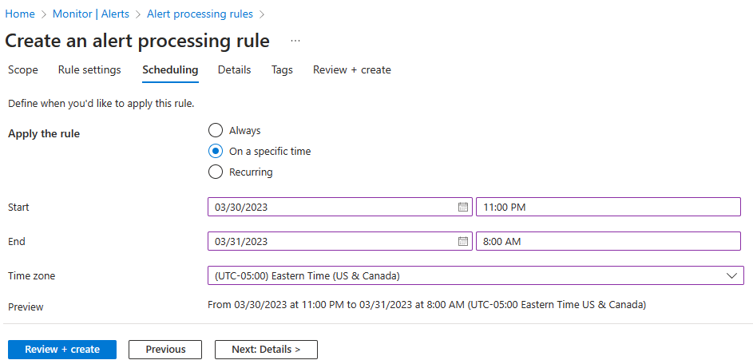
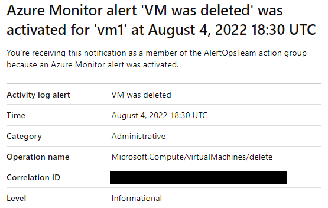

---
lab:
   title: 'Lab 11: Implement Monitoring'
   module: Administer Monitoring
   description: Configure Azure Monitor alerts and queries.
   duration: 45 minutes
   level: 300
   islab: true
   primarytopics:
   - Azure
   - Azure Monitor
---

> **Module:** [[11 - Monitoring]]  ·  **Index:** [[AZ-104 Course Index]]

# Lab 11: Implement monitoring

## Lab introduction

In this lab, you deploy a virtual machine with logs-based monitoring, verify that monitoring data is being collected, create an Activity Log alert and action group, suppress notifications during a maintenance period, and trigger the alert by deleting the virtual machine.

This lab requires an Azure subscription. Your subscription type can affect feature availability. The steps use **East US**, but you can select another region if necessary.

## Estimated time

45 minutes

## Lab scenario

Your organization has migrated infrastructure to Azure. Administrators must be notified of significant infrastructure changes. You plan to use Azure Monitor, Log Analytics, alerts, action groups, and alert processing rules to monitor a virtual machine.

## Lab tasks

- Task 1: Deploy the lab infrastructure.
- Task 2: Verify monitoring data with Azure Monitor Logs.
- Task 3: Create an action group.
- Task 4: Create an Activity Log alert.
- Task 5: Configure an alert processing rule.
- Task 6: Trigger and verify the alert.

## Task 1: Deploy the lab infrastructure

In this task, you deploy a virtual machine and the resources required to collect guest performance data in a Log Analytics workspace.

1. Download the **\Allfiles\Labs\11\az104-11-vm-template.json** lab file to your computer.

2. Sign in to the [Azure portal](https://portal.azure.com).

3. Search for and select **Deploy a custom template**.

4. On the custom deployment page, select **Build your own template in the editor**.

5. Select **Load file**.

6. Locate and select **az104-11-vm-template.json**, and then select **Open**.

7. Select **Save**.

8. Enter the following values, leaving all other settings at their default values.

| Setting | Value |
| --- | --- |
| Subscription | Your Azure subscription |
| Resource group | **az104-rg11**; create it if necessary |
| Region | **East US** |
| VM size | Select an available size. Use **Standard_D2s_v5** if available. |
| Username | `localadmin` |
| Password | A complex password |

9. Select **Review + create**, and then select **Create**.

> [!note]
> The template provides three current VM sizes. Start with **Standard_D2s_v5**. If the deployment fails because the size is unavailable or Azure lacks capacity, select **Standard_D2s_v6** and redeploy to the same resource group. If necessary, retry with **Standard_D2s_v7**. If a retry fails because an existing or partially deployed resource causes a conflict, delete **az104-rg11**. Restart Task 1 from **Search for and select Deploy a custom template**, reload the template, select **Create new** to recreate **az104-rg11**, and deploy again with the selected VM size.

10. Wait for the deployment to finish, and then select **Go to resource group**.

### Verify the deployment

1. On the **az104-rg11** resource group page, confirm that the following resources exist:

- Virtual machine **az104-vm0**
- Log Analytics workspace with a name that begins with **az104-law11-**
- Data collection rule **az104-dcr11**
- The virtual network, network interface, public IP address, network security group, and storage account

2. Open **az104-vm0**.

3. If the virtual machine status is **Stopped**, select **Start** and wait for its status to change to **Running**.

4. Under **Settings**, select **Extensions + applications**.

5. Confirm that **AzureMonitorWindowsAgent** has a status of **Provisioning succeeded**.

6. Return to **az104-rg11**, and then open **az104-dcr11**.

7. Under **Configuration**, select **Resources**, and then confirm that **az104-vm0** is associated with the data collection rule.

> [!note]
> Data can take several minutes to appear after the Azure Monitor Agent and data collection rule are deployed. Do not delete the virtual machine until you complete Task 2.

## Task 2: Verify monitoring data with Azure Monitor Logs

In this task, you verify that the Azure Monitor Agent is sending heartbeat and VM performance data to the Log Analytics workspace. Complete this task before deleting the virtual machine.

1. In **az104-rg11**, open the Log Analytics workspace whose name begins with **az104-law11-**.

2. Under **General**, select **Logs**.

3. Close the welcome window or **Queries hub** if either appears.

4. If necessary, select **KQL mode** from the query editor mode menu.



5. Replace any text in the query editor with the following query, and then select **Run**.

```kusto
Heartbeat
| where TimeGenerated > ago(30m)
| where Computer =~ "az104-vm0"
| summarize HeartbeatCount = count(), LastHeartbeat = max(TimeGenerated)
    by Computer, Category
```

6. Confirm that the results contain **az104-vm0**.

> [!note]
> If the query returns no records, wait five minutes and run it again. If it still returns no records, verify that the Azure Monitor Agent extension succeeded and that the data collection rule is associated with the virtual machine.

7. Replace the query with the following query, and then select **Run**.

```kusto
InsightsMetrics
| where TimeGenerated > ago(30m)
| where Computer =~ "az104-vm0"
| where Name == "UtilizationPercentage"
| summarize AverageUtilization = avg(Val)
    by bin(TimeGenerated, 5m), Computer
| render timechart
```

8. Confirm that the query returns VM performance data.

> [!important]
> Continue only after both queries return data. Previously ingested records remain in the workspace after the virtual machine is deleted, but the virtual machine can't send data that wasn't collected before deletion.

## Task 3: Create an action group

In this task, you create an action group that sends an email notification when the alert is triggered.

1. In the Azure portal, search for and select **Monitor**.

2. Select **Alerts**, and then select **Action groups**.

3. Select **Create**.

4. On the **Basics** tab, enter the following values.

| Setting | Value |
| --- | --- |
| Subscription | Your Azure subscription |
| Resource group | **az104-rg11** |
| Region | **Global** |
| Action group name | `Alert the operations team` |
| Display name | `AlertOpsTeam` |

5. Select **Next: Notifications**.

6. Enter the following notification settings.

| Setting | Value |
| --- | --- |
| Notification type | **Email/SMS message/Push/Voice** |
| Name | `VM was deleted` |

7. Select **Email**, enter your email address, and then select **OK**.

8. Select **Review + create**, and then select **Create**.

9. Confirm that you receive an email stating that you were added to the action group. Delivery can take several minutes.

## Task 4: Create an Activity Log alert

In this task, you create an alert for the Activity Log operation that deletes a virtual machine.

> [!note]
> Virtual machine deletion is an Activity Log administrative operation. It is not a VM metric. The operation name is `Microsoft.Compute/virtualMachines/delete`.

1. In **Azure Monitor**, select **Alerts**.

2. Select **Create**, and then select **Alert rule**.

3. On the **Scope** tab, select your subscription, and then select **Apply**.

4. Select the **Condition** tab.

5. Under **Select a signal**, select **Activity log**.

6. Select **Delete Virtual Machine (Virtual Machines)**, and then select **Apply**.

7. Under **Alert logic**, leave **Event level** and **Status** set to **All selected**.

> [!tip]
> If **See all signals** reports **Couldn't load metric query signals**, try to select **Delete Virtual Machine (Virtual Machines)**, and then select **Apply**. If the condition is applied, continue with the portal steps. The message affects metric-query signals and doesn't prevent the Activity Log signal from working. If you can't select or apply **Delete Virtual Machine (Virtual Machines)**, use the **Cloud Shell fallback for a signal-loading error** below.

8. Select the **Actions** tab.

9. Under **Select actions**, select **Use action groups**.

10. Select **Alert the operations team**, and then select **Select**.

11. Select the **Details** tab, and then enter the following values.

| Setting | Value |
| --- | --- |
| Subscription | Your Azure subscription |
| Resource group | **az104-rg11** |
| Alert rule name | `VM was deleted` |
| Alert rule description | `A VM in the subscription was deleted` |
| Region | **Global** |
| Enable alert rule upon creation | Selected |

12. Select **Review + create**, and then select **Create**.

13. In **Azure Monitor**, select **Alerts** > **Alert rules**.

14. Confirm that **VM was deleted** is enabled before continuing.

### Cloud Shell fallback for a signal-loading error

If the portal can't display the **Delete Virtual Machine** signal, use Azure Cloud Shell to create the same alert rule without the signal picker.

1. Open **Cloud Shell** and select **Bash**.

2. Run the following commands.

```azurecli
subscriptionId=$(az account show --query id --output tsv)
actionGroupId=$(az monitor action-group show \
  --resource-group az104-rg11 \
  --name "Alert the operations team" \
  --query id \
  --output tsv)

az monitor activity-log alert create \
  --name "VM was deleted" \
  --resource-group az104-rg11 \
  --scope "/subscriptions/$subscriptionId" \
  --condition "category=Administrative and operationName=Microsoft.Compute/virtualMachines/delete" \
  --action-group "$actionGroupId" \
  --description "A VM in the subscription was deleted"
```

3. When the command succeeds, return to **Azure Monitor** > **Alerts** > **Alert rules**.

4. Confirm that **VM was deleted** is enabled, and then continue to Task 5.

## Task 5: Configure an alert processing rule

In this task, you configure a rule that suppresses notifications during a planned maintenance period.

1. In **Azure Monitor**, select **Alerts** > **Alert processing rules**.

2. Select **Create**.

3. On the **Scope** tab, select your subscription, and then select **Apply**.

4. Select **Next: Rule settings**.

5. Select **Suppress notifications**.

6. Select **Next: Scheduling**.

7. Configure the following schedule.

| Setting | Value |
| --- | --- |
| Apply the rule | **At a specific time** |
| Start | Today's date at 10:00 PM |
| End | Tomorrow's date at 7:00 AM |
| Time zone | Your local time zone |



8. Select **Next: Details**.

9. Enter the following values.

| Setting | Value |
| --- | --- |
| Subscription | Your Azure subscription |
| Resource group | **az104-rg11** |
| Rule name | `Planned Maintenance` |
| Description | `Suppress notifications during planned maintenance.` |

10. Select **Review + create**, and then select **Create**.

> [!note]
> The schedule is outside the normal time used to complete this lab, so it shouldn't suppress the deletion notification. If your current time falls within the configured window, adjust the schedule before triggering the alert.

## Task 6: Trigger and verify the alert

In this task, you delete the virtual machine and confirm that the Activity Log alert is triggered.

> [!important]
> Confirm that the **VM was deleted** alert rule is enabled before deleting the virtual machine.

1. In the Azure portal, search for and select **Virtual machines**.

2. Select the checkbox for **az104-vm0**.

3. Select **Delete**.

4. In the **Delete resources** pane, review the selected resources.

5. Enter `delete` in the confirmation field, and then select **Delete**.

6. If a second confirmation dialog appears, select **Delete** again.

7. Select the **Notifications** icon and wait until the virtual machine is successfully deleted.

8. Wait for an email with a subject indicating that the **VM was deleted** Azure Monitor alert was activated.



> [!note]
> Activity Log entries and alert notifications can take several minutes to appear.

9. In **Azure Monitor**, select **Alerts**.

10. Confirm that an alert named **VM was deleted** appears.

11. Open the alert and review its scope, condition, operation name, status, and history.

12. Optionally, return to the Log Analytics workspace and rerun the Task 2 queries. The records collected before deletion remain available according to the workspace retention period.

## Clean up resources

If you're using your own subscription, delete the lab resource group to avoid unnecessary charges.

1. In the Azure portal, open **az104-rg11**.

2. Select **Delete resource group**.

3. Enter `az104-rg11` to confirm the deletion.

4. Select **Delete**, and then confirm the deletion if prompted.

You can also use Azure PowerShell:

```azurepowershell
Remove-AzResourceGroup -Name az104-rg11
```

Or Azure CLI:

```azurecli
az group delete --name az104-rg11
```

## Key takeaways

- Host and recommended VM metrics don't prove that logs-based VM monitoring is configured.
- Azure Monitor Logs requires a Log Analytics workspace and an appropriate data collection path.
- Azure Monitor Agent uses a data collection rule and association to send guest monitoring data to a workspace.
- Monitoring ingestion should be verified before deleting the resource that generates the data.
- Virtual machine deletion is an Activity Log administrative operation rather than a VM metric.
- Action groups define notification recipients, while alert processing rules control when notifications are delivered.


---

## My lab notes

> [!note] Fill this in while you work, not after
> Anything that surprised you, anything that didn't match the script, and any portal path you had to hunt for.

### What I actually did

### Things that didn't go to plan

### Commands / KQL worth keeping

### Back to the module note
Anything conceptual from this lab that belongs in **[[11 - Monitoring]]** — add it there, not here.
