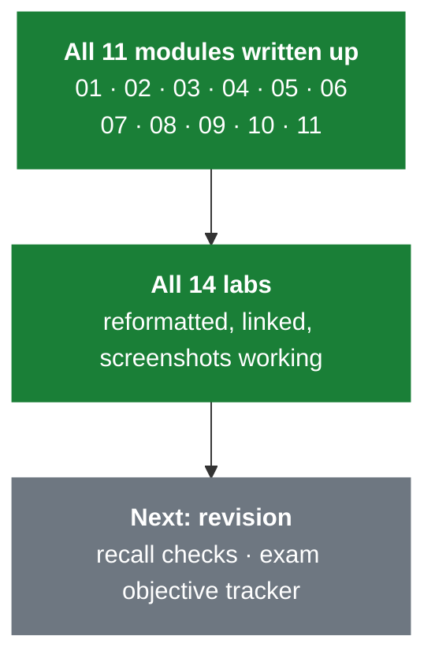

# AZ-104 — Microsoft Azure Administrator

Course notes, labs and revision material. Start here.

> [!info] How this vault is laid out
> One folder per module, numbered in course order. Each folder holds the **module note** and the **lab(s)** that belong to it. Lab screenshots live in `_attachments/`.
> Every written-up module note has the same five parts: a one-line summary, the content, an **exam objective** checklist, a **recall check**, and **references**.

**Admin:** [[Lab Environment]] · [[Exam Objectives Tracker]] · [[GitHub Publishing Workflow]] · [[LinkedIn Post Draft - AZ-104 Notes and Labs]]

---

## Progress

**11 of 11 modules written up.** All 14 labs are reformatted and linked. The course content is complete — what's left is revision.

---

## Modules

| # | Module | Lab(s) | Exam domain | Notes |
| :-- | --- | --- | --- | --- |
| 01 | [[01 - Administer Identity]] | [[LAB 01 - Manage Entra ID Identities]] | Identity & governance | ✅ Done |
| 02 | [[02 - Governance and Compliance]] | [[LAB 02a - Manage Subscriptions and RBAC]] · [[LAB 02b - Manage Governance via Azure Policy]] | Identity & governance | ✅ Done |
| 03 | [[03 - Administer Azure Resources]] | [[LAB 03 - Manage Azure Resources with ARM Templates]] | Compute | ✅ Done |
| 04 | [[04 - Virtual Networking]] | [[LAB 04 - Implement Virtual Networking]] | Networking | ✅ Done |
| 05 | [[05 - Intersite Connectivity]] | [[LAB 05 - Implement Intersite Connectivity]] | Networking | ✅ Done |
| 06 | [[06 - Network Traffic Management]] | [[LAB 06 - Implement Network Traffic Management]] | Networking | ✅ Done |
| 07 | [[07 - Azure Storage]] | [[LAB 07 - Manage Azure Storage]] | Storage | ✅ Done |
| 08 | [[08 - Azure Virtual Machines]] | [[LAB 08 - Manage Virtual Machines]] | Compute | ✅ Done |
| 09 | [[09 - PaaS Compute Options]] | [[LAB 09a - Implement Web Apps]] · [[LAB 09b - Implement Azure Container Instances]] · [[LAB 09c - Implement Azure Container Apps]] | Compute | ✅ Done |
| 10 | [[10 - Data Protection]] | [[LAB 10 - Implement Data Protection]] | Monitor & maintain | ✅ Done |
| 11 | [[11 - Monitoring]] | [[LAB 11 - Implement Monitoring]] | Monitor & maintain | ✅ Done |

---

## Exam weighting

| Domain | Weight | Modules | State |
| --- | :--: | --- | --- |
| Manage Azure identities and governance | 20-25% | 01, 02 | ✅ Both written |
| Implement and manage storage | 15-20% | 07 | ✅ Written |
| Deploy and manage Azure compute resources | 20-25% | 03, 08, 09 | ✅ All three written |
| Implement and manage virtual networking | 15-20% | 04, 05, 06 | ✅ All three written |
| Monitor and maintain Azure resources | 10-15% | 10, 11 | ✅ Both written |

Networking plus compute is roughly **half the exam** across five modules. Identity and governance is the single heaviest domain for the number of modules covering it.

Full breakdown with tickable objectives: [[Exam Objectives Tracker]]

---

## Where things cross over

Some topics get introduced in one module and finished in another. Worth knowing when revising:

| Topic | Introduced | Finished |
| --- | --- | --- |
| Azure DNS | [[04 - Virtual Networking]] | — (06 points back to 04) |
| User-defined routes | [[04 - Virtual Networking]] | [[05 - Intersite Connectivity]] |
| Azure Bastion | [[04 - Virtual Networking]] | [[05 - Intersite Connectivity]] |
| Reserved subnet names | [[04 - Virtual Networking]] | [[05 - Intersite Connectivity]] |
| Managed identities | [[01 - Administer Identity]] | [[02 - Governance and Compliance]] remediation, [[08 - Azure Virtual Machines]] |
| Availability and SLA | [[08 - Azure Virtual Machines]] | — |
| Network Watcher | [[04 - Virtual Networking]] | [[11 - Monitoring]] |
| Logic Apps | [[09 - PaaS Compute Options]] | [[11 - Monitoring]] action groups |
| Control plane vs data plane | [[08 - Azure Virtual Machines]] | [[11 - Monitoring]] activity vs resource logs |
| Log Analytics workspace | [[10 - Data Protection]] | [[11 - Monitoring]] |

---

## Working method

1. **Before the module** — skim the module note's headings so you know what's coming.
2. **During** — fill the headings in as you go. Don't write prose; write the thing you'd need to see again in three weeks. Mark gaps with *italics* and they get expanded in the brush-up.
3. **After the lab** — go back to the module note and add anything the lab taught you that the slides didn't. Paste screenshots of anything you had to work out.
4. **End of day** — answer the **recall check** questions from memory. Anything you can't answer is what you revise.
5. **End of week** — work through [[Exam Objectives Tracker]] and tick only what you could actually do in the portal unaided.

> [!tip] Where notes should go
> Conceptual content goes in the **module note**. Step-by-step "how I did it" goes in the **lab note**. If you find yourself writing portal click-paths in the module note, it probably belongs in the lab.

> [!warning] Close a note before it gets rewritten
> If a note is open in Obsidian while it's being updated from outside, Obsidian will save its own stale copy back over the change. Close the tab first, or press `Ctrl+R` afterwards to reload from disk.

---

## Portfolio publishing

This vault is ready to publish as a GitHub learning-evidence repo once screenshots have been checked for private account details.

- [[GitHub Publishing Workflow]] — repo setup, pre-publish checks, push commands and LinkedIn workflow.
- [[LinkedIn Post Draft - AZ-104 Notes and Labs]] — draft post and screenshot ideas.

---

## Reference

- [AZ-104 study guide — skills measured](https://learn.microsoft.com/en-us/credentials/certifications/resources/study-guides/az-104)
- [AZ-104 lab directory (Microsoft Learning)](https://microsoftlearning.github.io/AZ-104-MicrosoftAzureAdministrator/)
- [Azure Architecture Center — cloud design patterns](https://learn.microsoft.com/en-us/azure/architecture/patterns/)
- [Azure CLI reference](https://learn.microsoft.com/en-us/cli/azure/reference-index)
- [Az PowerShell module reference](https://learn.microsoft.com/en-us/powershell/azure/)
